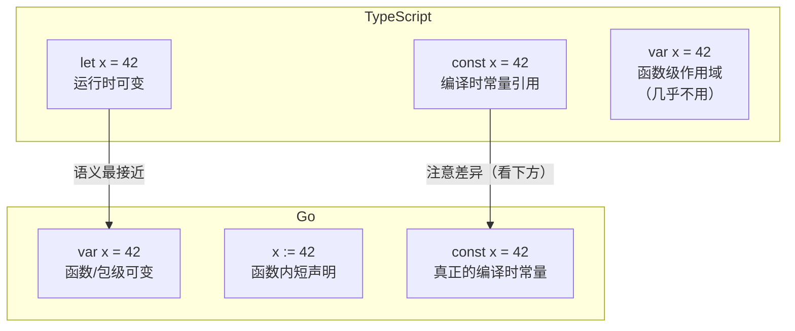
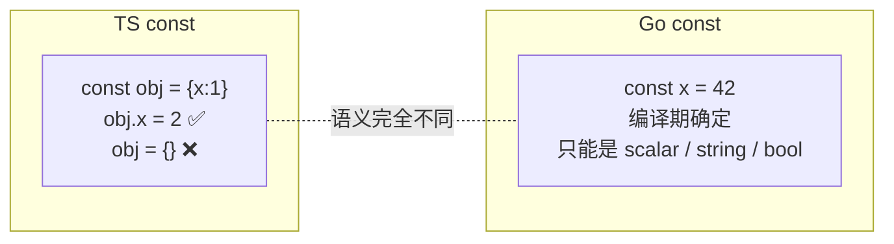
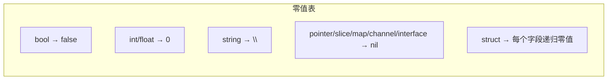
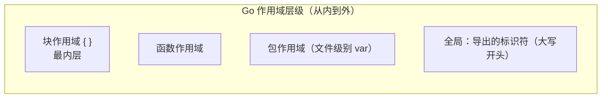

# 变量声明 — Variables

> TypeScript: `let` / `const` / `var` → Go: `var` / `:=` / `const`

## 全景对比




---

## 1. 基本声明

### 显式类型声明

```typescript
// TypeScript
let name: string = "Alice";
let age: number = 30;
let active: boolean = true;
```

```go
// Go — var + 类型
var name string = "Alice"
var age int = 30
var active bool = true

// 也支持分组声明（推荐：同类变量放一起）
var (
    name   string = "Alice"
    age    int    = 30
    active bool   = true
)
```

### 类型推断

```typescript
// TypeScript — 字面量推断为 primitive 类型
let name = "Alice";     // string
let age = 30;           // number
```

```go
// Go — 省略类型，从右值推断
var name = "Alice" // string
var age = 30       // int（不是 number！Go 细分 int/int8/int16/int32/int64）
```

### 短声明 `:=`（Go 特有，函数内使用）

```go
// Go — := 只能在函数内部使用
name := "Alice"  // string
age := 30        // int
pi := 3.14       // float64（默认 float64，不是 float32）
```

```typescript
// TS 没有等价物——最接近的是 let，但 let 是关键词不是运算符
// TS 不能:=混合声明+类型推断
```

> ⚠️ **关键差异**：`:=` 声明+赋值一步完成，且**至少有一个变量是新的**时才合法（复用变量用 `=`）。
>
> ```go
> x := 1
> x := 2       // ❌ 编译错误：左边没有新变量
> x, y := 3, 4 // ✅ 左边至少有一个新变量 y
> ```

> ⚠️ **默认类型推断表**：`:=` 的右侧值类型决定了变量类型，规则如下：
>
> | 字面量 | 推断类型 | 注意 |
> |--------|---------|------|
> | `42` | `int` | 不是 `int8`/`int16`，即使值很小 |
> | `3.14` | `float64` | 不是 `float32` |
> | `'a'` | `rune`（= `int32`） | 不是 `byte`，即使 ASCII |
> | `"hi"` | `string` | — |
> | `1 + 2i` | `complex128` | 默认 128 位精度 |
> | `true` | `bool` | — |
> | `[]int{1,2}` | `[]int` | slice 字面量 |
> | `map[string]int{}` | `map[string]int` | map 字面量 |
>
> 要精确控制类型，必须显式声明或类型转换：
> ```go
> var x int8 = 1
> y := int8(1)
> ```

---

## 2. 常量

```typescript
// TypeScript
const NAME = "Alice";       // 运行时不可重新赋值
const AGE = 30;             // 对象引用不可变，但内容可变
const PI = 3.14;
```

```go
// Go — const 是真正的编译时常量
const Name = "Alice" // 无类型常量（untyped constant）
const Age = 30
const Pi = 3.14

// 有类型常量
const Name string = "Alice"
const Age int = 30

// 分组常量 + iota 枚举模式
const (
    StatusNew  = iota // 0
    StatusActive      // 1
    StatusDone        // 2
)
```



> ⚠️ **关键差异**：
>
> | 维度 | TypeScript | Go |
>|------|-----------|----|
> | 可变性 | 引用不可变，**内容可变** | 值完全不可变 |
> | 何时确定 | 运行时 | 编译时 |
> | 支持类型 | 任意类型 | 仅 `bool` / `string` / 数值（`int`/`float`/`complex`） |
> | struct/array/map | ✅ `const obj = {a:1}` | ❌ 不能声明为 const |

### 2.1 未命名常量 vs 已命名常量（Untyped vs Typed）

```go
const x = 1       // 未命名（untyped integer constant）
const y int = 1   // 已命名（typed constant）
```

**未命名常量的核心优势：灵活隐式转换**

```go
// 未命名常量默认有"默认类型"，但在需要时可以隐式转为其他类型
const Big = 1 << 100     // ✅ 编译通过！未命名，不占内存
var a int = Big >> 98    // ✅ 使用时才决定类型，结果是 4
// var b int = (1 << 100) // ❌ 右值不是常量，编译期溢出检查

// 隐式转换灵活性
const Untyped = 42
var i int     = Untyped  // ✅
var i8 int8   = Untyped  // ✅ 未命名常量可隐式转为 int8
// var i8 int8 = 300     // ❌ 编译时溢出检查
// var i8 int8 = y       // ❌ y 是 typed const，不能隐式转
```

```typescript
// TypeScript — 没有等价概念
// TS 的 const 引用是运行时的，没有未命名常量的隐式转换机制
const untyped = 42;  // 就是一个 number，无法隐式转 int8
```

### 2.2 iota 枚举模式

```go
// 基础模式：自增枚举
const (
    StatusNew  = iota // 0
    StatusActive      // 1
    StatusDone        // 2
)

// 从 1 开始（跳过 0）
const (
    _ = iota      // 0 丢弃
    StatusNew     // 1
    StatusActive  // 2
)

// 跳过中间值
const (
    A = iota  // 0
    _         // 1 跳过
    C         // 2
)

// 位移枚举（权限标志位）
const (
    Read  = 1 << iota // 1 (0b001)
    Write             // 2 (0b010)
    Exec              // 4 (0b100)
)

// 字符串枚举（iota + 数组映射）
const (
    Monday = iota
    Tuesday
    Wednesday
    Thursday
    Friday
    Saturday
    Sunday
)

var dayNames = [...]string{
    "Monday", "Tuesday", "Wednesday", "Thursday", "Friday", "Saturday", "Sunday",
}

func (d Day) String() string { return dayNames[d] }
```

> ⚠️ **iota 只在 const 块内工作**，每个 const 块重新从 0 开始：
> ```go
> const (
>     A = iota  // 0
>     B         // 1
> )
> const (
>     C = iota  // 0！新块重置
> )
> ```

---

## 3. 零值 — Zero Values（最重要差异之一）

```typescript
// TypeScript — 所有变量必须显式初始化才能使用
let x: number;       // undefined（可用但危险）
console.log(x + 1);  // NaN
```

```go
// Go — 每个变量都有零值，不需要手动初始化
var x int       // 0
var s string    // "" (空串)
var b bool      // false
var p *int      // nil (指针)
var arr [3]int  // [0, 0, 0]
var sl []int    // nil (但可安全 append)
var m map[int]string // nil（写入会 panic，要 make）

// 零值保证安全——不会"未定义行为"
var counter int
counter++       // ✅ 1，不需要先赋 0
```



> **设计哲学**：Go 的零值保证了**所有声明都是安全可用的**，没有 TS 里 `undefined` 引发的一连串 `?.` 检查。

---

## 4. 多变量声明

```typescript
// TypeScript
let a = 1, b = "hello", c = true;
```

```go
// Go — 同一类型
var a, b, c int = 1, 2, 3

// 不同类型
var (
    a int    = 1
    b string = "hello"
    c bool   = true
)

// := 多变量
a, b, c := 1, "hello", true

// 经典用法：函数返回值
n, err := fmt.Println("hello")
```

---

## 5. 作用域与遮蔽 — Scope & Shadowing



```typescript
// TypeScript
const x = 1;
if (true) {
    const x = 2; // 遮蔽外层 x
    console.log(x); // 2
}
console.log(x); // 1
```

```go
// Go — 作用和遮蔽规则相同
const x = 1
if true {
    x := 2      // 遮蔽包级 x
    println(x)  // 2
}
println(x)      // 1
```

> ⚠️ **Go 特有陷阱：循环变量遮蔽（Go 1.22 已修复）**
>
> ```go
> // Go < 1.22 — 所有 goroutine 看到同一个 i ❌
> // Go 1.22+ — 每次迭代创建新 i ✅
> for i := range 3 {
>     go func() { println(i) }() // 1.22+: 0,1,2；以前: 2,2,2
> }
> ```
>
> 如果你必须兼容老版本，显式传参：
> ```go
> for i := range 3 {
>     go func(n int) { println(n) }(i) // 安全
> }
> ```

---

## 6. 丢弃标识符 `_`（Blank Identifier）

```typescript
// TypeScript — 用 _ 做 unused 参数是约定，无编译检查
function fn(_: string, y: number) {
    return y;
}
```

```go
// Go — _ 是语言级"必须使用"的逃生口
result, _ := strconv.Atoi("42") // 忽略 error
_, err := doSomething()         // 忽略返回值

for _, item := range items {    // 忽略索引
    fmt.Println(item)
}

// Go 不允许声明未使用的变量——_ 是唯一例外
```

> **设计哲学**：Go 编译器会报错"declared but not used"——用 `_` 明确表示"我故意的"。

---

## 7. 地址可寻址性 — Addressability

> TypeScript 没有等价概念——所有变量都是引用，不存在"能否取地址"的问题。

Go 中**不是所有变量都能取地址**。对不可寻址的值调用 `&` 会编译错误。

```go
x := 42
p := &x  // ✅ 局部变量可寻址

arr := [3]int{1, 2, 3}
p := &arr[0]  // ✅ 数组元素可寻址

sl := []int{1, 2, 3}
p := &sl[0]   // ✅ slice 元素可寻址

type Point struct{ X, Y int }
pt := Point{1, 2}
p := &pt.X     // ✅ struct 字段可寻址
```

### 不可寻址的情况

```go
// ❌ 常量不可寻址
const C = 42
// p := &C

// ❌ 字面量不可寻址
// p := &Point{1, 2}  // 但你可以先赋值给变量

// ❌ 函数返回值不可寻址
func newPoint() Point { return Point{1, 2} }
// p := &newPoint()

// ❌ map 元素不可寻址
m := map[int]Point{0: {1, 2}}
// p := &m[0]
```

### 不可寻址的实际后果

最常踩的坑是 **map 值调用指针接收者方法**：

```go
type Counter struct{ n int }
func (c *Counter) Inc() { c.n++ }

m := map[string]Counter{"x": {}}
// m["x"].Inc()  // ❌ Cannot take address of map value

// 必须迂回：读出 → 修改 → 写回
c := m["x"]
c.Inc()
m["x"] = c
```

另一个常见场景：**range 迭代变量具有稳定地址**，但每次迭代重写：

```go
for i, v := range items {
    // i 和 v 地址不变！每次迭代复用同一变量
    go func() { println(v) }() // ❌ 所有 goroutine 看到最后一个 v
}

// ✅ 正确
for i, v := range items {
    v := v  // 创建副本
    i := i
    go func() { println(v) }()
}

// Go 1.22+：for range 已修复，每次迭代创建新变量
for i, v := range items {
    go func() { println(v) }() // ✅ 1.22+ 每个 goroutine 有自己的 v
}
```

> **为什么 map 元素不可寻址？** map 底层是哈希表，插入/删除可能触发 rehash 导致元素地址变动。Go 干脆禁止取地址，避免悬空指针。

> 更深入的指针和 `&`/`*` 用法见 [指针章节](/01-language/06-pointers.md)。

---

## 8. 泛型变量（Go 1.18+）

```typescript
// TypeScript — 泛型变量类型标注
function identity<T>(value: T): T {
    return value;
}

const x = identity<number>(42);
```

```go
// Go 1.18+ — 泛型函数，类型参数
func Identity[T any](value T) T {
    return value
}

// 调用时类型推断
x := Identity(42)     // int
y := Identity("hi")   // string
z := Identity[int](42) // 也可显式指定

// 泛型约束：comparable / Ordered 等
func Max[T ~int | ~float64](a, b T) T {
    if a > b {
        return a
    }
    return b
}
```

> **TS vs Go 泛型差异**：
>
> | 维度 | TypeScript | Go |
> |------|-----------|-----|
> | 结构体泛型 | ✅ `class Box<T> {}` | ✅ `type Box[T any] struct{}` |
> | 约束语法 | `T extends Constraint` | `T Constraint`（interface as constraint） |
> | 类型参数位置 | 任意 | 仅函数/类型声明 |
> | 方法泛型 | ✅ | ❌ 方法不能有自己的类型参数 |

---

## 9. 完整对照表

| 操作 | TypeScript | Go |
|------|-----------|-----|
| 声明+初始化 | `let x = 1` | `var x = 1` 或 `x := 1` |
| 显式类型 | `let x: number = 1` | `var x int = 1` |
| 常量 | `const x = 1` | `const x = 1` |
| 未命名常量 | 无 | `const x = 1` — 可隐式转为任意兼容类型 |
| 多变量 | `let a=1,b=2` | `a, b := 1, 2` |
| 未初始化 | `let x: number` → `undefined` | `var x int` → `0` |
| 丢弃值 | 无语言支持 | `_` |
| 取地址 | 所有变量天然可引用 | `&x` — 不是所有变量可寻址（map 元素 ❌） |
| 泛型变量 | `function f<T>(x:T)` | `func F[T any](x T)` |
| 类型定义（新类型） | `type ID = string`（别名） | `type ID string`（新类型，不能与 string 互转） |
| 类型别名（可互换） | 同上（TS 无区分） | `type ID = string`（与 string 完全互换） |
| 类型推断 | 常用 | 常用 |
| 遮蔽 | 块级 `{}` | 块级 `{}` |

---

## 快速记忆

```
TS  let      = 可变
TS  const    = 不可重新赋值（但对象内容可变）
Go  var      = 可变（函数内或包级）
Go  :=       = 声明+赋值（函数内专用）
Go  const    = 编译时不可变（仅标量/字符串/bool）

!  Go 变量安全       — 有零值，不会 undefined
!  Go 变量必须使用    — 未使用编译报错
!  Go := 至少一个新变量 — 复用用 =
```
