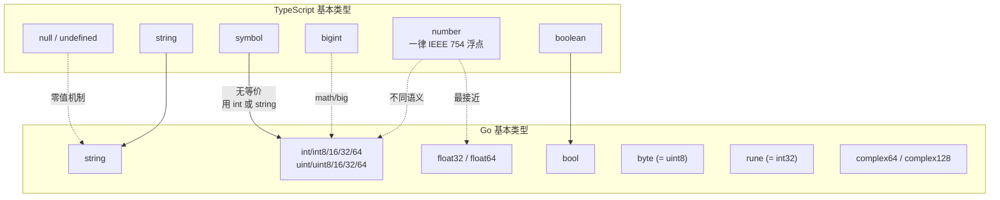
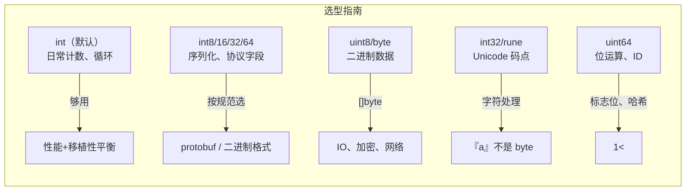
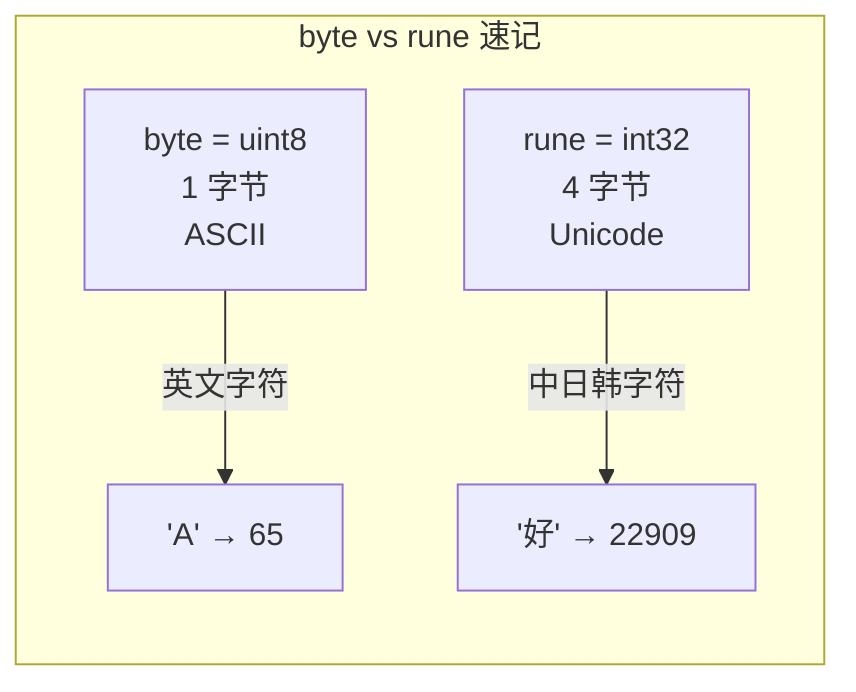

# 基本类型 — Primitives

> TypeScript: `string` / `number` / `boolean` / `bigint` / `symbol` / `null` / `undefined`
> Go: `string` / `intXX` / `floatXX` / `bool` / `byte` / `rune` / `complexXX`

## 全景对比



---

## 1. 布尔型 — `bool`

```typescript
// TypeScript
let done: boolean = true;
let started = false;
```

```go
// Go
var done bool = true
started := false

// 零值是 false
var active bool // false，安全使用
```

> `bool` 不能隐式转为 `int`（与 C 不同）：
> ```go
> var b bool = true
> // var i int = b   // ❌ 编译错误
> var i int = 0
> if b { i = 1 }     // ✅ 必须显式写条件
> ```

---

## 2. 数值类型 — 体系完全不同

### 2.1 整数族

```typescript
// TypeScript — 只有一个 number
let age: number = 30;        // IEEE 754 双精度浮点
let big: bigint = 9007199254740991n;  // 任意精度
```

```go
// Go — 按位宽细分，共 12 种整数类型
// 有符号（负数 ↔ 正数）
var a int     // 平台相关：64 位系统上 = int64，32 位系统上 = int32
var b int8    // -128 ~ 127
var c int16   // -32768 ~ 32767
var d int32   // -2_147_483_648 ~ 2_147_483_647
var e int64   // -9_223_372_036_854_775_808 ~ 9_223_372_036_854_775_807

// 无符号（仅正数）
var f uint    // 平台相关
var g uint8   // 0 ~ 255（byte 的别名）
var h uint16  // 0 ~ 65_535
var i uint32  // 0 ~ 4_294_967_295
var j uint64  // 0 ~ 18_446_744_073_709_551_615

// 特殊别名
var k byte    // = uint8
var l rune    // = int32（Unicode 码点）
```



> ⚠️ **关键差异**：
> - TS 的 `number` 是 IEEE 754 双精度——所有整数到 `2^53` 才丢失精度。Go 中 `int`/`int64` 是精确算术。
> - Go **不会隐式转换**不同大小的整数类型——即使 `int` 和 `int32` 在 64 位系统上位宽相同，也要显式转。
>
> ```go
> var x int = 42
> var y int64 = 99
> // z := x + y  // ❌ mismatched types int and int64
> z := int64(x) + y // ✅ 必须显式转换
> ```

### 2.2 浮点族

```go
// Go — 两种浮点
var f32 float32 // 约 ±3.4e38，精度 ~7 位小数
var f64 float64 // 约 ±1.8e308，精度 ~15 位小数（TS 的 number 等价）
```

```typescript
// TypeScript
let pi: number = 3.141592653589793;  // float64 精度
```

> ⚠️ **Go 的 `:=` 推断为 `float64`**：
> ```go
> pi := 3.14    // float64，不是 float32
> ```
>
> 数学库 `math` 的函数签名全是 `float64`，日常用 `float64` 即可。

### 2.3 复数族（Go 独有）

```go
// TypeScript 没有等价物
var c64 complex64   // 由 float32 + float32 构成
var c128 complex128 // 由 float64 + float64 构成（常用）

a := 1 + 2i              // complex128（由推断）
b := complex(3, 4)       // 构造函数
realPart := real(a)      // 取实部 → float64
imagPart := imag(a)      // 取虚部 → float64
```

### 2.4 字面量语法

```go
// Go 1.13+ 的数字字面量
// 二进制
b := 0b1010          // 10

// 八进制
o := 0o77            // 63

// 十六进制
h := 0xFF            // 255

// 下划线分隔（提高可读性）
big := 1_000_000     // 1000000
hex := 0xFFFF_0000   // 4294901760
bin := 0b1000_0101   // 133

// 浮点数科学记数
e := 1.5e10          // 15000000000
tiny := 1e-9         // 0.000000001
```

```typescript
// TypeScript — 同样支持
const b = 0b1010;       // ✅
const h = 0xFF;         // ✅
const big = 1_000_000;  // ✅ (ES2021+)
```

---

## 3. 字符串 — `string`

### 3.1 基础

```typescript
// TypeScript
let s: string = "hello";
let t = "world";
let tmpl = `hello ${name}`;  // 模板字符串
```

```go
// Go
var s string = "hello"
t := "world"

// Go 1.22+ 新增的整数 range 让字符串遍历更简洁
s := "你好"
for i, r := range s {
    fmt.Printf("%d: %c\n", i, r) // 按 rune 遍历
}

// string 是 []byte 的只读视图，不是 []rune
s := "hello"
fmt.Println(len(s))     // 5
s2 := "你好"
fmt.Println(len(s2))    // 6（每个汉字 3 字节）
fmt.Println(utf8.RuneCountInString(s2)) // 2（Unicode 字符数）
```

### 3.2 string 与 []byte 互转

```go
s := "hello"
b := []byte(s)    // string → []byte（复制）
s2 := string(b)   // []byte → string（复制）

// ❌ 注意：转换会复制底层数组
// 大量转换会分配内存
```

```typescript
// TypeScript — 没有 []byte 等价物
// 最接近的是 Uint8Array
const encoder = new TextEncoder();
const bytes = encoder.encode("hello"); // Uint8Array
const decoder = new TextDecoder();
const s = decoder.decode(bytes);
```

### 3.3 strings.Builder（高效字符串拼接）

```go
// Go — strings.Builder（处理大量字符串拼接）
var sb strings.Builder
sb.WriteString("hello")
sb.WriteString(" ")
sb.WriteString("world")
result := sb.String() // "hello world"，一次分配

// 不要用 + 拼接大量字符串：
// s := ""; for ... { s += x }  // ❌ O(n²)
```

```typescript
// TypeScript
// TS 中 + 和 join 通常够用
let s = "";
for (const x of items) s += x;   // 引擎优化后接近 O(n)

const parts: string[] = [];
parts.push("hello", " ", "world");
const result = parts.join("");
```

---

## 4. 类型转换（Type Conversion）

**Go 没有隐式类型转换**——这是与 TS 最大的设计差异之一。

```typescript
// TypeScript — 类型会隐式升级
const x: number = 42;
const y: number = x + "hello";  // "42hello"！string 隐式转换
const z: number = x + 3.14;     // 45.14，number 自动提升
```

```go
// Go — 任何不同类型都需要显式转换
var i int = 42
var f float64 = float64(i)  // ✅ 显式
var u uint = uint(i)         // ✅ 显式

// 算术表达式中也必须一致
var a int = 3
var b int64 = 4
// c := a + b           // ❌ mismatched types int and int64
c := int64(a) + b       // ✅

// 字符串与数值转换
s := strconv.Itoa(42)         // int → string: "42"
s2 := strconv.FormatInt(42, 16) // int → hex string: "2a"
n, _ := strconv.Atoi("42")     // string → int
n2, _ := strconv.ParseInt("2a", 16, 64) // hex string → int64
```

> **设计哲学**：Go 的"无隐式转换"防止了 `"42" + 1` 这种 TS/JS 中著名的混乱行为。

---

## 5. `byte` 与 `rune` — Go 独有

```go
// byte 就是 uint8，用于二进制数据
var b byte = 'A'       // 65（ASCII 码）
fmt.Printf("%c", b)    // 'A'

// rune 就是 int32，用于 Unicode 码点
var r rune = '好'       // 22909（Unicode 码点）
var r2 rune = '\u597D' // 16 进制写法，同上
var r3 rune = '\U0000597D' // 完整 32 位写法

// 字符字面量用单引号，不是双引号
ch := 'A'  // rune 类型（不是 byte）
by := byte('A') // byte
```

```typescript
// TypeScript
const ch = 'A';       // string（长度为 1 的字符串，不是独立的 char 类型）
const code = 'A'.charCodeAt(0); // 65
const char = String.fromCharCode(65); // 'A'

// TS 没有独立的 byte 或 rune 类型
// Unicode 处理需要 String.fromCodePoint / codePointAt
```



---

## 6. `any` = `interface{}`（Go 1.18+）

```go
// Go 1.18 起，any 是 interface{} 的类型别名
var x any
x = 42
x = "hello"
x = struct{ Name string }{"Alice"}

// 取回需要类型断言
s := x.(string)          // panic 如果类型不对
s, ok := x.(string)      // ok=false 时安全
```

```typescript
// TypeScript — 等价于 unknown
let x: unknown;
x = 42;
x = "hello";

// 取回需要类型收窄
if (typeof x === "string") {
    const s = x.toUpperCase();
}
```

---

## 7. 泛型与基本类型约束

```go
// Go 1.18+ — 用 constraints 或 interface 约束基本类型
// 方式 1：使用 golang.org/x/exp/constraints（标准库计划）
func Min[T constraints.Integer](a, b T) T {
    if a < b { return a }
    return b
}

// 方式 2：直接用 interface 约束
func Max[T ~int | ~int8 | ~int16 | ~int32 | ~int64](a, b T) T {
    if a > b { return a }
    return b
}

// ~int 表示"底层类型为 int 的所有类型"（包括 type MyInt int）
```

```typescript
// TypeScript — 用 extends
function min<T extends number>(a: T, b: T): T {
    return a < b ? a : b;
}
```

---

## 8. 完整对照表

| 操作 | TypeScript | Go |
|------|-----------|-----|
| 布尔 | `boolean` | `bool` |
| 数值 | `number`（float64） | `int` / `int8~64` / `uint8~64` / `float32` / `float64` |
| 大整数 | `bigint` | `int64` 或 `math/big` 包 |
| 复数 | 无 | `complex64` / `complex128` |
| 字符 | `string[0]` → 单字符 string | `rune`（Unicode）/ `byte`（ASCII） |
| 字符串 | `string` | `string`（不可变） |
| 字节数组 | `Uint8Array` | `[]byte` |
| 泛型约束 | `T extends number` | `T ~int \| ~float64` |
| 类型转换 | 隐式 + 显式 | **仅显式** |
| 字符串拼接 | `+` / `template literals` | `+` / `strings.Builder` |
| 字面量分隔 | `1_000_000` | `1_000_000` |
| 任意类型 | `unknown` / `any` | `any`（= `interface{}`） |

---

## 8. 算法刷题特供

### 8.1 整数溢出（最隐蔽的 bug）

```go
// Go 默认 int 是 64 位（64 位系统），但 LeetCode 和 ACM 中
// 经常遇到 int32 范围的题，溢出是最常见的 bug

// math.MaxInt32  = 2147483647
// math.MinInt32  = -2147483648
// math.MaxInt64  = 9223372036854775807

// ❌ 溢出示例
var a int32 = 2000000000
a = a + 1000000000    // ❌ 溢出！结果是 -1294967296（绕回）

// ✅ 检查溢出
func safeAdd(a, b int) (int, bool) {
    if a > math.MaxInt - b {
        return 0, false // 溢出
    }
    return a + b, true
}

// 乘法溢出
func safeMul(a, b int) (int, bool) {
    if a == 0 || b == 0 { return 0, true }
    if a > math.MaxInt/b {
        return 0, false // 溢出
    }
    return a * b, true
}

// 中值计算（防溢出）
// ❌ mid := (left + right) / 2
// ✅
mid := left + (right-left)/2

// 绝对值（MinInt 的绝对值还是 MinInt！）
func safeAbs(x int) int {
    if x == math.MinInt { return math.MaxInt } // 特殊处理
    if x < 0 { return -x }
    return x
}
```

### 8.2 byte 计数模式（替代 map 做字符统计）

```go
// 算法中最常用的优化：用 [26]int 或 [128]int 替代 map[byte]int
// 因为数组比 map 快 5-10 倍，没有哈希开销

// 小写字母计数（最常见的模式）
s := "leetcode"
freq := [26]int{}
for i := range s {
    freq[s[i]-'a']++
}
// freq['l'-'a']=1, freq['e'-'a']=2, ...

// 全部 ASCII
s = "hello world!"
ascii := [128]int{}
for i := range s {
    ascii[s[i]]++ // 直接用字符做索引
}

// 对比类型：

// 字符串
for i := 0; i < len(s); i++ {
    ch := s[i]     // byte（uint8）
    // ch 是 0-255 的 ASCII/UTF-8 字节
}

// rune 遍历（Unicode）
for _, r := range s {
    // r 是 rune（int32），可能出现中文字
    // 做计数时用 map[rune]int
}

// 判断字母异位词
func isAnagram(s, t string) bool {
    if len(s) != len(t) { return false }
    cnt := [26]int{}
    for i := range s {
        cnt[s[i]-'a']++
        cnt[t[i]-'a']--
    }
    return cnt == [26]int{} // 数组可直接 == 比较！
}
// 注意：[26]int 是数组（值类型），可以直接 ==
// 而 []int（切片）不能 ==
```

### 8.3 无穷大初始化

```go
// 算法中常用 "无穷大" 初始化
// Go 的做法：

const INF = math.MaxInt32      // 32 位够用
const INF64 = math.MaxInt64    // 64 位
const INF32 = 1e9              // 1_000_000_000，常用做 INF

// 最短路径初始化
dist := make([]int, n)
for i := range dist { dist[i] = INF }

// 最小值用 MaxInt（因为搜索取 min）
minDist := INF
for _, d := range dist {
    if d < minDist { minDist = d }
}

// 最大值用 MinInt（因为搜索取 max）
maxScore := math.MinInt32
for _, s := range scores {
    if s > maxScore { maxScore = s }
}
```

### 8.4 类型选择的实际建议

```go
// 刷题时选类型的决策树：

// 1. 大多数 LeetCode 题 → int（够用）
// 2. 位运算题 → int（Go 的 int 至少 32 位）
// 3. 大数题（10^9+ 数量级）→ int64
// 4. 字符计数 → [26]int（字母）/ [128]int（ASCII）
// 5. 浮点题 → float64（默认）
// 6. 复数题 → complex128（极少数）

// ⚠️ 统一类型：int 在 32 位系统上是 32 位，64 位上是 64 位
// 如果写库代码要考虑移植性，用 int/int64 明确
```

---

## 快速记忆

```
TS  number      = Go float64 + int/uint 组合
TS  string      = Go string（不可变）
TS  Uint8Array  = Go []byte

Go  int          — 平台相关，日常首选
Go  float64     — 默认浮点，等价 TS number
Go  byte         = uint8，二进制数据
Go  rune         = int32，Unicode 字符

math.MaxInt32    — 1<<31 - 1（无穷大初始化）
math.MinInt32    — -1<<31

[26]int          — 字母计数（替代 map，快 5-10 倍）
freq[s[i]-'a']++ — 小写字母统计（核心模式）

!  Go 必须显式类型转换  — 没有 "42" + 1
!  Go string 是字节序列  — len("你好")=6，不是 2
!  Go 数值细分 12 种    — 不是 TS 的"全用 number"
!  int 溢出不会报错     — 需要手动检查 safeAdd/safeMul
!  [26]int == [26]int   — 数组可以直接比较，切片不行
```
