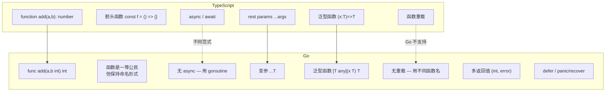
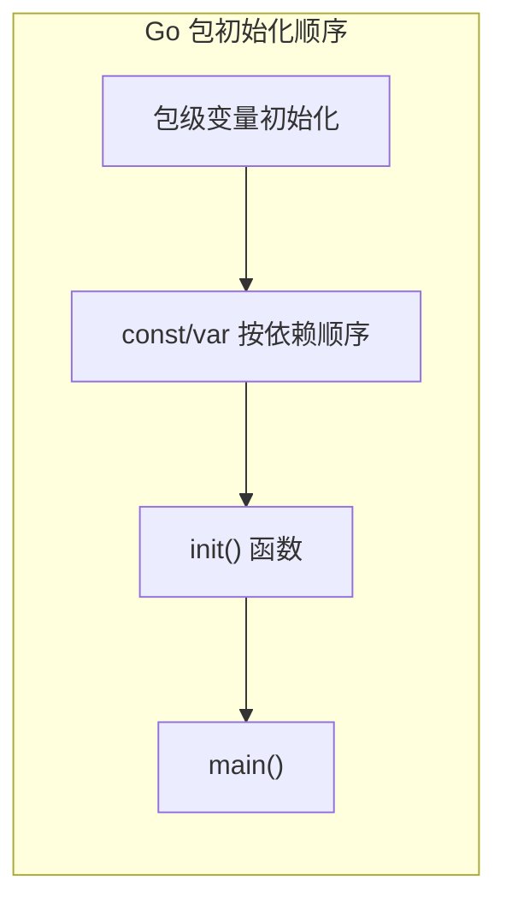

# 函数 — Functions

> TypeScript: `function` / `=>` / `async` → Go: `func` / 多返回值 / `defer`

## 全景对比



---

## 1. 基本函数

```typescript
// TypeScript
function add(a: number, b: number): number {
    return a + b;
}

// 箭头函数
const add = (a: number, b: number): number => a + b;
```

```go
// Go — 类型放在变量名后面
func add(a int, b int) int {
    return a + b
}

// 相同类型参数可以合并
func add(a, b int) int {
    return a + b
}

// 命名返回值（declared return value）
func add(a, b int) (sum int) {  // sum 自动初始化为 0
    sum = a + b  // 直接给命名返回值赋值
    return       // 裸 return，返回 sum 当前值
}
```

> ⚠️ **裸 return**：仅用于短函数。长函数中显式 `return sum` 更清晰。

---

## 2. 多返回值（Go 最大特性之一）

```go
// Go — 函数可以返回多个值
func divide(a, b int) (int, error) {
    if b == 0 {
        return 0, errors.New("division by zero")
    }
    return a / b, nil
}

// 调用
result, err := divide(10, 3)
if err != nil {
    log.Fatal(err)
}

// 忽略某个返回值
result, _ := divide(10, 3)
```

```typescript
// TypeScript — 用 tuple 或对象模拟
function divide(a: number, b: number): [number, Error | null] {
    if (b === 0) return [0, new Error("division by zero")];
    return [a / b, null];
}

// 或用对象解构
function divide(a: number, b: number): { result: number; error: Error | null } {
    ...
}
```

> **设计哲学**：Go 把 error 作为返回值的一部分，而不是异常机制——强迫调用者处理错误。try/catch 可以"忘记"catch，Go 的 `(result, err)` 模式让人无法忽视 error。

---

## 3. 变参函数（Variadic Functions）

```typescript
// TypeScript
function sum(...nums: number[]): number {
    return nums.reduce((a, b) => a + b, 0);
}
sum(1, 2, 3);
const arr = [1, 2, 3];
sum(...arr);
```

```go
// Go — ...T 必须是最后一个参数
func sum(nums ...int) int {
    total := 0
    for _, n := range nums {
        total += n
    }
    return total
}

sum(1, 2, 3)

// slice 展开
nums := []int{1, 2, 3}
sum(nums...) // 解包 slice

// 泛型变参
func Sum[T ~int | ~float64](nums ...T) T {
    var total T
    for _, n := range nums {
        total += n
    }
    return total
}
```

---

## 4. 闭包与一等公民

```typescript
// TypeScript
function makeCounter(): () => number {
    let count = 0;
    return () => count++;
}

const counter = makeCounter();
console.log(counter()); // 0
console.log(counter()); // 1
```

```go
// Go — 闭包语法一致
func makeCounter() func() int {
    count := 0
    return func() int {
        count++
        return count - 1
    }
}

counter := makeCounter()
fmt.Println(counter()) // 0
fmt.Println(counter()) // 1

// 函数作为参数
func mapSlice[T any, U any](s []T, f func(T) U) []U {
    result := make([]U, len(s))
    for i, v := range s {
        result[i] = f(v)
    }
    return result
}

doubled := mapSlice([]int{1, 2, 3}, func(x int) int { return x * 2 })
// []int{2, 4, 6}
```

---

## 5. `defer` — Go 独有的清理机制

```typescript
// TypeScript — 用 try/finally
function readFile(path: string): string {
    const fd = open(path);
    try {
        return fd.read();
    } finally {
        fd.close();
    }
}
```

```go
// Go — defer，在函数返回时按 LIFO 顺序执行
func readFile(path string) (string, error) {
    f, err := os.Open(path)
    if err != nil {
        return "", err
    }
    defer f.Close() // 无论什么路径返回，文件都会被关闭

    data, err := io.ReadAll(f)
    if err != nil {
        return "", err  // f.Close() 仍然会执行
    }
    return string(data), nil
}

// 多个 defer — 后进先出（类似栈）
func example() {
    defer fmt.Println("first deferred")   // 第三个执行
    defer fmt.Println("second deferred")  // 第二个执行
    defer fmt.Println("third deferred")   // 第一个执行
}

// defer 参数在注册时求值
func example() {
    x := 1
    defer fmt.Println(x) // 打印 1（不是函数返回时的 x 值）
    x = 2
}

// defer 表达式中可以修改命名返回值
func example() (n int) {
    defer func() { n++ }() // 函数返回前 n 自增
    return 5               // 实际返回 6
}
```

> ⚠️ **defer 开销**：每次调用有微小开销。密集热路径中可用手写清理代替。但默认应优先用 defer——安全 > 微优化。

---

## 6. 函数类型与兼容性

```go
// Go 中函数是有类型的
type Handler func(a, b int) int

var h Handler = add // ✅ add 符合签名
// h = func(a int) int { ... } // ❌ 参数数量不匹配

// 函数作为 struct 字段
type Server struct {
    logger func(format string, args ...any)
}
```

```typescript
// TypeScript
type Handler = (a: number, b: number) => number;
```

> **差异**：Go 函数类型**不计闭包捕获**——只有签名决定兼容性。

---

## 7. `init()` 函数

```go
// Go — 每个包可以有多个 init()，按源文件顺序、按声明顺序执行
// 在包初始化时自动执行，不能被手动调用
var config map[string]string

func init() {
    config = map[string]string{
        "env": "production",
        "port": "8080",
    }
}

// 多个 init 顺序执行
func init() { fmt.Println("init 1") }
func init() { fmt.Println("init 2") }
```

```typescript
// TypeScript — 无直接等价
// 最接近是模块顶层的 IIFE 或 class 静态块
const config: Record<string, string> = (() => {
    return { env: "production", port: "8080" };
})();
```



> ⚠️ **不要依赖 init() 的执行顺序**——不同包之间的 init 顺序由导入依赖图决定，但同一包内不要假设多个 init 的执行顺序，除非在同一文件中。

---

## 8. 泛型函数（Go 1.18+）

```go
// Go — 类型参数在函数名之后、参数之前
func Map[T, U any](s []T, f func(T) U) []U {
    result := make([]U, len(s))
    for i, v := range s {
        result[i] = f(v)
    }
    return result
}

// 多个类型约束
func Min[T ~int | ~int8 | ~int16 | ~int32 | ~int64](a, b T) T {
    if a < b { return a }
    return b
}

// comparable 约束（内置）
func Contains[T comparable](s []T, v T) bool {
    for _, item := range s {
        if item == v { return true }
    }
    return false
}

// 调用时类型推断
doubled := Map([]int{1, 2, 3}, func(x int) int { return x * 2 })
has := Contains([]string{"a", "b"}, "c") // false
```

```typescript
// TypeScript
function map<T, U>(arr: T[], fn: (x: T) => U): U[] {
    return arr.map(fn);
}

function min<T extends number>(a: T, b: T): T {
    return a < b ? a : b;
}
```

> ⚠️ **Go 泛型限制**：
> - 方法不能有额外的类型参数（不像 TS class 方法可以加 `<U>`）
> - 泛型函数不能用于 `defer` / `go` 语句

---

## 9. 函数选项模式（Function Options Pattern）

Go 没有 TS 那样灵活的对象合并，函数选项模式是最常用的配置模式：

```go
// Go — 函数选项模式（Functional Options）
type Server struct {
    host string
    port int
    tls  bool
}

type Option func(*Server)

func WithHost(host string) Option {
    return func(s *Server) { s.host = host }
}

func WithPort(port int) Option {
    return func(s *Server) { s.port = port }
}

func WithTLS() Option {
    return func(s *Server) { s.tls = true }
}

func NewServer(opts ...Option) *Server {
    s := &Server{host: "localhost", port: 8080} // 默认值
    for _, opt := range opts {
        opt(s)
    }
    return s
}

// 使用
s := NewServer(WithHost("example.com"), WithTLS())
```

```typescript
// TypeScript — 用对象合并更常见
interface ServerOptions {
    host?: string;
    port?: number;
    tls?: boolean;
}

function newServer(opts: ServerOptions = {}): Server {
    return {
        host: opts.host ?? "localhost",
        port: opts.port ?? 8080,
        tls: opts.tls ?? false,
    };
}
```

> **为什么 Go 用模式而非对象合并？**
> Go struct 没有 optional fields，也没有 `??` 合并运算符。函数选项模式可以：
> - 链式调用
> - 可扩展（加一个新选项不用改签名）
> - 每个选项可以附带验证逻辑

---

## 10. 算法刷题特供

### 10.1 闭包捕获与循环变量

```go
// 算法中闭包最常见的场景：sort.Slice 的比较函数

// 闭包捕获"外部变量"——按自定义规则排序
type Edge struct{ To, Weight int }

edges := []Edge{{1, 5}, {2, 3}, {3, 8}}

// sortFunc 是一个闭包，捕获了外部的 edges
sortFunc := func(i, j int) bool {
    return edges[i].Weight < edges[j].Weight
}
sort.Slice(edges, sortFunc) // 按权重升序

// 闭包实现"生成器"
func fibGen() func() int {
    a, b := 0, 1
    return func() int {
        a, b = b, a+b
        return a
    }
}
gen := fibGen()
fmt.Println(gen()) // 1
fmt.Println(gen()) // 1
fmt.Println(gen()) // 2
```

### 10.2 递归与栈深度

```go
// Go 的递归栈是有上限的（默认 ~1GB），比 TS 大得多
// 但深度递归仍有风险

// ✅ 大部分 LeetCode 树递归安全
func maxDepth(root *TreeNode) int {
    if root == nil { return 0 }
    return 1 + max(maxDepth(root.Left), maxDepth(root.Right))
}

// ⚠️ 但线性递归可达上万层
// 比如链表递归（n=10000 时可能栈溢出）
func reverseListRecursive(head *ListNode) *ListNode {
    if head == nil || head.Next == nil { return head }
    newHead := reverseListRecursive(head.Next)
    head.Next.Next = head
    head.Next = nil
    return newHead
}

// ✅ 改为迭代
func reverseListIterative(head *ListNode) *ListNode {
    var prev *ListNode
    cur := head
    for cur != nil {
        next := cur.Next
        cur.Next = prev
        prev = cur
        cur = next
    }
    return prev
}
```

### 10.3 defer 在算法中的限制

```go
// defer 在算法中不太常用——因为算法代码没有"清理"需求
// 但有例外：

// 测量执行时间
func solve() {
    start := time.Now()
    defer func() {
        fmt.Println("time:", time.Since(start))
    }()
    // 算法逻辑...
}

// 确保解锁
mu.Lock()
defer mu.Unlock() // 在并发算法/生产者消费者中很有用

// ⚠️ defer 有微小开销（约 50ns/次）
// 热循环中不要用 defer
// ❌
for i := 0; i < 1000000; i++ {
    mu.Lock()
    defer mu.Unlock() // ❌ defer 在循环中不仅慢，还会累积到函数结束才执行
    // ...
}
// ✅
for i := 0; i < 1000000; i++ {
    func() {
        mu.Lock()
        defer mu.Unlock()
        // ...
    }() // 在匿名函数内 defer
}
```

### 10.4 函数作为算法构建块

```go
// 高阶函数做 DFS 模板
func dfs[T any](root *TreeNode, visit func(*TreeNode)) {
    if root == nil { return }
    visit(root)
    dfs(root.Left, visit)
    dfs(root.Right, visit)
}

// 函数选项构造复杂参数
type DijkstraOptions struct {
    MaxDist int
    EarlyStop bool
}
type DijkstraOption func(*DijkstraOptions)

func WithMaxDist(d int) DijkstraOption {
    return func(opts *DijkstraOptions) { opts.MaxDist = d }
}
func dijkstra(graph [][]Edge, start int, opts ...DijkstraOption) []int {
    options := DijkstraOptions{MaxDist: math.MaxInt}
    for _, opt := range opts { opt(&options) }
    // ...
}
```

---

## 11. 完整对照表

| 操作 | TypeScript | Go |
|------|-----------|-----|
| 声明 | `function f() {}` | `func f() {}` |
| 箭头函数 | `const f = () => {}` | 无直接等价（用函数字面量） |
| 多返回值 | `[T, U]` tuple | `(T, U)` 内建支持 |
| 命名返回值 | 无 | ✅ `(sum int)` |
| 变参 | `...args: T[]` | `args ...T` |
| 闭包 | ✅ | ✅ |
| defer | try/finally | `defer` 内建 |
| 泛型 | `<T>` | `[T any]` |
| 重载 | ✅ 多种签名 | ❌ 不支持，用不同函数名 |
| 函数类型 | `(a: T) => U` | `func(T) U` |
| 默认参数 | `function f(x=5)` | ❌ 不支持，用选项模式 |
| init 函数 | 无 | 包自动初始化 |
| 方法 | `{ f() {} }` | 接收者 `func (s *S) f()` |

---

## 快速记忆

```
func name(params) returnType    — 声明
func name(params) (T, error)    — 多返回值（最常见模式）
func name[T any](params) T      — 泛型函数
defer fn()                       — 延迟执行（return / panic 时也执行）
func (r *Receiver) Method()     — 方法（见 OOP 章节）

sortFunc := func(i,j int) bool  — 闭包做排序比较器
gen := func() int { return n++ } — 闭包生成器

!  Go 没有隐式 return    — 每个分支都要显式 return
!  Go 没有函数重载       — 用不同函数名
!  Go 没有默认参数       — 用选项模式
!  Go 没有箭头函数       — 但有函数字面量（一样是一等公民）
!  深度递归可能栈溢出    — n>10000 时考虑迭代
!  热循环不要用 defer    — 累积到函数结束才执行
```
