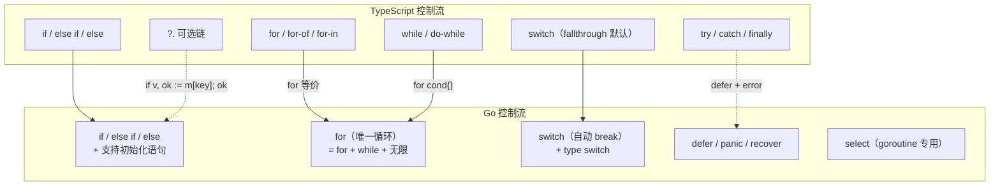
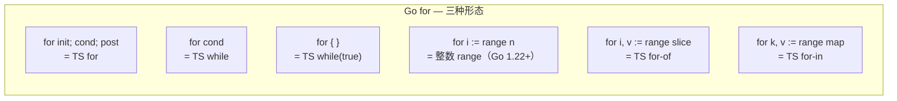
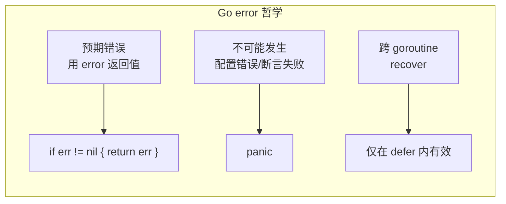

# 控制流 — Control Flow

> TypeScript: `if` / `for` / `while` / `switch` / `try-catch`
> Go: `if`（带初始化）/ `for`（唯一循环）/ `switch`（自动 break）/ `defer` / `panic-recover`

## 全景对比



---

## 1. `if` 语句

### 1.1 基本结构

```typescript
// TypeScript
const age = 20;
if (age >= 18) {
    console.log("adult");
} else if (age >= 13) {
    console.log("teen");
} else {
    console.log("child");
}
```

```go
// Go — 条件不带括号，但**必须用大括号**
age := 20
if age >= 18 {
    fmt.Println("adult")
} else if age >= 13 {
    fmt.Println("teen")
} else {
    fmt.Println("child")
}
```

### 1.2 Go 特有：带初始化语句的 if

```go
// Go — 在条件前执行一个初始化语句，变量作用域限定在 if 块内
if err := doSomething(); err != nil {
    fmt.Println("error:", err)
    return
}
// 这里 err 不可见

// 这是 Go 代码中最常见的模式之一
if v, ok := m["key"]; ok {
    fmt.Println("found:", v)
}
// 这里 v 和 ok 不可见
```

```typescript
// TypeScript — 没有等价语法，需要手动隔离
{
    const err = doSomething();
    if (err) {
        console.log("error:", err);
        return;
    }
}
// err 不可见（块级）
```

> ⚠️ **Go 的 if 初始化**：变量仅在 if/else if/else 块内可见，有效防止变量泄漏到外部作用域。

---

## 2. `for` — Go 唯一的循环

Go 只有一个循环关键词 `for`，它可以模拟所有循环形态。



### 2.1 经典 for

```typescript
// TypeScript
for (let i = 0; i < 10; i++) {
    console.log(i);
}
```

```go
// Go — 同样结构，无括号
for i := 0; i < 10; i++ {
    fmt.Println(i)
}

// Go 1.22+ 的整数 range（更简洁）
for i := range 10 {
    fmt.Println(i) // 0, 1, ..., 9
}
```

### 2.2 while 风格

```typescript
// TypeScript — while 循环
let i = 0;
while (i < 10) {
    console.log(i);
    i++;
}
```

```go
// Go — 用 for 代替 while
i := 0
for i < 10 {
    fmt.Println(i)
    i++
}
```

### 2.3 无限循环

```typescript
// TypeScript
while (true) {
    // ...
}
```

```go
// Go
for {
    // ...
}
```

### 2.4 range 迭代（最常用）

```typescript
// TypeScript
const arr = [10, 20, 30];
for (const v of arr) {       // for-of
    console.log(v);
}
for (const i in arr) {       // for-in（索引）
    console.log(i);
}
```

```go
// Go — range 支持 slice / map / string / channel
nums := []int{10, 20, 30}
for i, v := range nums {   // 索引 + 值
    fmt.Println(i, v)
}

for _, v := range nums {   // 忽略索引
    fmt.Println(v)
}

for i := range nums {      // 仅索引（Go 1.22+ 语义改进）
    fmt.Println(nums[i])
}

// map 迭代
m := map[string]int{"a": 1, "b": 2}
for k, v := range m {
    fmt.Println(k, v)
}

// string 迭代（按 rune）
s := "你好"
for i, r := range s {
    fmt.Printf("byte=%d rune=%c\n", i, r)
}
// byte=0 rune=你
// byte=3 rune=好
```

> ⚠️ **Go 1.22 关键改进**：range 循环变量不再被复用——每次迭代创建新变量。
> ```go
> // Go 1.22+：安全
> for _, v := range nums {
>     go func() { fmt.Println(v) }() // 每个 goroutine 得到正确的 v
> }
> ```

---

## 3. `switch` 语句

```go
// Go — switch 自动 break，不需要写 break

// 基础 switch
switch os := runtime.GOOS; os {
case "darwin":
    fmt.Println("macOS")
case "linux":
    fmt.Println("Linux")
default:
    fmt.Printf("%s\n", os)
}
// os 只在 switch 块内可见
```

```typescript
// TypeScript — 需要手动 break
switch (os) {
    case "darwin":
        console.log("macOS");
        break;
    case "linux":
        console.log("Linux");
        break;
    default:
        console.log(os);
}
```

### 3.1 Go 特有：表达式 switch

```go
// Go — case 可以是任意表达式，不限于常量
score := 85
switch {
case score >= 90:
    fmt.Println("A")
case score >= 80:
    fmt.Println("B")  // 匹配这里
case score >= 70:
    fmt.Println("C")
default:
    fmt.Println("F")
}
```

```typescript
// TypeScript — 等效用 if-else
```

### 3.2 Go 特有：type switch

```go
// Go — 基于类型分派（interface 场景）
func describe(v any) string {
    switch v := v.(type) {
    case nil:
        return "nil"
    case int:
        return fmt.Sprintf("int: %d", v)
    case string:
        return fmt.Sprintf("string: %q", v)
    case bool:
        return fmt.Sprintf("bool: %v", v)
    case []int:
        return fmt.Sprintf("slice: %v", v)
    default:
        return fmt.Sprintf("unknown: %T", v)
    }
}
```

```typescript
// TypeScript — 用 typeof 或 instanceof
function describe(v: unknown): string {
    if (v === null) return "null";
    if (typeof v === "number") return `number: ${v}`;
    if (typeof v === "string") return `string: ${v}`;
    return `unknown: ${typeof v}`;
}
```

### 3.3 fallthrough

```go
// Go — 默认不穿透，需要 fallthrough 关键词
switch n {
case 1:
    fmt.Println("one")
    fallthrough  // 穿透到 case 2
case 2:
    fmt.Println("two")
default:
    fmt.Println("other")
}
// n=1 时输出：one two
// n=2 时输出：two
```

---

## 4. `defer` — 特殊的控制流

已在 [函数章节](./03-functions.md) 详述，这里补充控制流视角：

```go
func example() {
    defer fmt.Println("1")  // 第三执行
    defer fmt.Println("2")  // 第二执行
    defer fmt.Println("3")  // 第一执行（LIFO）

    panic("something wrong") // panic 发生后 defer 仍然执行
    // 输出：3 2 1，然后 panic
}
```

---

## 5. `panic` / `recover` — Go 的"异常"

```go
// Go — panic 类似 TS 的 throw，recover 类似 catch
// 但 Go 工程实践推荐用 error 返回值，仅"不可能发生"的情况用 panic

func safeDivide(a, b int) (result int) {
    defer func() {
        if r := recover(); r != nil {
            fmt.Println("recovered:", r)
            result = 0  // 给返回值赋值
        }
    }()

    if b == 0 {
        panic("division by zero") // 触发 defer，然后被 recover
    }
    return a / b
}

// recover 仅在 defer 函数中有效
```

```typescript
// TypeScript
function safeDivide(a: number, b: number): number {
    try {
        if (b === 0) throw new Error("division by zero");
        return a / b;
    } catch (e) {
        console.error("recovered:", e);
        return 0;
    }
}
```



> ⚠️ **工程准则**：
> - 正常错误 → 多返回值 `(result, error)`
> - 不可恢复（空指针、数组越界）→ `panic`（由运行时触发）
> - 捕获 panic → `defer + recover`（通常只在 main / 中间件使用）

---

## 6. Go 1.18+ 泛型与 `clear()`（Go 1.21+）

```go
// Go 1.21+ — clear 内建函数清空 map 或 slice
m := map[string]int{"a": 1, "b": 2}
clear(m)   // m 变为空 map
fmt.Println(len(m)) // 0

s := []int{1, 2, 3}
clear(s)   // 元素置零：[]int{0, 0, 0}，len 不变
```

```typescript
// TypeScript
const m = new Map([["a", 1]]);
m.clear(); // 全部清空

const arr = [1, 2, 3];
arr.fill(0); // [0, 0, 0]
```

---

## 7. `goto` — 存在但极少用

```go
// Go 保留关键词，仅在某些深度嵌套循环中合理使用
for i := 0; i < 10; i++ {
    for j := 0; j < 10; j++ {
        if i*j > 50 {
            goto exit
        }
    }
}
exit:
fmt.Println("exited")
```

> ⚠️ Go 的 `goto` 不能跳过变量声明跳到块外——比其他语言限制更严格。

---

## 8. 算法刷题特供

### 8.1 Go 1.22 整数 range 循环

```go
// Go 1.22+ 新增：for i := range n
// 等价于 for i := 0; i < n; i++

// ✅ 更简洁，避免 off-by-one
for i := range 10 {
    fmt.Println(i) // 0 1 2 ... 9
}

// ✅ 配合 slice 切片
n := len(nums)
for i := range n / 2 {
    nums[i], nums[n-1-i] = nums[n-1-i], nums[i] // 反转
}

// ⚠️ range n 是 0 到 n-1，不是 1 到 n
for i := range 5 { // 0,1,2,3,4
}
// 如果要从 1 开始：
for i := 1; i <= 5; i++ {
}
```

### 8.2 带标签的 break / continue

```go
// 嵌套循环中跳出外层——标签是唯一方案

// 矩阵搜索
matrix := [][]int{{1, 2, 3}, {4, 5, 6}, {7, 8, 9}}
target := 5
found := false

outer:
for i := range matrix {
    for j := range matrix[i] {
        if matrix[i][j] == target {
            found = true
            break outer // 跳出两层循环！
        }
    }
}
fmt.Println(found) // true

// 带标签的 continue
loop:
for i := 0; i < 3; i++ {
    for j := 0; j < 3; j++ {
        if i == j { continue loop } // 跳回外层
    }
}
```

### 8.3 for-range 遍历 map 时删除

```go
// Go 允许在 for-range 中删除 map 元素
// 这是安全的行为！

m := map[string]int{"a": 1, "b": 2, "c": 3}

for k, v := range m {
    if v%2 == 0 {
        delete(m, k) // ✅ 安全！Go 保证了这一点
    }
}
// m 中只有奇数

// ❌ 但不要在 for-range 中新增 map 元素
// 行为未定义，可能新增也可能不新增
for k, v := range m {
    m["new"] = v // ❌ 不可预测
}
```

### 8.4 switch 替代 if-else 链

```go
// 算法中多条 if-else 用 switch 更清晰

// ❌ 长 if-else 链
func grade(score int) string {
    if score >= 90 { return "A" }
    if score >= 80 { return "B" }
    if score >= 70 { return "C" }
    if score >= 60 { return "D" }
    return "F"
}

// ✅ switch 无表达式版本（更清晰）
func grade(score int) string {
    switch {
    case score >= 90: return "A"
    case score >= 80: return "B"
    case score >= 70: return "C"
    case score >= 60: return "D"
    default: return "F"
    }
}

// type switch 处理多类型（常见于序列化/反序列化）
func jsonNumber(v any) float64 {
    switch n := v.(type) {
    case float64:
        return n
    case int:
        return float64(n)
    case string:
        f, _ := strconv.ParseFloat(n, 64)
        return f
    default:
        return 0
    }
}
```

### 8.5 for 循环做 BFS / 拓扑排序

```go
// BFS 标准循环模式
func bfs(graph [][]int, start int) []int {
    visited := make([]bool, len(graph))
    queue := []int{start}
    visited[start] = true
    var result []int

    for len(queue) > 0 {   // 等价 while(!queue.isEmpty())
        v := queue[0]
        queue = queue[1:]
        result = append(result, v)
        for _, u := range graph[v] {
            if !visited[u] {
                visited[u] = true
                queue = append(queue, u)
            }
        }
    }
    return result
}

// 无限循环 + 条件退出
func simulate(particles []Particle) {
    for { // while(true)
        updated := false
        for i := range particles {
            if move(&particles[i]) {
                updated = true
            }
        }
        if !updated { break }
    }
}

// for + range 遍历时用索引避免复制大结构体
type BigStruct struct { Data [1024]byte; ID int }
for i := range items {
    items[i].ID = i // ✅ 直接通过索引修改，避免复制
}
```

---

## 9. 完整对照表

| 操作 | TypeScript | Go |
|------|-----------|-----|
| if | `if (cond) {}` | `if cond {}`（无括号） |
| if 初始化 | 无 | `if v := f(); v { }` |
| for 经典 | `for (;;){}` | `for ;; {}` |
| for 条件 | `while(){}` | `for cond {}` |
| for 无限 | `while(true){}` | `for {}` |
| for-of | `for (v of arr)` | `for _, v := range arr` |
| for 索引 | `for (i in arr)` | `for i := range arr` |
| for 整数 | `for (let i=0;i<n;i++)` | `for i := range n`（1.22+） |
| switch | `switch {case:}`（穿透） | `switch {case:}`（自动 break） |
| type switch | `typeof` / `instanceof` | `v.(type)` |
| try-catch | `try {} catch {}` | `defer+recover` |
| 可选链 | `obj?.prop` | 无，用 `if v,ok := m[k]; ok` |

---

## 快速记忆

```
if cond { ... }              — 无括号，有大括号
if err := f(); err != nil {  — if 初始化（Go 标配模式）
for i := range n {           — 1.22+ 整数循环
for i, v := range arr {      — 遍历 slice / map / string / channel
for {                        — 无限循环，break 退出

switch {                     — 无表达式 = if-else 链
switch v := x.(type) {       — type switch 泛型分派

outer: for ... { break outer }  — 标签跳出嵌套循环
for k, v := range m { delete }  — range 中删除安全

!  for 是 Go 唯一循环        — 没有 while / do-while
!  switch 默认 break         — 不用写 break，穿透用 fallthrough
!  if 条件前可以初始化       — 变量在块内局部
!  标签 break 跳出多层       — 矩阵搜索必需品
!  range map 时删除元素安全  — 但新增元素行为未定义
```
