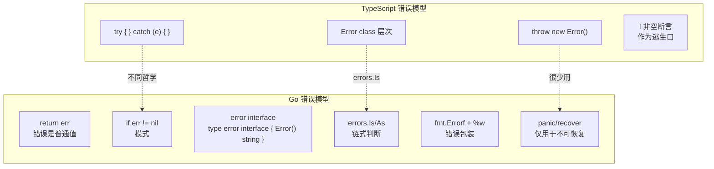
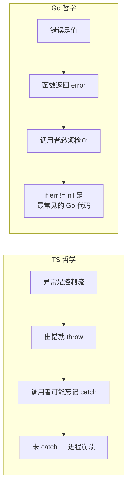
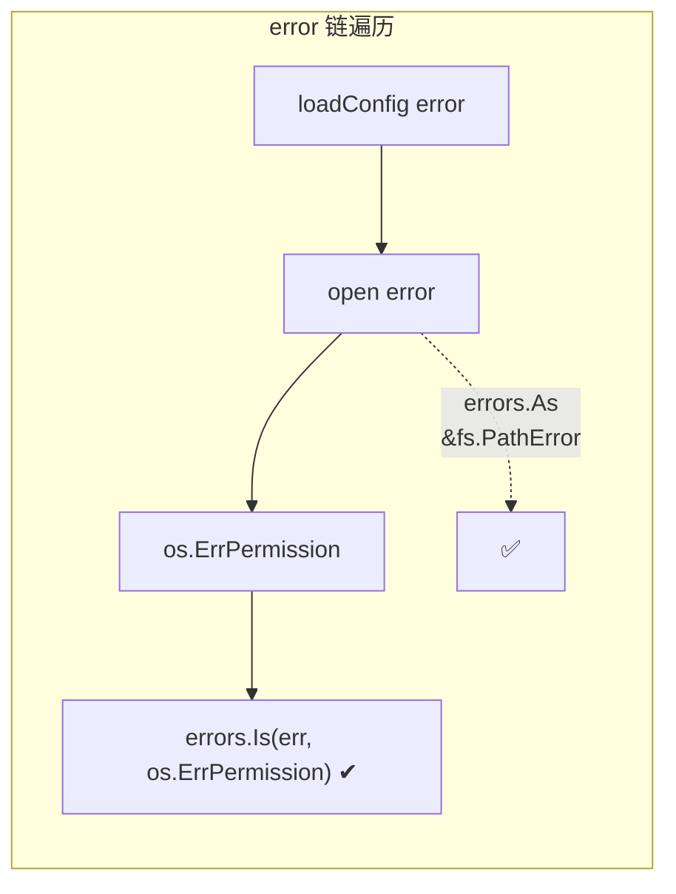

# 错误处理 — Error Handling

> TypeScript: `throw` / `try-catch` / `Error` class
> Go: `error` interface / 多返回 / `errors.Is/As` / `panic-recover`

## 全景对比



---

## 1. 核心哲学差异



```typescript
// TypeScript — try/catch 模式
function divide(a: number, b: number): number {
    if (b === 0) throw new Error("division by zero");
    return a / b;
}

function caller() {
    try {
        const r = divide(10, 0);
        console.log(r); // 不会执行
    } catch (e) {
        console.error(e.message);
    }
}
```

```go
// Go — error 作为返回值
func divide(a, b int) (int, error) {
    if b == 0 {
        return 0, errors.New("division by zero")
    }
    return a / b, nil
}

func caller() {
    r, err := divide(10, 0)
    if err != nil {
        fmt.Println("error:", err)
        return
    }
    fmt.Println(r)
}
```

> **关键差异**：Go 中 error 不会打断控制流——它是一个普通的返回值。你不检查它，程序会继续执行（可能后续 panic）。

---

## 2. `error` 接口

```go
// Go — error 是内建接口，只有一个方法
type error interface {
    Error() string
}

// 任何实现了 Error() string 的类型都可以作为 error
type MyError struct {
    Code    int
    Message string
}

func (e *MyError) Error() string {
    return fmt.Sprintf("code=%d: %s", e.Code, e.Message)
}

// 使用自定义 error
func doSomething() error {
    return &MyError{Code: 404, Message: "not found"}
}

// 调用方用类型断言获取详情
err := doSomething()
if myErr, ok := err.(*MyError); ok {
    fmt.Println(myErr.Code) // 404
}
```

```typescript
// TypeScript — 需要 extends Error
class MyError extends Error {
    constructor(public code: number, message: string) {
        super(message);
        this.name = "MyError";
    }
}
```

---

## 3. 创建错误的几种方式

```go
// 方法 1：errors.New（最简单）
err := errors.New("something went wrong")

// 方法 2：fmt.Errorf（带格式化，Go 1.13+）
err := fmt.Errorf("user %d not found", userID)

// 方法 3：自定义 struct 实现 error 接口
type ValidationError struct {
    Field string
    Value any
}
func (e *ValidationError) Error() string {
    return fmt.Sprintf("validation failed: %s = %v", e.Field, e.Value)
}

// 方法 4：包装错误（Go 1.13+）
if err := doSomething(); err != nil {
    return fmt.Errorf("doSomething failed: %w", err) // %w 创建包装链
}
```

---

## 4. 错误检查模式

### 4.1 基础模式

```go
// Go 中最常见的代码模式——没有之一
result, err := doSomething()
if err != nil {
    // 处理错误：返回、log、重试
    return fmt.Errorf("doSomething: %w", err)
}
// 继续使用 result
```

### 4.2 函数链传递

```go
func readConfig(path string) (*Config, error) {
    f, err := os.Open(path)
    if err != nil {
        return nil, fmt.Errorf("open config: %w", err)
    }
    defer f.Close()

    data, err := io.ReadAll(f)
    if err != nil {
        return nil, fmt.Errorf("read config: %w", err)
    }

    cfg, err := parseConfig(data)
    if err != nil {
        return nil, fmt.Errorf("parse config: %w", err)
    }
    return cfg, nil
}
```

### 4.3 哨兵错误（Sentinel Errors）

```go
// Go — 定义包级别的错误变量，调用方用 == 判断
var ErrNotFound = errors.New("not found")

func GetUser(id int) (*User, error) {
    if id <= 0 {
        return nil, ErrNotFound
    }
    // ...
}

// 调用方
user, err := GetUser(-1)
if err == ErrNotFound {
    fmt.Println("user not found, creating...")
    createUser()
} else if err != nil {
    fmt.Println("unexpected error:", err)
}
```

---

## 5. 错误链与 `errors.Is` / `errors.As`（Go 1.13+）

```go
// Go 1.13+ — 用 %w 构建错误链
type ConfigError struct {
    Path string
    Err  error
}
func (e *ConfigError) Error() string {
    return fmt.Sprintf("config %s: %v", e.Path, e.Err)
}
func (e *ConfigError) Unwrap() error {
    return e.Err
}

// 或者用 fmt.Errorf + %w 自动包装
func loadConfig(path string) error {
    if err := openFile(path); err != nil {
        return fmt.Errorf("load config %s: %w", path, err) // %w 创建包装链
    }
    return nil
}

// errors.Is — 沿着错误链找匹配的哨兵错误
var ErrPermission = errors.New("permission denied")

func openFile(path string) error {
    return fmt.Errorf("open %s: %w", path, ErrPermission)
}

func caller() {
    err := loadConfig("/etc/app.conf")
    if errors.Is(err, ErrPermission) {
        // 即使经过多层包装，也能匹配到 ErrPermission
        fmt.Println("permission issue, trying fallback...")
    }
}

// errors.As — 沿着错误链找匹配的 error 类型
func caller() {
    err := loadConfig("/etc/app.conf")
    var cfgErr *ConfigError
    if errors.As(err, &cfgErr) {
        fmt.Println("config error:", cfgErr.Path)
    }
}
```

```typescript
// TypeScript — 用 instanceof 判断错误类型
try {
    const cfg = loadConfig("/etc/app.conf");
} catch (err) {
    if (err instanceof ConfigError) {
        console.log(err.path);
    } else if (err instanceof TypeError) {
        // ...
    }
}
```



> ⚠️ **`%w` vs `%v`**：
> - `%w` — 可被 `errors.Is/As` 遍历（需要 unwrap）
> - `%v` — 只生成字符串，不保留链式信息
>
> 只在需要调用方检查的包装用 `%w`，一般错误信息用 `%v`。

---

## 6. `panic` / `recover` — Go 的"真异常"

```go
// panic 相当于 throw，recover 相当于 catch
// 但 Go 工程准则：仅「不可能发生」的情况用 panic

func mustParse(input string) int {
    n, err := strconv.Atoi(input)
    if err != nil {
        panic(fmt.Sprintf("invalid input: %s", input)) // 配置错误，panic
    }
    return n
}

// recover 仅在 defer 内有效
func safeCaller() {
    defer func() {
        if r := recover(); r != nil {
            fmt.Println("recovered from panic:", r)
        }
    }()

    n := mustParse("not-a-number") // panic，被 recover
    fmt.Println(n)                 // 不会执行
}

// recover 返回 panic 的值，可用类型断言判断
defer func() {
    if r := recover(); r != nil {
        switch e := r.(type) {
        case string:
            fmt.Println("panic with string:", e)
        case error:
            fmt.Println("panic with error:", e)
        default:
            fmt.Println("unknown panic value")
        }
    }
}()
```

```typescript
// TypeScript
function mustParse(input: string): number {
    const n = parseInt(input, 10);
    if (isNaN(n)) throw new Error(`invalid input: ${input}`);
    return n;
}

function safeCaller() {
    try {
        const n = mustParse("not-a-number");
    } catch (e) {
        if (e instanceof Error) console.log(e.message);
    }
}
```

---

## 7. Go 1.20+ 的多个错误合并

```go
// Go 1.20+ — errors.Join 合并多个独立错误
err1 := errors.New("error 1")
err2 := errors.New("error 2")

combined := errors.Join(err1, err2)
fmt.Println(combined) // "error 1\nerror 2"
fmt.Println(errors.Is(combined, err1)) // true
fmt.Println(errors.Is(combined, err2)) // true

// 常用于验证多个条件
func validate(input string) error {
    var errs []error
    if len(input) == 0 {
        errs = append(errs, errors.New("input is empty"))
    }
    if len(input) > 100 {
        errs = append(errs, errors.New("input too long"))
    }
    return errors.Join(errs...) // nil 如果 errs 为空
}
```

---

## 8. 泛型与错误

```go
// Go 1.18+ — 泛型函数也可以返回 error
func Must[T any](v T, err error) T {
    if err != nil {
        panic(err)
    }
    return v
}

// 使用
n := Must(strconv.Atoi("42")) // 返回 int，panic 如果 error
```

---

## 9. 工程实践模式

```go
// 模式 1：快速返回（early return）— 避免深度嵌套
func process(r io.Reader) error {
    data, err := io.ReadAll(r)
    if err != nil {
        return fmt.Errorf("read: %w", err)
    }

    cfg, err := parse(data)
    if err != nil {
        return fmt.Errorf("parse: %w", err)
    }

    return save(cfg)
}

// 模式 2：defer 进行清理 + 错误包装
func readFile(path string) (data []byte, err error) {
    f, err := os.Open(path)
    if err != nil {
        return nil, err
    }
    defer func() {
        closeErr := f.Close()
        if err == nil {
            err = closeErr // 如果读成功但关闭失败，返回关闭错误
        }
    }()

    return io.ReadAll(f)
}
```

```typescript
// TypeScript — 类似模式
function process(stream: ReadableStream): Promise<void> {
    const reader = stream.getReader();
    // ...
}
```

---

## 10. 完整对照表

| 操作 | TypeScript | Go |
|------|-----------|-----|
| 创建错误 | `new Error("msg")` | `errors.New("msg")` |
| 格式化错误 | `new Error(template)` | `fmt.Errorf("fmt %s", v)` |
| 抛错 | `throw err` | 极少用 `panic(err)` |
| 捕获 | `try { } catch(e) { }` | `defer + recover()` |
| 检查错误 | `catch(e)` 隐式 | `if err != nil` 显式 |
| 错误类型 | `instanceof` | `errors.As` |
| 错误相等 | `===` 哨兵 | `errors.Is`（支持链） |
| 错误包装 | `message: ${cause}` | `fmt.Errorf("%w", err)`（可拆解） |
| 多错误合并 | 无标准 | `errors.Join`（1.20+） |
| 最终清理 | `finally {}` | `defer` |
| 非空断言 | `x!` | 无，用 `Must()` 泛型 |

---

## 快速记忆

```
return val, nil          — 成功
return nil, err          — 失败
return nil, fmt.Errorf("ctx: %w", err)  — 包装错误

if err != nil {          — Go 中最常见的 3 行
    return err
}

errors.Is(err, Sentinel) — 检查链中是否包含某哨兵
errors.As(err, &Type)    — 检查链中是否包含某类型

!  error 是值，不是控制流  — 必须手动检查
!  panic 用于「不可能」     — 配置错误、断言失败
!  recover 仅在 defer 内   — 跨 goroutine 无效
!  %w 构建链，%v 不构建    — 只在需要被检查时用 %w
```
