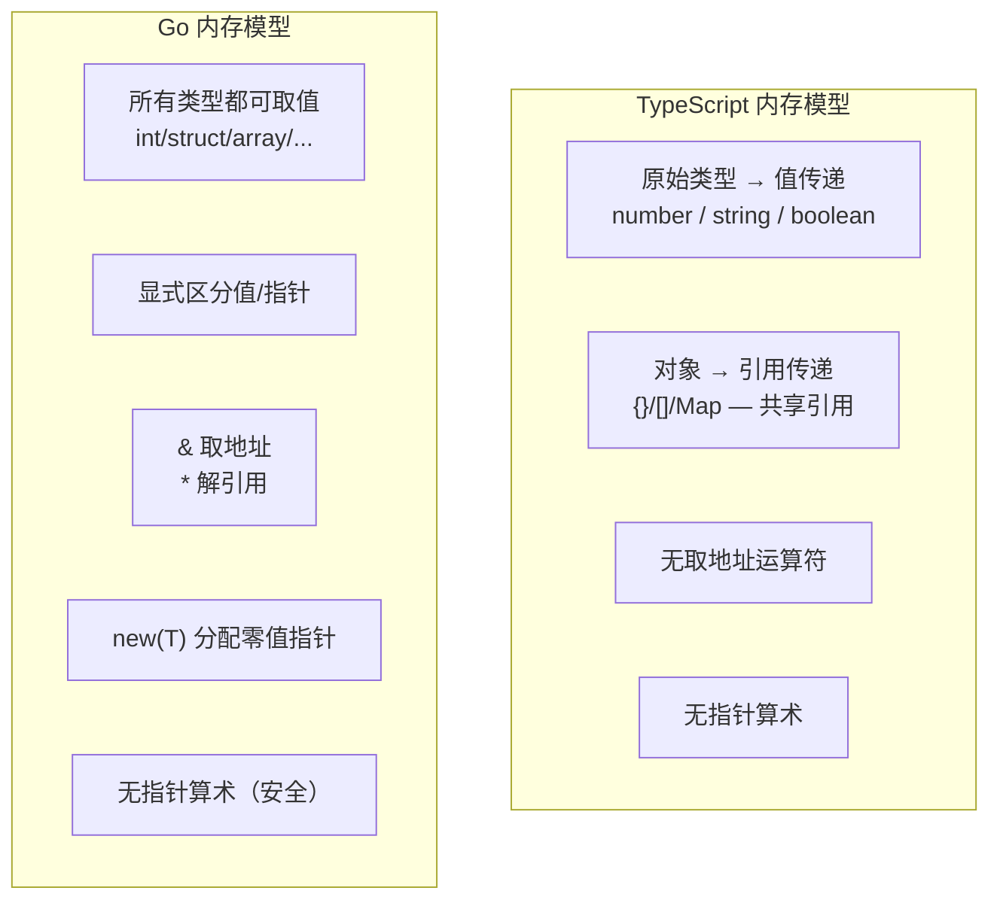
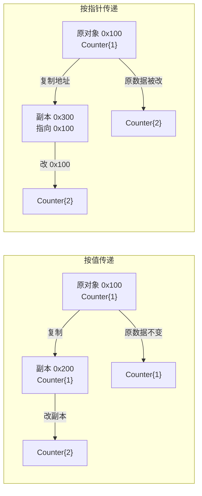
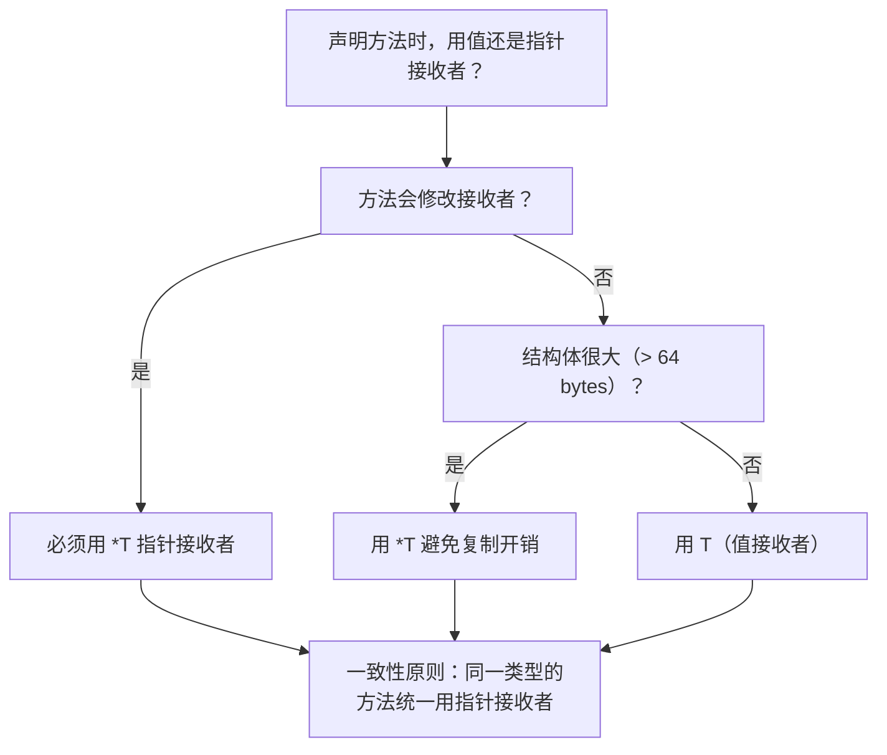
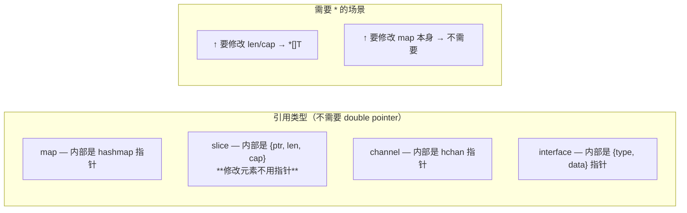

# 指针 — Pointers

> TypeScript: 无指针概念，所有对象按引用传递（且不暴露地址）
> Go: 显式指针 `*T` / `&` 取地址 / `new` 分配

## 全景对比



---

## 1. 为什么 Go 需要指针（而 TS 不需要）

```typescript
// TypeScript — 对象总是共享引用
function increment(obj: { value: number }) {
    obj.value++;
}

const x = { value: 1 };
increment(x);
console.log(x.value); // 2 ✅ 修改了原对象

// 但对于原始类型不行——总是复制
function incrementValue(v: number) {
    v++;
}

let a = 1;
incrementValue(a);
console.log(a); // 1 ❌ 没变，因为 number 按值传递
```

```go
// Go — 你必须自己决定"按值"还是"按指针"
type Counter struct{ Value int }

// 按值传递（复制整个结构体）
func incrementValue(c Counter) {
    c.Value++
}
// ✅ 不修改原结构体

// 按指针传递（复制地址，不复制数据）
func incrementPointer(c *Counter) {
    c.Value++ // 等价于 (*c).Value++
}

counter := Counter{Value: 1}
incrementValue(counter)
fmt.Println(counter.Value) // 1 ❌ 没变

incrementPointer(&counter)
fmt.Println(counter.Value) // 2 ✅ 修改了原对象
```



---

## 2. 指针基础语法

```go
// 声明指针变量
var p *int           // p 是一个指向 int 的指针，零值为 nil
var s *string        // 指向 string 的指针

// 取地址 &
x := 42
p = &x               // p 指向 x 的地址
fmt.Println(p)       // 0xc0000b2008（内存地址，每次运行不同）

// 解引用 *
fmt.Println(*p)      // 42（取指针指向的值）
*p = 100             // 修改 x 的值
fmt.Println(x)       // 100

// new 函数：分配零值并返回指针
p2 := new(int)       // *int，指向零值 0
fmt.Println(*p2)     // 0
```

```typescript
// TypeScript — 没有等价语法
// 最接近是对象引用，但不暴露地址
let x = 42;
// 无法取 x 的地址，无法创建指向 x 的指针
```

> ⚠️ **与 C/C++ 不同**：Go 指针不支持算术运算——不能 `p++` 或 `p + 8`。这意味着 Go 指针比 C 指针安全得多（没有缓冲区溢出攻击）。

---

## 3. 指针与 struct

```go
type User struct {
    Name string
    Age  int
}

// 方式 1：直接值
u := User{Name: "Alice", Age: 30}

// 方式 2：取结构体地址（返回 *User）
u2 := &User{Name: "Bob", Age: 25}

// 方式 3：new
u3 := new(User) // *User，字段全零值
u3.Name = "Charlie"

// 方式 4：函数返回指针
func NewUser(name string, age int) *User {
    return &User{Name: name, Age: age} // Go 会逃逸到堆上
}
```

> ⚠️ **Go 允许取局部变量的地址并返回**——逃逸分析自动决定分配堆上还是栈上：
> ```go
> func createPointer() *int {
>     x := 42
>     return &x  // ✅ x 逃逸到堆上，不会悬空
> }
> ```
>
> 这是与 C 的关键区别——Go 没有悬空指针。

---

## 4. 值接收者 vs 指针接收者

```go
// 这是 Go 中最常纠结的选择
type Counter struct{ value int }

// 值接收者（不修改原对象）
func (c Counter) Value() int {
    return c.value
}

// 指针接收者（修改原对象）
func (c *Counter) Increment() {
    c.value++
}

c := Counter{value: 10}
c.Increment()                   // Go 自动取 &c 调用指针方法
fmt.Println(c.Value())          // 11

// 也可以显式
(&c).Increment()                // 显式取地址
```

```typescript
// TypeScript — class 方法总是引用 this
class Counter {
    constructor(public value: number) {}
    increment() { this.value++; }
}
```

**选择规则**：



> ⚠️ **一致性格言**：不要在一个类型上混用值接收者和指针接收者。选一个方式全用——通常选指针接收者。

---

## 5. nil 指针与安全

```go
// Go 指针的零值是 nil
var p *int
fmt.Println(p == nil) // true
// fmt.Println(*p)    // panic: runtime error: invalid memory address

// 安全解引用模式
if p != nil {
    fmt.Println(*p)
}

// 常见的 nil 检查
type Config struct {
    Host string
    Port int
}

func (c *Config) Addr() string {
    if c == nil {
        return "default:8080"
    }
    return fmt.Sprintf("%s:%d", c.Host, c.Port)
}

var cfg *Config // nil
fmt.Println(cfg.Addr()) // "default:8080" — 方法可以在 nil 接收者上安全调用！
```

> ⚠️ **Go 可以在 nil 指针上调用方法**——只要方法内部做了 nil 检查。这与 TS/Java 不同。

---

## 6. 指针与 slice / map / channel

```go
// ❌ 常见误解：slice / map / channel 本身就是引用类型，不需要指针
// 但修改 slice 的 header（长度、容量）需要指针

func appendItem(s *[]int, v int) {
    *s = append(*s, v) // 修改 slice header，需要指针
}

nums := []int{1, 2, 3}
appendItem(&nums, 4)
fmt.Println(nums) // [1 2 3 4]

// map 本身就是引用——不需要 *map
func setValue(m map[string]int, key string, v int) {
    m[key] = v // 直接修改原 map
}

// channel 也是引用——不需要 *chan
```



---

## 7. 泛型与指针

```go
// Go 1.18+ — 泛型约束也可能包含指针
func Zero[T any]() *T {
    return new(T) // 返回零值的指针
}

x := Zero[int]()    // *int，指向 0
s := Zero[string]() // *string，指向 ""

// 指针类型作为类型参数
func Clone[T any](v *T) *T {
    c := *v  // 解引用复制
    return &c
}

type User struct{ Name string }
original := &User{Name: "Alice"}
clone := Clone(original)
clone.Name = "Bob"
fmt.Println(original.Name) // "Alice" — 不受影响
```

---

## 8. 指针 vs 值 — 性能与语义

| 场景 | 值传递 | 指针传递 |
|------|--------|---------|
| 修改原对象 | ❌ | ✅ |
| 复制成本 | 复制整个数据 | 复制地址（8 字节） |
| 大结构体 | 较高 | 低 |
| 小结构体（int/bool/小 struct） | 可忽略 | 可能更慢（间接访问） |
| 并发安全 | ✅ 天然隔离 | ⚠️ 需要锁 |
| nil 语义 | 不可能 nil | ✅ 可为 nil |
| 逃逸到堆上 | 通常栈上 | 可能堆上（GC 压力） |

---

## 9. 完整对照表

| 操作 | TypeScript | Go |
|------|-----------|-----|
| 取地址 | 无 | `&x` |
| 解引用 | `obj.prop` 隐式 | `*p` / 自动解引用 `.` |
| 声明指针类型 | 无 | `var p *T` |
| 分配零值指针 | `{}` 手动 | `new(T)` |
| 值接收者 | class 方法 = 引用 | 复制接收者 |
| 指针接收者 | `this` | `func (s *T)` |
| nil 检查 | `if (x === null)` | `if p != nil` |
| nil 方法调用 | ❌ TypeError | ✅ 方法内可检查 |
| 返回局部变量地址 | N/A | ✅ 逃逸分析 |
| 指针算术 | 无 | ❌ 不支持 |

---

## 快速记忆

```
&x   → 取 x 的地址（pointer to x）
*p   → 取指针 p 指向的值（dereference）
new(T) → *T 指向零值

值接收者  → func (s T) Method()  — 复制
指针接收者 → func (s *T) Method() — 引用

选指针接收者：修改、大结构体、一致性
选值接收者：小结构体、不可变性、并发安全

!  Go 指针是安全的     — 无指针算术、无悬空指针
!  Go 可返回局部地址   — 逃逸分析决定分配位置
!  同类型方法统一风格  — 不要混用值/指针接收者
!  map/slice/channel 已经引用 — 传递不需要 *
!  nil 指针上可调方法  — 方法内部检查 nil
```
