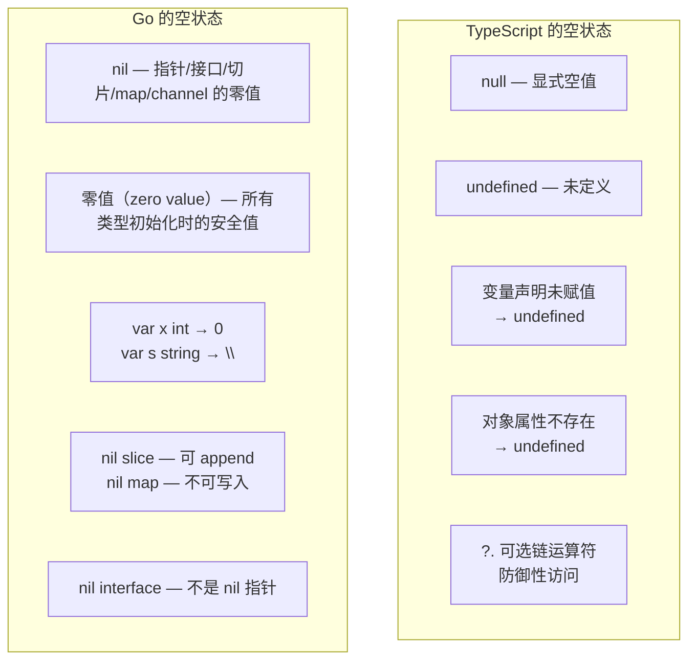
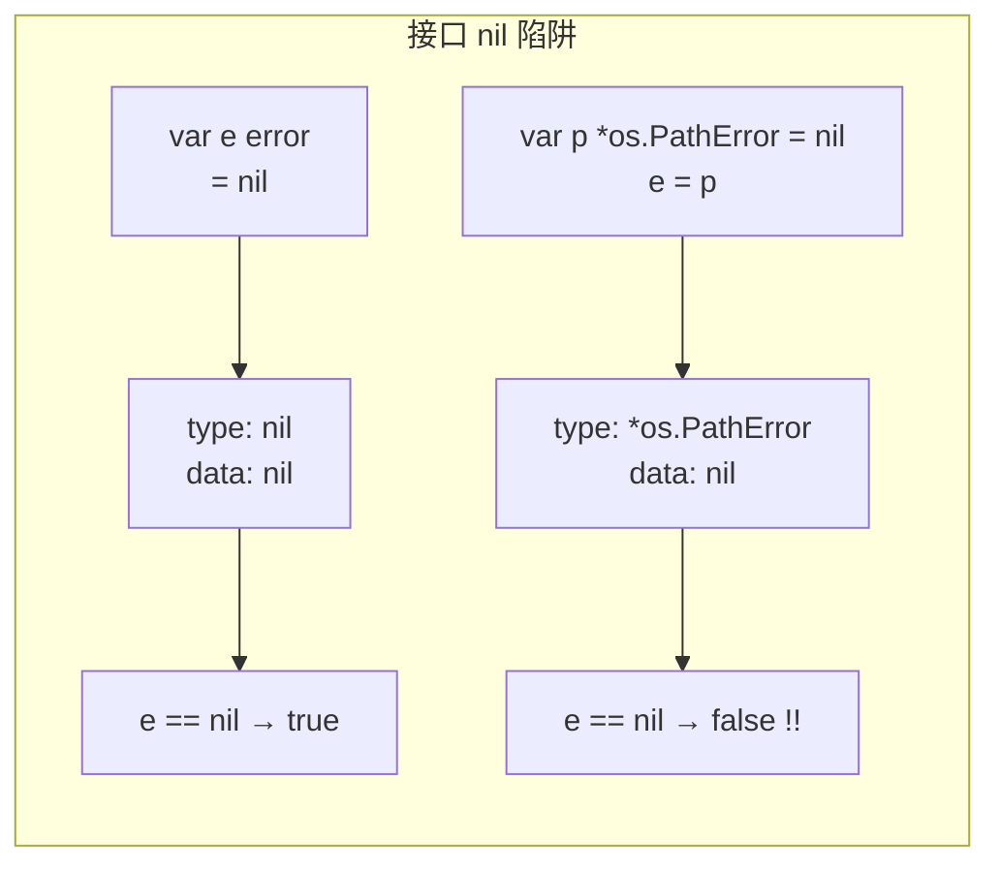

# nil 与零值 — nil & Zero Values

> TypeScript: `null` / `undefined` / uninitialized state
> Go: `nil` / 零值（zero values） 两个不同概念

## 全景对比



---

## 1. 核心区别

```typescript
// TypeScript — 两种空
let a: number | null = null;      // 显式空
let b: number;                     // undefined（声明未赋值）
let c: { x?: number } = {};       // c.x → undefined（属性不存在）
```

```go
// Go — 每个类型都有一个零值，nil 仅适用于特定类型
// 零值（zero value）：所有类型声明后自动拥有的初值
var x int          // 0
var s string       // ""
var b bool         // false
var f float64      // 0.0

// nil：以下 5 种类型的零值
var p *int         // nil（指针）
var sl []int       // nil（切片）
var m map[int]bool // nil（map）
var c chan int     // nil（channel）
var i error        // nil（接口）
```

> **设计哲学**：Go 的零值确保**所有变量都可安全使用**——不存在 TS 中 `undefined + 1` → `NaN` 的情况。

---

## 2. 零值的实际意义

```go
// Go — 零值使结构体可直接使用
type Server struct {
    Host string
    Port int
}

// 全零值结构体即可用
var srv Server
srv.Host = "localhost" // ✅ Port 是 0 也合理（默认端口）

// sync.Mutex 零值可用（这是经典设计）
var mu sync.Mutex
mu.Lock()   // ✅ 不需要初始化
mu.Unlock()

// 零值 slice 可 append
var nums []int           // nil, len=0
nums = append(nums, 1)   // ✅ 直接使用

// 零值 string 可拼接
var s string             // ""
s += "hello"             // ✅
```

```typescript
// TypeScript — 没有零值概念，所有值必须显式初始化
let x: number;       // undefined
// x + 1 → NaN       ❌

let server: { host: string; port: number };
// server.host = "localhost";  // ❌ TypeError: Cannot set properties of undefined
```

---

## 3. nil 的详细行为

### 3.1 nil 指针

```go
var p *int           // nil
// *p = 42           // ❌ panic: runtime error（解引用 nil 指针）

// 安全模式
if p != nil {
    fmt.Println(*p)
}

// 但是在 nil 指针上调用方法是可以的（前提方法内部做了 nil 检查）
type IntBox struct{ val int }
func (b *IntBox) Get() int {
    if b == nil {
        return 0
    }
    return b.val
}

var box *IntBox // nil
fmt.Println(box.Get()) // 0，不是 panic
```

### 3.2 nil slice

```go
var s []int             // nil, len=0, cap=0
fmt.Println(len(s))     // 0
fmt.Println(cap(s))     // 0

// ✅ nil slice 可安全使用的操作
s = append(s, 1)        // ✅ 变成 []int{1}
for i, v := range s {   // ✅ 零次迭代
    // ...
}
_ = s[:0]               // ✅ 空切片

// ❌ nil slice 不能做的操作
// s[0] = 1             // ❌ panic: index out of range
// s[0:1]               // ❌ panic（同上，cap=0）
```

### 3.3 nil map

```go
var m map[string]int    // nil

// ✅
_, ok := m["key"]       // ok=false，不 panic
for k, v := range m {   // ✅ 零次迭代
    // ...
}

// ❌ nil map 写入会 panic
// m["key"] = 1         // ❌ panic: assignment to entry in nil map

// ✅ 必须先初始化
m = make(map[string]int)  // 或 map[string]int{}
m["key"] = 1              // ✅
```

### 3.4 nil channel

```go
var c chan int          // nil

// nil channel 的读写会永久阻塞
// c <- 1               // ❌ 永久阻塞
// <-c                  // ❌ 永久阻塞

// nil channel 在 select 中不会被选中——这是特性！
select {
case v := <-c:          // 永不会执行（c 是 nil）
    fmt.Println(v)
case <-time.After(1 * time.Second):
    fmt.Println("timeout")
}

// 关闭 nil channel 会 panic
// close(c)             // ❌ panic: close of nil channel
```

### 3.5 nil interface

```go
// 这是 Go 中最容易踩的 nil 陷阱
var e error            // nil（接口类型）
fmt.Println(e == nil)  // true

// ⚠️ 将一个具体类型的 nil 指针赋给接口
var p *os.PathError = nil
e = p
fmt.Println(e == nil)  // false！因为接口有具体类型信息
// 接口的 nil 检查：只有 type 和 data 都为 nil 才是真 nil
```



```go
// 正确检查方式
func checkError(e error) {
    if e == nil {
        fmt.Println("no error") // 某些情况下不会执行！
    }
    
    // 安全做法：反射检查底层值
    if v := reflect.ValueOf(e); !v.IsValid() || v.IsNil() {
        fmt.Println("truly nil")
    }
}

// 更好的做法：永远返回 error 类型而非 *具体类型
func maybeError() error {
    var p *os.PathError = nil
    return p // ❌ 调用方检查 e == nil 会失败
}

func maybeError2() error {
    // ✅ 直接返回 nil（error 类型）
    return nil
}
```

---

## 4. TS 到 Go 的语义映射

| TS 写法 | Go 写法 | 说明 |
|---------|---------|------|
| `let x: number` → `undefined` | `var x int` → `0` | 零值安全，不会 NaN |
| `let x: T \| null = null` | `var x *T = nil` | 用指针表示可空 |
| `let x: T \| undefined` | `var x T`（零值）或 `*T` | 大多情况零值够用 |
| `obj?.prop` | `if v, ok := m[k]; ok` | map 安全访问 |
| `arr?.length` | `len(slice)` | nil slice 的 len 是 0 |
| `null ?? defaultValue` | `if v == nil { v = defaultValue }` | 无 nullish coalescing |

---

## 5. Go 1.21+ 的 `clear()` 与零值

```go
// Go 1.21+ — clear() 将元素"还原"到零值
s := []int{1, 2, 3}
clear(s)      // s = []int{0, 0, 0}（元素置零，len 不变）

m := map[string]int{"a": 1}
clear(m)      // m = map[string]int{}（清空，不是 nil）
```

---

## 6. 完整对照表

| 操作 | TypeScript | Go |
|------|-----------|-----|
| 空值声明 | `let x: T = null` | `var x *T = nil` |
| 未初始化 | `let x: T` → `undefined` | `var x T` → 零值 |
| 可选属性 | `prop?: T` → `undefined` | 无（用 `*T` 或 `zero`） |
| nil 检查 | `if (x === null)` | `if p != nil` |
| 接口 nil | `null` | 小心 type+data 双 nil |
| 字符串空 | `"" == null` → false | `"" != nil`（nil 与空串不同） |
| 默认值 | `x ?? defaultValue` | 手动 if 检查（无运算符） |
| 可选链 | `obj?.prop` | 无，用 if 提前 return |
| nil slice | `[]` | `nil` 但可 append |
| nil map | `new Map()` | `nil`，不可写入 |

---

## 快速记忆

```
零值（zero value）— 所有类型的默认状态
    bool → false
    int  → 0
    string → ""
    struct → 每个字段递归零值

nil — 5 种引用类型的零值
    *T 指针     — 解引用 panic，方法可调
    []T slice   — 可 append/range/len ✅
    map[T]U     — 可读 ❌ 写会 panic
    chan T      — 读写阻塞
    interface   — 小心 type wrapper 陷阱

!  零值是安全值 — 不是 undefined 不会 NaN
!  nil slice 可 append — 不需要 make
!  nil map 不可写     — 先 make
!  nil 接口有类型信息  — 具体类型的 nil ≠ nil
```
