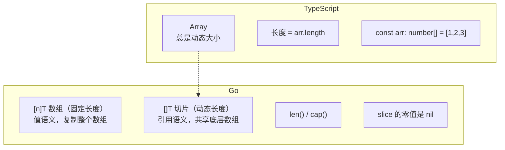
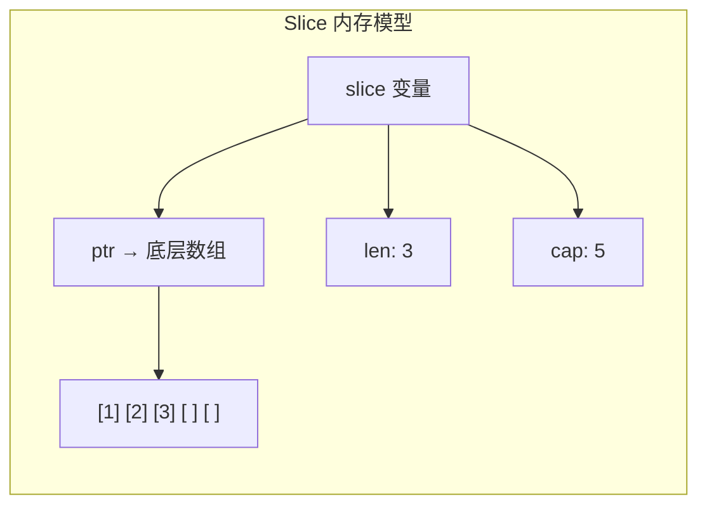
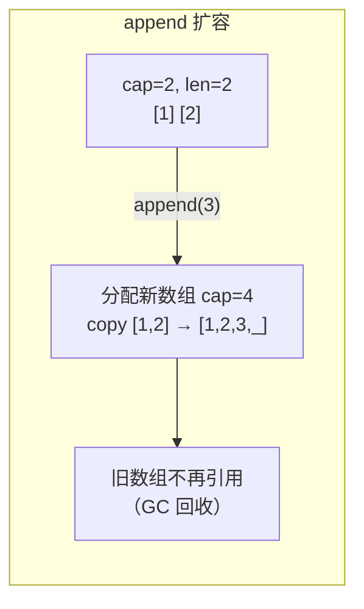
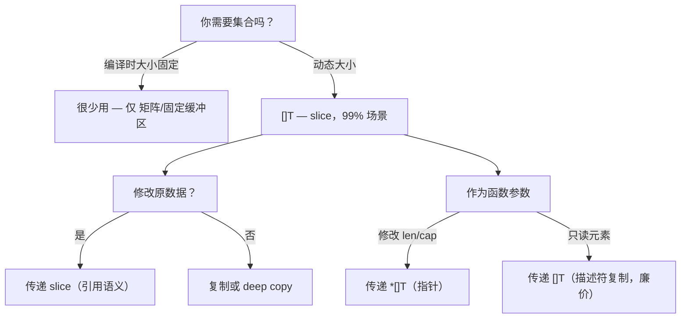

# 数组与切片 — Array vs Slice

> TypeScript: `Array<T>` / 动态长度
> Go: `[n]T`（数组，固定长度） vs `[]T`（切片，动态长度）

## 全景对比



---

## 1. 数组（Array）

```go
// Go — 数组是值类型，长度是类型的一部分
var arr [3]int               // [0, 0, 0]
arr[0] = 1
fmt.Println(arr)             // [1, 0, 0]
fmt.Println(len(arr))        // 3

// 字面量初始化
arr2 := [3]int{1, 2, 3}      // [1, 2, 3]
arr3 := [...]int{1, 2, 3}    // 编译器推断长度 → [3]int

// ⚠️ 数组是值类型——赋值会复制整个数组
a := [3]int{1, 2, 3}
b := a                        // 复制！b 是独立副本
b[0] = 100
fmt.Println(a[0])            // 1（不受影响）

// 函数参数也是复制
func modify(arr [3]int) {
    arr[0] = 999
}
modify(a)
fmt.Println(a[0])             // 1（不受影响）
```

```typescript
// TypeScript — 数组总是引用类型
const arr = [1, 2, 3];
const brr = arr;          // 引用，不是复制
brr[0] = 100;
console.log(arr[0]);      // 100 ⚠️ 被修改了
```

> **实际使用**：Go 中数组很少直接使用——99% 的场景用 slice。数组主要出现在：
> - 固定大小的缓冲区 `[64]byte`
> - 矩阵计算 `[3][3]float64`
> - 与 C 交互（cgo）

---

## 2. 切片（Slice）— Go 的核心

```go
// 切片声明
var s []int              // nil slice，len=0，cap=0
s2 := []int{1, 2, 3}     // 字面量：len=3，cap=3
s3 := make([]int, 3)     // [0, 0, 0]，len=3，cap=3
s4 := make([]int, 3, 5)  // [0, 0, 0]，len=3，cap=5

// 切片是引用类型
a := []int{1, 2, 3}
b := a                    // 共享底层数组！
b[0] = 100
fmt.Println(a[0])         // 100（被修改了）
```

### 2.1 Slice 内部结构



```go
// slice = struct { ptr *[N]T; len int; cap int }
// 所以传递 slice 只复制这个"描述符"，底层数组共享
```

### 2.2 切片操作

```typescript
// TypeScript
const arr = [0, 1, 2, 3, 4, 5];
arr.slice(1, 4);     // [1, 2, 3]（新数组）
```

```go
// Go — 切片操作不复制数据！是底层数组的视图
arr := []int{0, 1, 2, 3, 4, 5}
s := arr[1:4]         // [1, 2, 3]，共享 arr 的底层数组

// 修改会影响原数组
s[0] = 100
fmt.Println(arr[1])   // 100

// 完整切片表达式：控制新 slice 的容量
s2 := arr[1:4:5]      // ptr=arr[1], len=3, cap=4（限制 append 范围）
```

### 2.3 append 与扩容

```go
// append 是 Go 最常用的内建函数
var s []int
s = append(s, 1)       // [1]
s = append(s, 2, 3)    // [1, 2, 3]
s = append(s, []int{4, 5}...) // [1, 2, 3, 4, 5]

// 扩容规则：
// - len < 256: 翻倍
// - len ≥ 256: 增加 ~25%
s := make([]int, 0, 2) // cap=2
s = append(s, 1)       // len=1, cap=2
s = append(s, 2)       // len=2, cap=2
s = append(s, 3)       // len=3, cap=4 ← 扩容！复制整个底层数组
```



> ⚠️ **append 陷阱**：容量不足时重新分配——旧 slice 和 新 slice 不再共享数组。
> ```go
> s := []int{1, 2, 3}
> s2 := s
> s = append(s, 4)     // 容量够（原来 cap=3? 不，字面量 cap=len=3）
>  // 需要扩容！s 指向新数组，s2 仍然指向旧数组
> // s[0] 和 s2[0] 不再指向同一地址
> ```
>
> 字面量 `[]int{1,2,3}` 的 cap = len = 3，所以 append 立即触发扩容。

---

## 3. 泛型与 slice

```go
// Go 1.18+ — 泛型 slice 操作
func Filter[T any](s []T, pred func(T) bool) []T {
    var result []T
    for _, v := range s {
        if pred(v) {
            result = append(result, v)
        }
    }
    return result
}

func Map[T, U any](s []T, f func(T) U) []U {
    result := make([]U, len(s))
    for i, v := range s {
        result[i] = f(v)
    }
    return result
}

func Reduce[T, U any](s []T, init U, f func(U, T) U) U {
    acc := init
    for _, v := range s {
        acc = f(acc, v)
    }
    return acc
}

// 使用
nums := []int{1, 2, 3, 4, 5}
evens := Filter(nums, func(v int) bool { return v%2 == 0 })
doubled := Map(nums, func(v int) int { return v * 2 })
sum := Reduce(nums, 0, func(acc, v int) int { return acc + v })
```

```typescript
// TypeScript
const nums = [1, 2, 3, 4, 5];
const evens = nums.filter(v => v % 2 === 0);
const doubled = nums.map(v => v * 2);
const sum = nums.reduce((acc, v) => acc + v, 0);
```

---

## 4. slice 的常见操作

```go
// 复制
src := []int{1, 2, 3}
dst := make([]int, len(src))
copy(dst, src) // 返回复制元素数

// 单行复制
clone := append([]int(nil), src...) // 简洁常用

// 删除（不保留顺序）
s := []int{1, 2, 3, 4, 5}
i := 2
s[i] = s[len(s)-1] // 用最后一个元素覆盖
s = s[:len(s)-1]   // 截断
// s = [1, 2, 5, 4]

// 删除（保留顺序）— 需要复制
s = []int{1, 2, 3, 4, 5}
s = append(s[:i], s[i+1:]...)
// s = [1, 2, 4, 5]

// 插入
s = []int{1, 2, 4, 5}
s = append(s, 0)            // 扩展一位
copy(s[i+1:], s[i:])       // 后移
s[i] = 3                    // 插入
// s = [1, 2, 3, 4, 5]

// 清空
s = s[:0]                   // len=0，cap 不变（复用底层数组）
```

```typescript
// TypeScript
const arr = [1, 2, 3, 4, 5];
arr.splice(2, 1);           // 删除索引 2
arr.splice(2, 0, 3);        // 在索引 2 插入 3
```

---

## 5. 算法刷题特供

这里集中了你刷 LeetCode / 笔试题时 slice 的**高频坑和便捷模式**。

### 5.1 预分配容量（Pre-allocation）

```go
// ❌ 反复 append 导致多次扩容
var s []int
for i := 0; i < 100000; i++ {
    s = append(s, i) // 扩容约 18 次，每次复制全部数据
}

// ✅ 预分配容量，零次扩容
s := make([]int, 0, 100000)
for i := 0; i < 100000; i++ {
    s = append(s, i) // 全程不扩容
}

// 知道长度时还可以直接赋值而非 append
s := make([]int, 100000)
for i := range s {
    s[i] = i  // 更快，无需 len 检查
}
```

> **扩容成本**：`append` 不需要你手动管理内存，但扩容 = 全部复制。刷题时大数据量预分配是质变级别的优化。

### 5.2 二维 slice（DP 数组的噩梦）

```go
// ❌ 错误：make 了第一层，忘记初始化第二层
dp := make([][]int, n)     // dp[i] 都是 nil
// dp[0][0] = 1            // panic: index out of range

// ✅ 方式 1：循环初始化
dp := make([][]int, n)
for i := range dp {
    dp[i] = make([]int, m) // 每个子 slice 独立数组
}

// ✅ 方式 2：一次性分配（更快，连续内存）
dp := make([][]int, n)
data := make([]int, n*m)   // 一块连续内存
for i := range dp {
    dp[i] = data[i*m : (i+1)*m] // 切片引用，不复制
}

// ✅ 方式 3：一行初始化（适合小规模）
n, m := 5, 5
dp := make([][]int, n)
for i := range dp {
    dp[i] = append(make([]int, 0, m), make([]int, m)...)
}
```

```typescript
// TypeScript
const dp = Array.from({ length: n }, () => new Array(m).fill(0));
```

### 5.3 sort.Slice（算法中最常用的模式）

```go
import "sort"

nums := []int{3, 1, 4, 1, 5}

// 升序
sort.Slice(nums, func(i, j int) bool { return nums[i] < nums[j] })

// 降序
sort.Slice(nums, func(i, j int) bool { return nums[i] > nums[j] })

// 按自定义规则排序（最常见的算法需求）
type Item struct { Val int; Priority int }
items := []Item{{3, 1}, {1, 5}, {4, 2}}
sort.Slice(items, func(i, j int) bool {
    return items[i].Priority > items[j].Priority // 按优先级降序
})

// sort.Ints / sort.Strings（简便方法）
sort.Ints(nums)
sort.SliceIsSorted(nums, func(i, j int) bool { return nums[i] < nums[j] }) // 检查

// Go 1.21+ 的 slices 包
import "slices"
slices.Sort(nums)               // 升序
slices.SortFunc(items, func(a, b Item) int {
    return cmp.Compare(a.Priority, b.Priority)
})
slices.Reverse(nums)            // 反转
slices.Compact(sorted)          // 去重（相邻且相等）
slices.Index(nums, 42)          // 查找
slices.Contains(nums, 42)       // 是否存在
slices.Max(nums) / slices.Min(nums) // 最大/最小值
slices.Clip(nums)               // 去除多余容量（cap = len）
```

### 5.4 copy 的隐藏语义

```go
src := []int{1, 2, 3, 4, 5}

// copy 只复制 min(len(dst), len(src)) 个元素
dst := make([]int, 3)
n := copy(dst, src) // n = 3，dst = [1, 2, 3]

// 自己复制自己（删除/移动的底层操作）
a := []int{1, 2, 3, 4, 5}
copy(a[2:], a[3:]) // a = [1, 2, 4, 5, 5]（往前覆盖）
a = a[:4]          // [1, 2, 4, 5]（截断）

// 单行克隆（算法中最常用）
clone := append([]int(nil), src...)

// Go 1.21+：slices.Clone
clone2 := slices.Clone(src)
```

### 5.5 slice 作为队列（BFS 的陷阱）

```go
// ❌ 从 slice 头部 pop 会导致底层数组不释放
queue := make([]int, 0, 1000000)
// ... 大量 enqueue ...
for len(queue) > 0 {
    v := queue[0]
    queue = queue[1:]    // ❌ 底层数组仍在！内存泄漏
}

// ✅ 方案 1：使用环形队列或索引指针（推荐）
queue := make([]int, 0, 1000000)
head := 0  // 用索引指针避免移动数据
for head < len(queue) {
    v := queue[head]
    head++
    if head > len(queue)/2 { // 定期清理
        queue = queue[head:]
        head = 0
    }
}

// ✅ 方案 2：固定容量环形队列（最高效）
type Queue struct {
    data []int
    head, tail, size, cap int
}

// ✅ 方案 3：小数据量直接用（Go 对小 slice 的移动做了优化）
// LeetCode 一般 n ≤ 10^5，直接 queue = queue[1:] 可以接受
```

### 5.6 `s[:0]` vs `s = nil`

```go
// s = s[:0]  — 清空但不释放底层数组（复用内存）
// s = nil    — 清空且释放底层数组（GC）

// ✅ 复用底层数组（避免再分配）
buffer := make([]int, 0, 1000)
for i := 0; i < 10; i++ {
    // 重置，复用底层 1000 容量的数组
    buffer = buffer[:0]
    for j := 0; j < i*100; j++ {
        buffer = append(buffer, j)
    }
    process(buffer)
}

// ❌ 下面这样每次都会新分配
var buffer []int
for i := 0; i < 10; i++ {
    buffer = nil // 或 var buffer []int 在循环内
    for j := 0; j < i*100; j++ {
        buffer = append(buffer, j) // 扩容到 i*100
    }
}
```

### 5.7 越界与切片表达式的边界

```go
s := []int{0, 1, 2, 3, 4}

// 合法切片范围：0 ≤ low ≤ high ≤ cap(s)
// low=high 得到空 slice
// high = len(s) 是合法的！
s2 := s[len(s):]   // ✅ []（空 slice），不越界
s3 := s[:len(s)]   // ✅ 整个 slice

// ❌ 超出 len 但不超过 cap 的写操作：
// s[5:5]     // ✅ 空 slice
// s[:5]      // ❌ panic（len=5, cap=5, high=5 恰好在边界）
// s[1:6]     // ❌ panic: index out of range

// 完整切片表达式 s[low:high:max] — 限制 cap
// 新 slice cap = max - low
s4 := s[1:3]       // cap(s4) = cap(s)-1 = 4
s5 := s[1:3:4]     // cap(s5) = 4-1 = 3，限制 append 范围
```

### 5.8 零长度 slice 的用途

```go
// 零长度 slice 不分配内存，但可以安全使用
// 常见模式：替代 nil 返回
func findItems() []int {
    return []int{} // 返回空 slice 而非 nil
}
// 调用方可以放心 range，不需要判断 nil

// len(s) == 0 对 nil slice 和空 slice 都返回 true
// 所以大部分场景不需要区分两者
```

### 5.9 常见算法操作的 Go 写法

```go
// 反转 slice
func reverse[T any](s []T) {
    for i, j := 0, len(s)-1; i < j; i, j = i+1, j-1 {
        s[i], s[j] = s[j], s[i]
    }
}

// 去重（有序）
func unique[T comparable](sorted []T) []T {
    if len(sorted) == 0 { return sorted }
    result := sorted[:1]
    for _, v := range sorted[1:] {
        if v != result[len(result)-1] {
            result = append(result, v)
        }
    }
    return result
}

// 取最大值
func maxOf[T constraints.Ordered](s []T) T {
    m := s[0]
    for _, v := range s[1:] {
        if v > m { m = v }
    }
    return m
}

// 切片求和
func sum[T constraints.Integer](s []T) T {
    var total T
    for _, v := range s { total += v }
    return total
}

// 切片转 map（快速查重）
func toSet[T comparable](s []T) map[T]struct{} {
    set := make(map[T]struct{}, len(s))
    for _, v := range s { set[v] = struct{}{} }
    return set
}

// 子数组最大和（Kadane）
func maxSubarray(nums []int) int {
    maxEnd, maxSoFar := nums[0], nums[0]
    for i := 1; i < len(nums); i++ {
        maxEnd = max(nums[i], maxEnd+nums[i])
        maxSoFar = max(maxSoFar, maxEnd)
    }
    return maxSoFar
}
```

## 6. 数组 vs slice 选择指南



---

## 7. 完整对照表

| 操作 | TypeScript | Go 数组 `[n]T` | Go 切片 `[]T` |
|------|-----------|----------------|---------------|
| 声明 | `let arr: number[]` | `var arr [3]int` | `var arr []int` |
| 创建 | `[1, 2, 3]` | `[3]int{1, 2, 3}` | `[]int{1, 2, 3}` |
| 长度 | `arr.length` | `len(arr)` | `len(arr)` |
| 容量 | `arr.length` | `n`（固定） | `cap(arr)` |
| 追加 | `arr.push(4)` | ❌ 不能追加 | `append(arr, 4)` |
| 切片 | `arr.slice(1,3)` | `arr[1:3]` → `[]int` | `arr[1:3]` |
| 复制（深） | `[...arr]` | `b := a`（值复制） | `append([]T(nil), arr...)` |
| 传递语义 | 引用 | **值**（复制整个数组） | 引用（共享底层） |
| 零值 | `undefined` | `[3]int{0,0,0}` | `nil`（可 append） |
| 泛型 | `T[]` | `[n]T`（长度必须已知） | `[]T`（常用） |

---

## 快速记忆

```
[n]T      — 数组，值类型，长度固定，很少用
[]T       — 切片，引用类型，动态长度，99% 用它

make([]T, len)       — 创建切片
make([]T, len, cap)  — 指定容量，避免频繁扩容
append(s, v...)      — 追加
copy(dst, src)       — 复制（取 min(len)）
s[i:j]               — 切片操作（共享底层数组）
s[i:j:k]             — 限定容量
sort.Slice(s, less)  — 排序（刷题必备）
slices.Reverse(s)    — 反转（1.21+）

!  slice 是引用类型        — 赋值不复制数据
!  append 超出 cap 会扩容  — 大数据量预分配 make
!  二维 slice 需循环初始化  — make([][]int,n) 后每行 make
!  数组作为函数参数会复制   — 除非传指针 *[n]T
!  BFS 队列用索引指针      — queue[1:] 会导致底层不释放
!  s = s[:0] 复用底层数组  — 比 s=nil 更高效
```
