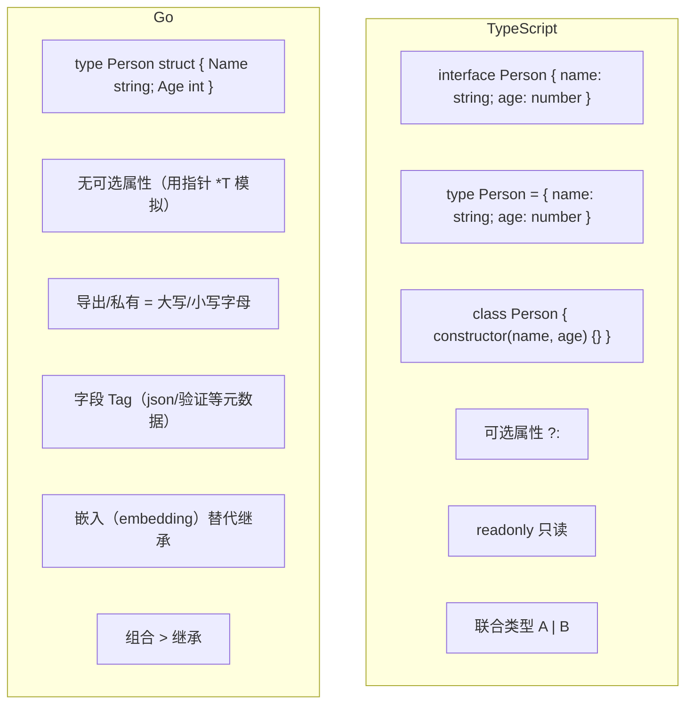

# 对象与结构体 — Object vs Struct

> TypeScript: `interface` / `type` / `class` / 对象字面量 `{ }`
> Go: `struct` / `type` 定义 / 组合（embedding）

## 全景对比



---

## 1. 基本结构体

```typescript
// TypeScript
interface Person {
    name: string;
    age: number;
    email?: string;        // 可选
    readonly id: number;   // 只读
}

const p: Person = { name: "Alice", age: 30, id: 1 };
```

```go
// Go — struct，字段名首字母大写 = 公开，小写 = 私有
type Person struct {
    Name  string   // 导出的（public）
    Age   int      // 导出的
    email string   // 未导出的（private，仅同一包可访问）
    ID    int      // 导出的
}

// 创建方式 1：字面量（推荐按字段名）
p1 := Person{
    Name: "Alice",
    Age:  30,
    ID:   1,
}

// 创建方式 2：按位置（不推荐，字段顺序变化会静默出错）
p2 := Person{"Bob", 25, "bob@example.com", 2}

// 创建方式 3：零值 + 赋值
var p3 Person
p3.Name = "Charlie"
p3.Age = 35

// 访问字段
fmt.Println(p1.Name) // "Alice"
```

> ⚠️ **Go 没有可选字段**——所有字段必须有值（零值也算）。模拟可选：
> ```go
> type Person struct {
>     Name  string
>     Age   int
>     Email *string  // 用指针表示"可能为空"
> }
> // n := "alice@example.com"
> // p := Person{Email: &n}
>
> // 输出时检查
> if p.Email != nil {
>     fmt.Println(*p.Email)
> }
> ```

---

## 2. 结构体零值与初始化

```go
// Go — 零值结构体是安全的
type Config struct {
    Host string
    Port int
    TLS  bool
}

var cfg Config          // {"", 0, false}
cfg.Host = "localhost"  // 其余字段保持零值

// 工厂函数（Go 没有构造函数）
func NewConfig(host string, port int) *Config {
    return &Config{
        Host: host,
        Port: port,
        // TLS 自动为 false
    }
}

// 如果零值不合理，用工厂函数设默认值
func DefaultConfig() *Config {
    return &Config{
        Host: "localhost",
        Port: 8080,
        TLS:  true,
    }
}
```

```typescript
// TypeScript
interface Config {
    host: string;
    port: number;
    tls?: boolean;
}

// 没有"构造"机制，每次都写全
const cfg: Config = {
    host: "localhost",
    port: 8080,
};

// 或在函数中合并默认值
function createConfig(overrides?: Partial<Config>): Config {
    return { host: "localhost", port: 8080, tls: false, ...overrides };
}
```

---

## 3. 字段 Tag — 元数据（Go 特有）

```go
// Go struct tags — 附加元数据，反射读取
type User struct {
    ID    int    `json:"id" validate:"required"`
    Name  string `json:"name" validate:"required,min=2"`
    Email string `json:"email,omitempty" validate:"email"`
    Role  string `json:"role" validate:"oneof=admin user"`
}

// json 序列化自动使用 tag
u := User{ID: 1, Name: "Alice", Email: "", Role: "admin"}
data, _ := json.Marshal(u)
// {"id":1,"name":"Alice","role":"admin"}（email 被 omitempty 省略）

// orm / validator 也依赖 tag
err := validator.New().Struct(u)
```

```typescript
// TypeScript — 用装饰器模拟（需要 experimentalDecorators）
class User {
    @JsonProperty("id")
    id!: number;

    @JsonProperty("name")
    @MinLength(2)
    name!: string;
}

// 或直接类型标注（无运行时效果）
interface User {
    id: number;
    name: string;
    email?: string;
}
```

> **Tag 常见格式**：
> - `json:"field,omitempty"` — JSON 序列化
> - `yaml:"field"` — YAML 序列化
> - `validate:"required,min=1"` — 验证库
> - `gorm:"column:name;type:varchar(100)"` — ORM
> - `xml:"field,attr"` — XML 序列化

---

## 4. 结构体嵌入 — Struct Embedding

> TypeScript: `extends` / `mixin` / 组合
> Go: 嵌入（embedding）— 语法糖级组合，不是继承

```typescript
// TypeScript — extends 继承
class Animal {
    constructor(public name: string) {}
    speak(): string { return "..."; }
}

class Dog extends Animal {
    speak(): string { return "woof"; }
}
```

```go
// Go — 嵌入，字段/方法被"提升"到外层结构体
type Animal struct {
    Name string
}

func (a Animal) Speak() string {
    return "..."
}

type Dog struct {
    Animal          // 嵌入（不是 extends）
    Breed string
}

dog := Dog{
    Animal: Animal{Name: "Buddy"},
    Breed:  "Labrador",
}

fmt.Println(dog.Name)    // "Buddy" — 提升字段
fmt.Println(dog.Speak()) // "..." — 提升方法
```

### 4.1 嵌入 vs 继承的关键区别

```go
// 嵌入不是"is-a"关系——Go 中没有多态继承

type Cat struct {
    Animal
}

// "重写"方法
func (c Cat) Speak() string {
    return "meow"
}

// 调用：
cat := Cat{Animal: Animal{Name: "Kitty"}}
fmt.Println(cat.Speak())         // "meow" — 自己的方法
fmt.Println(cat.Animal.Speak())  // "..." — 原始方法仍可访问

// 但接口层面：
var a Animal
a = cat        // ❌ Cat 不是 Animal（没有继承）
               // 除非 Animal 是接口
```

### 4.2 嵌入的实际用途

```go
// 1. 组合行为
type Logger struct{}
func (l Logger) Log(msg string) {
    fmt.Println(msg)
}

type Server struct {
    Logger          // 嵌入 Logger
    Host string
    Port int
}

srv := Server{Host: "localhost", Port: 8080}
srv.Log("server started") // 直接调用 Logger 的方法

// 2. 接口满足
type ReadWriter struct {
    *bytes.Buffer  // 嵌入 *bytes.Buffer
}

// ReadWriter 自动实现了 io.Reader 和 io.Writer

// 3. 嵌入 vs 命名成员
type Server2 struct {
    logger Logger   // 命名成员，需要 srv.logger.Log()
    Host    string
}
```

```typescript
// TypeScript — mixin 模式
function LoggerMixin<TBase extends Constructor>(Base: TBase) {
    return class extends Base {
        log(msg: string) { console.log(msg); }
    };
}
```

---

## 5. 泛型结构体（Go 1.18+）

```go
type Box[T any] struct {
    Value T
}

func (b Box[T]) Get() T { return b.Value }
func (b *Box[T]) Set(v T) { b.Value = v }

// 使用
intBox := Box[int]{Value: 42}
strBox := Box[string]{Value: "hello"}

// 泛型约束
type Numeric interface {
    ~int | ~float64
}

type Pair[T Numeric] struct {
    First, Second T
}

func (p Pair[T]) Sum() T {
    return p.First + p.Second
}
```

```typescript
// TypeScript
class Box<T> {
    constructor(public value: T) {}
}

interface Pair<T extends number> {
    first: T;
    second: T;
}
```

---

## 6. 方法 vs 独立函数

```go
// Go — 方法只是带接收者的函数
type Point struct {
    X, Y float64
}

// 方法
func (p Point) Distance() float64 {
    return math.Sqrt(p.X*p.X + p.Y*p.Y)
}

// 值接收者方法不可修改原对象
func (p Point) Scale(factor float64) Point {
    return Point{p.X * factor, p.Y * factor}
}

// 指针接收者可修改
func (p *Point) ScaleInPlace(factor float64) {
    p.X *= factor
    p.Y *= factor
}

// 也可以写成普通函数
func Distance(p Point) float64 {
    return math.Sqrt(p.X*p.X + p.Y*p.Y)
}
```

```typescript
// TypeScript — class 方法 vs 独立函数
class Point {
    constructor(public x: number, public y: number) {}
    distance() { return Math.sqrt(this.x ** 2 + this.y ** 2); }
}
function distance(p: Point) { return Math.sqrt(p.x ** 2 + p.y ** 2); }
```

---

## 7. 结构体比较

```go
// Go — 可比较的结构体（所有字段都是可比较的）
type Point struct {
    X, Y int
}

p1 := Point{1, 2}
p2 := Point{1, 2}
fmt.Println(p1 == p2) // true

// 包含不可比较字段的结构体不可用 ==
type S struct {
    Data []int // slice 不可比较
}
// s1 == s2 // ❌ 编译错误：slice can only be compared to nil

// 用 reflect.DeepEqual 或 cmp 包
s1 := S{Data: []int{1, 2}}
s2 := S{Data: []int{1, 2}}
fmt.Println(reflect.DeepEqual(s1, s2)) // true
```

---

## 8. 算法刷题特供

### 8.1 struct 作为 map 键

```go
// 算法中最实用的 struct 用法——组合多个字段作为一个 map 键
// 适合：DP 记忆化、坐标缓存、状态去重

// 坐标键（BFS/DFS 网格）
type Point struct {
    X, Y int
}
visited := make(map[Point]bool)

// BFS 使用
bfs := func(grid [][]int, start Point) {
    queue := []Point{start}
    visited[start] = true
    for len(queue) > 0 {
        p := queue[0]; queue = queue[1:]
        for _, d := range [][2]int{{0,1},{1,0},{0,-1},{-1,0}} {
            np := Point{p.X + d[0], p.Y + d[1]}
            if !visited[np] { visited[np] = true; queue = append(queue, np) }
        }
    }
}

// DP 状态键（记忆化搜索核心）
type State struct {
    I, J     int
    Last     byte
    Mask     int   // 位掩码
}
memo := make(map[State]int)

func dfs(s State) int {
    if v, ok := memo[s]; ok { return v }
    // 计算...
    return 0
}

// ❌ 常见错误：用 slice 做键
// type State struct { Path []int }  // 编译错误！
// map[State]int  // slice 不可比较

// ✅ 数组可以
type State2 struct {
    Path [10]int  // 固定大小数组可以
}

// ✅ string 也可以（备选方案）
key := fmt.Sprintf("%d,%d", i, j) // 简单但慢
```

### 8.2 struct 零值比较

```go
// struct 所有字段都 comparable 时，可以用 == 比较
type Point struct {
    X, Y int
}
p1 := Point{1, 2}
p2 := Point{1, 2}
fmt.Println(p1 == p2) // true

// 用在算法中的例子：判断棋盘状态是否回退
type BoardState struct {
    Player [8][8]int  // 8x8 棋盘（数组可比较）
    Turn   int
}

// 判断是否陷入循环
seen := make(map[BoardState]bool)
if seen[state] {
    return // draw by repetition
}
seen[state] = true

// 自定义比较——排序用
type Item struct {
    Value    int
    Priority int
}
items := []Item{{1, 3}, {2, 1}, {3, 2}}
sort.Slice(items, func(i, j int) bool {
    return items[i].Priority < items[j].Priority
})
```

### 8.3 空结构体 `struct{}`

```go
// struct{} 是零字节类型——算法中两个经典用途

// 用途 1：set 的值（见 map 章节）
set := make(map[int]struct{})

// 用途 2：无数据 channel 信号
done := make(chan struct{})
go func() {
    // do work
    close(done) // 通知完成
}()
<-done

// 用途 3：节约内存的枚举
type Color struct{}
var (
    Red   = Color{}
    Green = Color{}
    Blue  = Color{}
)
```

### 8.4 结构体工厂——构建算法数据结构

```go
// 算法的常见模式：工厂函数返回带默认值的结构体

// 二叉树节点
func NewTreeNode(val int) *TreeNode {
    return &TreeNode{Val: val}
}

// 图的边
func NewEdge(to, weight int) Edge {
    return Edge{To: to, Weight: weight}
}

// 并查集（带有默认配置）
func NewDSU(n int) *DSU {
    parent := make([]int, n)
    for i := range parent { parent[i] = i }
    return &DSU{
        parent: parent,
        rank:   make([]int, n),
        count:  n,
    }
}
```

### 8.5 嵌入 vs 组合——算法场景

```go
// 算法中几乎不用嵌入——而是用组合
// 因为嵌入的"提升"语义在算法代码中反而混淆

// ✅ 算法中用组合（清晰）
type PriorityQueue struct {
    items []Item
    less  func(i, j int) bool
}

// ❌ 很少用嵌入
type MyHeap struct {
    container/heap // 嵌入
}
```

---

## 9. 完整对照表

| 操作 | TypeScript | Go |
|------|-----------|-----|
| 定义 | `interface` / `type` / `class` | `type T struct { ... }` |
| 可选字段 | `field?: T` | `Field *T`（用指针） |
| 只读 | `readonly field: T` | 无内建（约定不写） |
| 可见性 | `public` / `private` / `#` | 首字母大小写 |
| 元数据 | 装饰器 | struct tags |
| 继承 | `extends` / `implements` | 嵌入（embedding） |
| 方法 | class 方法 | 接收者方法 |
| 构造 | `constructor()` | 工厂函数 `NewT()` |
| 默认值 | 无（`??` 合并） | 零值 |
| 泛型 | `class Box<T>` | `type Box[T any] struct{}` |
| 比较 | `===`（引用） | `==`（值，仅可比较字段） |
| JSON | `JSON.stringify` | `json.Marshal`（用 tag） |

---

## 快速记忆

```
type T struct {      — 定义结构体
    Field Type       — 导出字段（首字母大写）
    field Type       — 私有字段（首字母小写）
    Tag   Type `json:"tag"`  — 元数据
    OtherType        — 嵌入（提升字段/方法）
}

T{Field: val}        — 字面量创建
&T{Field: val}       — 创建指针
NewT()               — 工厂函数命名约定

type Point struct{X,Y int}   — 做 map 键（DP 必用）
struct{}                     — 零字节：set + channel 信号

!  结构体是值类型     — 赋值/传参复制整个结构体
!  嵌入不是继承       — 没有多态，只有提升
!  tag 是字符串       — 反射读取，编译期不验证
!  可选字段用 *T      — 零值安全，需要 nil 检查
!  struct 做 map 键   — 比 sprintf 快 10 倍
```
