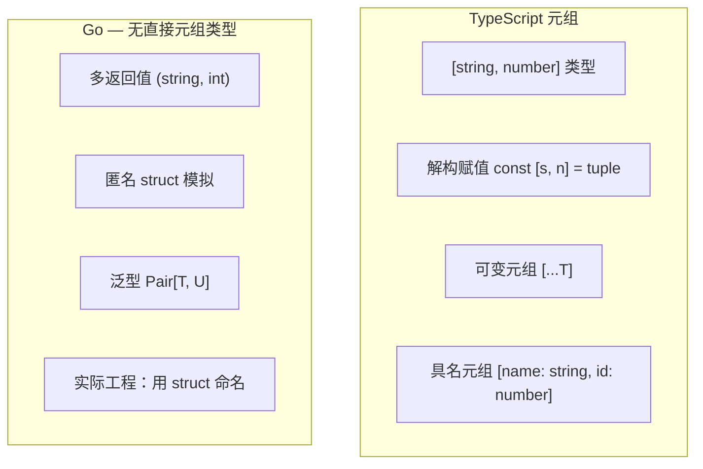
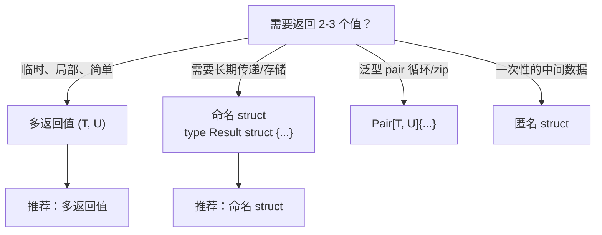

# 元组 — Tuple

> TypeScript: `[T, U]` 元组类型
> Go: 多返回值 / struct 模拟 / `slices.SortFunc` 处理 pairs

## 全景对比



---

## 1. Go 没有元组类型

```typescript
// TypeScript — 元组是一等公民
const pair: [string, number] = ["Alice", 30];
const [name, age] = pair;

type NameAndAge = [name: string, age: number];

function createUser(): [string, number] {
    return ["Bob", 25];
}
```

```go
// Go — 没有 [T, U] 语法，但有几种替代方案
```

---

## 2. 替代方案 1：多返回值（最常用）

```go
// Go — 这是最接近元组的设计
func splitFullName(name string) (string, string) {
    parts := strings.SplitN(name, " ", 2)
    if len(parts) < 2 {
        return parts[0], ""
    }
    return parts[0], parts[1]
}

// 调用时解构
firstName, lastName := splitFullName("Alice Wang")

// 多返回值本质上也是"无名元组"
// 但不能赋值给变量、不能作为数组元素、不能作为 map 键
```

---

## 3. 替代方案 2：匿名 struct

```go
// Go — 临时用匿名 struct 表示元组
pair := struct {
    Name string
    Age  int
}{
    Name: "Alice",
    Age:  30,
}
fmt.Println(pair.Name, pair.Age)

// 匿名 struct 在函数返回值中很少用
func getUser() struct {
    Name string
    Age  int
} {
    return struct {
        Name string
        Age  int
    }{"Bob", 25}
}

// 实际工程：少数情况用，长函数签名不推荐
```

---

## 4. 替代方案 3：泛型 Pair（Go 1.18+）

```go
// Go 1.18+ — 自定义泛型元组
type Pair[T, U any] struct {
    First  T
    Second U
}

func NewPair[T, U any](first T, second U) Pair[T, U] {
    return Pair[T, U]{First: first, Second: second}
}

// 通常再组合为 slice
func Zip[T, U any](ts []T, us []U) []Pair[T, U] {
    n := min(len(ts), len(us))
    result := make([]Pair[T, U], n)
    for i := 0; i < n; i++ {
        result[i] = Pair[T, U]{First: ts[i], Second: us[i]}
    }
    return result
}

// 使用
names := []string{"Alice", "Bob"}
ages := []int{30, 25}
pairs := Zip(names, ages)
for _, p := range pairs {
    fmt.Println(p.First, p.Second)
}
```

```typescript
// TypeScript
function zip<T, U>(ts: T[], us: U[]): [T, U][] {
    const n = Math.min(ts.length, us.length);
    return Array.from({ length: n }, (_, i) => [ts[i], us[i]]);
}
```

---

## 5. Go 1.21+ 的 slices / maps 包与 pair 处理

```go
// Go 1.21+ — 标准库 slices 包内置了一些需 pair 的场景
pairs := []struct {
    Name string
    Age  int
}{
    {"Alice", 30},
    {"Bob", 25},
    {"Charlie", 35},
}

// 按 Age 排序
slices.SortFunc(pairs, func(a, b struct{ Name string; Age int }) int {
    return a.Age - b.Age
})
```

---

## 6. 什么时候用哪种



```go
// 决策示例：
// ❌ 滥用多返回值
func getStats(data []int) (min, max, sum, avg float64, count int) { ... }

// ✅ 改为命名 struct
type Stats struct {
    Min, Max, Sum, Avg float64
    Count              int
}
func getStats(data []int) Stats { ... }
```

---

## 7. 算法刷题特供

### 7.1 Pair 模式（坐标 / 键值对）

```go
// 算法中最常用的泛型 Pair
// 适合：网格坐标、DP 索引对、BFS 节点 + 距离

type Pair[T, U any] struct {
    First  T
    Second U
}

func NewPair[T, U any](first T, second U) Pair[T, U] {
    return Pair[T, U]{First: first, Second: second}
}

// 使用场景 1：BFS 网格坐标
type Point = Pair[int, int]
queue := []Point{NewPair(0, 0)}
for len(queue) > 0 {
    p := queue[0]; queue = queue[1:]
    for _, d := range [][2]int{{0,1},{1,0},{0,-1},{-1,0}} {
        np := NewPair(p.First+d[0], p.Second+d[1])
        queue = append(queue, np)
    }
}

// 使用场景 2：BFS 距离
type NodeWithDist = Pair[*TreeNode, int]
queue2 := []NodeWithDist{NewPair(root, 0)}
for len(queue2) > 0 {
    item := queue2[0]; queue2 = queue2[1:]
    node, dist := item.First, item.Second
    if node.Left != nil { queue2 = append(queue2, NewPair(node.Left, dist+1)) }
    if node.Right != nil { queue2 = append(queue2, NewPair(node.Right, dist+1)) }
}

// 使用场景 3：并查集返回值
type FindResult = Pair[int, bool] // (root, isNewUnion)
```

### 7.2 多返回值简化 DFS

```go
// 多返回值适合 DFS 返回多个统计值

// 二叉树直径（返回 {直径, 深度}）
func diameterOfBinaryTree(root *TreeNode) int {
    var dfs func(*TreeNode) (int, int) // (diameter, depth)
    dfs = func(n *TreeNode) (int, int) {
        if n == nil { return 0, 0 }
        lDia, lDep := dfs(n.Left)
        rDia, rDep := dfs(n.Right)
        dia := max(lDia, rDia, lDep+rDep)
        dep := 1 + max(lDep, rDep)
        return dia, dep
    }
    dia, _ := dfs(root)
    return dia
}

// 打家劫舍 III（返回 {选根, 不选根}）
func rob(root *TreeNode) int {
    var dfs func(*TreeNode) (int, int)
    dfs = func(n *TreeNode) (int, int) {
        if n == nil { return 0, 0 }
        lRob, lSkip := dfs(n.Left)
        rRob, rSkip := dfs(n.Right)
        rob := n.Val + lSkip + rSkip   // 选根
        skip := max(lRob, lSkip) + max(rRob, rSkip) // 不选根
        return rob, skip
    }
    rob, skip := dfs(root)
    return max(rob, skip)
}
```

### 7.3 匿名 struct vs 命名 struct vs 多返回值

```go
// 算法中选择策略：

// ✅ 2 个返回值 → 直接用多返回
func minMax(nums []int) (int, int) { ... }

// ✅ 2 个相关值作为集合 → Pair[T,U]
pairs := []Pair[int, int]{{1, 2}, {3, 4}}

// ✅ 3+ 个字段 → 命名 struct（见 09-object-vs-struct）
type State struct { X, Y, Dist int }

// ❌ 避免 4+ 个多返回值，可读性差
func stats(data []int) (min, max, sum, avg int) // 不推荐

// ✅ 改为 struct
type Stats struct {
    Min, Max, Sum, Avg int
    Count              int
}
```

### 7.4 [2]int 作为轻量级 pair

```go
// 对两个 int 的情况，直接用 [2]int 更轻量
// [2]int 可做 map 键，而 Pair[int,int] 需要 struct

// 四方向
dirs := [][2]int{{0, 1}, {1, 0}, {0, -1}, {-1, 0}}

// 坐标集合
visited := make(map[[2]int]bool)
visited[[2]int{1, 2}] = true

// 边的集合
edges := make(map[[2]int]bool)
edges[[2]int{1, 2}] = true
// 注意 [2]int 按值比较，{2,1} 和 {1,2} 是不同的键
```

---

## 8. 完整对照表

| 操作 | TypeScript | Go |
|------|-----------|-----|
| 声明类型 | `[T, U]` | 无 |
| 创建 | `["a", 1]` | 多返回 / `Pair{T, U}` / struct |
| 解构 | `const [a, b] = t` | `a, b := fn()` |
| 命名元素 | `[name: string, age: number]` | struct 字段 |
| 变长元组 | `[string, ...number[]]` | 无 |
| 函数返回 | `(): [T, U]` | `() (T, U)` |
| 存储到数组 | `[T, U][]` | `[]Pair[T,U]` |
| 泛型 | `[T, U]` | `Pair[T, U any]` |

---

## 快速记忆

```
Go 没有元组类型   — 用 struct 替代
多返回值 ≈ 无名元组 — 函数返回多个值，临场性好

多返回值  → 函数内部 / 临时组合
命名 struct → 需要多次传递 / 长期存在
Pair[T,U]   → 1.18+ 泛型，循环 / zip 场景
[2]int      → 轻量 pair，可做 map 键

dirs := [][2]int{{0,1},{1,0}}  — 四方向常用
type Point = Pair[int,int]      — BFS 网格坐标

!  超过 3 个返回值 → 改用命名 struct
!  多返回值赋值 = 解构  — a, b, c := fn()
!  不想用某个返回值 → _  — result, _ := fn()
!  DFS 返回多值非常实用 — 直径、打家劫舍 III
```
