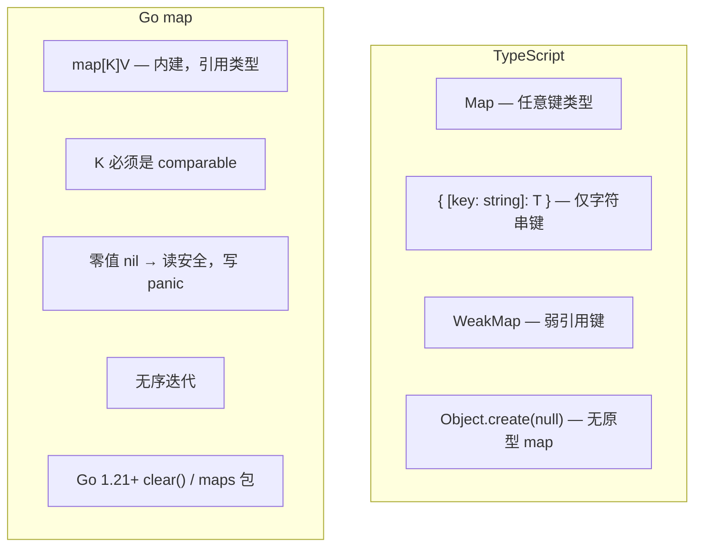

# 映射 — Map

> TypeScript: `Map<K, V>` / `{ [key: string]: T }` / 对象作为 record
> Go: `map[K]V`（内建，泛型）

## 全景对比



---

## 1. 基本操作

```typescript
// TypeScript
const m = new Map<string, number>();
m.set("a", 1);
m.set("b", 2);
console.log(m.get("a"));    // 1
console.log(m.has("c"));    // false
console.log(m.size);        // 2
m.delete("a");
m.clear();
```

```go
// Go — map 是内建类型
// 创建
m := make(map[string]int)  // ✅ 最常用
m2 := map[string]int{}     // 等价，但不 nil
// var m3 map[string]int   // nil！不可写入

// 读写
m["a"] = 1
m["b"] = 2

v := m["a"]               // 1（键不存在时返回零值）
v, ok := m["c"]           // ok=false，v=0（安全取值）

fmt.Println(len(m))       // 2
delete(m, "a")            // 删除键

// 遍历（无序！）
for k, v := range m {
    fmt.Println(k, v)
}

// 仅键
for k := range m {
    fmt.Println(k)
}
```

---

## 2. map 的重要特性

### 2.1 map 是引用类型

```go
// map 变量存的是指向底层哈希表的指针
m1 := map[string]int{"a": 1}
m2 := m1
m2["a"] = 100
fmt.Println(m1["a"]) // 100 ✅ 共享底层数据

// 赋值给 nil map 不影响原 map
var m3 map[string]int // nil
m3 = m1               // 现在指向同一个底层表
```

### 2.2 零值 nil map

```go
var m map[string]int // nil

// ✅ 可安全操作
_, ok := m["key"]  // ok=false，不 panic
for k, v := range m { // 零次迭代
}

// ❌ 写入会 panic
// m["key"] = 1  // panic: assignment to entry in nil map

// ✅ 必须先 make
m = make(map[string]int)
m["key"] = 1
```

### 2.3 键类型限制

```go
// 键必须是 comparable（支持 == 的类型）
// ✅ 可用：bool, int/string/float, pointer, channel, struct(全字段 comparable)
// ❌ 不可用：slice, map, function（不可比较）

// struct 作为键（注意：按值比较）
type Key struct {
    ID   int
    Name string
}
m := make(map[Key]string)
k := Key{ID: 1, Name: "main"}
m[k] = "config value"

// 等价：
m[Key{ID: 1, Name: "main"}] // 同样访问到
```

### 2.4 迭代顺序

```go
// Go 故意设计 map 迭代无序——每次运行顺序可能不同
m := map[string]int{"a": 1, "b": 2, "c": 3}

// 如果想有序遍历，需要手动排序键
keys := make([]string, 0, len(m))
for k := range m {
    keys = append(keys, k)
}
slices.Sort(keys) // Go 1.21+
for _, k := range keys {
    fmt.Println(k, m[k])
}
```

---

## 3. 泛型与 map

```go
// Go 1.18+ — 泛型 map 辅助函数
func MapKeys[K comparable, V any](m map[K]V) []K {
    keys := make([]K, 0, len(m))
    for k := range m {
        keys = append(keys, k)
    }
    return keys
}

func MapValues[K comparable, V any](m map[K]V) []V {
    vals := make([]V, 0, len(m))
    for _, v := range m {
        vals = append(vals, v)
    }
    return vals
}

// 使用
m := map[string]int{"a": 1, "b": 2}
keys := MapKeys(m)   // []string{"a", "b"}
vals := MapValues(m) // []int{1, 2}
```

```typescript
// TypeScript
const keys = Array.from(m.keys());
const vals = Array.from(m.values());
```

---

## 4. Go 1.21+ 的 maps 包

```go
// Go 1.21+ — 标准库 maps 包
import "maps"

m1 := map[string]int{"a": 1, "b": 2}
m2 := map[string]int{"c": 3}

// 复制 map
clone := maps.Clone(m1)        // 浅拷贝，独立 map
fmt.Println(clone)              // map[a:1 b:2]

// 合并 map
maps.Copy(m1, m2)              // 把 m2 的键值复制到 m1
fmt.Println(m1)                 // map[a:1 b:2 c:3]

// 相等比较
equal := maps.Equal(m1, m2)    // false

// 自定义相等判断
m3 := map[string][]int{"a": {1, 2}}
m4 := map[string][]int{"a": {1, 2}}
equal = maps.EqualFunc(m3, m4, slices.Equal) // true
```

```typescript
// TypeScript
const m1 = new Map([["a", 1], ["b", 2]]);
const clone = new Map(m1);
```

---

## 5. Go 1.21+ 的 clear()

```go
// Go 1.21+ — 清空 map（保留底层内存，可复用）
m := map[string]int{"a": 1, "b": 2}
clear(m)
fmt.Println(len(m)) // 0

// 对比重新 make
m = make(map[string]int) // 新分配
```

---

## 6. TS 对象 vs Go map 的差异

```typescript
// TypeScript — 对象作为 record
const obj: Record<string, number> = { a: 1, b: 2 };
console.log(obj.a);         // 1
console.log(obj["a"]);      // 1
console.log("toString" in obj); // true（继承原型）
```

```go
// Go — map 没有原型链污染
m := map[string]int{"a": 1, "b": 2}
_, ok := m["toString"] // false（干净）
_, ok := m["a"]        // true

// Go map 不是 struct——不能用 . 访问
// m.a  // ❌ 编译错误：type map[string]int does not support field access
```

```mermaid
graph LR
    subgraph "Record<string, T> vs map[string]T"
        A["TS Record"] --> A1["继承 Object.prototype"]
        A1 --> A2['"toString" in obj → true']
        B["Go map"] --> B1["纯哈希表"]
        B1 --> B2['"toString" in m → false']
    end
```

---

## 7. sync.Map — 并发安全 map

```go
// sync.Map — 读多写少的并发场景
var sm sync.Map

// 写
sm.Store("key", "value")

// 读
v, ok := sm.Load("key")

// 不存在时写入（类似 setdefault）
v, loaded := sm.LoadOrStore("key", "default")
// loaded=false → 写入成功

// 删除
sm.Delete("key")

// 遍历
sm.Range(func(key, value any) bool {
    fmt.Println(key, value)
    return true // 继续遍历；false 停止
})

// 注意：sync.Map 的 key/value 是 any，有类型安全损失
```

```typescript
// TypeScript — 无直接等价
// 用 Map + 锁，或自己实现
```

> **sync.Map 适用场景**：读远多于写，且 key 生命周期不固定。否则仍建议 `map + sync.RWMutex`。

---

## 8. 算法刷题特供

### 8.1 频率计数（Counter）

```go
// 字符计数——最常用的 map 模式
s := "hello"
freq := make(map[byte]int)
for i := range s {
    freq[s[i]]++   // 零值可用！首次访问返回 0，直接 ++
}
// freq['h']=1, freq['e']=1, freq['l']=2, freq['o']=1

// TS 写法：
// const freq = new Map<string, number>();
// for (const ch of s) freq.set(ch, (freq.get(ch) ?? 0) + 1);

// 数值计数
nums := []int{1, 2, 3, 2, 1, 2}
count := make(map[int]int)
for _, v := range nums {
    count[v]++
}
// count[1]=2, count[2]=3, count[3]=1

// ✅ 记住：Go map 读取不存在的键返回零值，所以可以直接 ++
// 不需要 TS 的 `?? 0` 或 `|| 0` 模式
```

### 8.2 用 map 实现 Set

```go
// Go 没有内建 set 类型，用 map[K]struct{} 模拟
// struct{} 是零字节的——不占额外空间

type Set map[int]struct{}

func (s Set) Add(v int)    { s[v] = struct{}{} }
func (s Set) Has(v int) bool  { _, ok := s[v]; return ok }
func (s Set) Remove(v int) { delete(s, v) }
func (s Set) Len() int     { return len(s) }

// 使用
set := make(Set)
set.Add(1)
set.Add(2)
fmt.Println(set.Has(1)) // true

// 一行创建 + 初始化
set2 := Set{1: {}, 2: {}, 3: {}}

// 从 slice 构建 set（去重）
nums := []int{1, 2, 2, 3, 3, 3}
set3 := make(Set, len(nums))
for _, v := range nums { set3.Add(v) }
fmt.Println(set3.Len()) // 3

// 判断交集
a := Set{1: {}, 2: {}, 3: {}}
b := Set{2: {}, 4: {}}
for k := range a {
    if b.Has(k) {
        fmt.Println("intersection:", k) // 2
    }
}
```

```typescript
// TypeScript
const set = new Set<number>([1, 2, 3]);
set.has(1); // true
```

### 8.3 struct 作为键（DP 记忆化搜索）

```go
// 这是 Go 里做 DP 记忆化搜索的关键模式

// ❌ 用字符串拼接做键（慢、容易冲突）
memo := make(map[string]int)
key := fmt.Sprintf("%d-%d", i, j) // 慢！fmt.Sprintf 很重

// ✅ 用 struct 做键（快、类型安全）
type Key struct {
    I, J int
}
memo := make(map[Key]int)

// DFS + 记忆化搜索完整模板
func dfs(i, j int, memo map[Key]int) int {
    if i == 0 || j == 0 { return 0 }
    key := Key{i, j}
    if v, ok := memo[key]; ok { return v }

    // 计算...
    result := dfs(i-1, j, memo) + dfs(i, j-1, memo)
    memo[key] = result
    return result
}

// 三字段键
type Key3 struct {
    I, J, K int
}

// 注意：slice 不能做 map 键（不可比较）
// ❌ map[[]int]int  // 编译错误
// ✅ 转成 string 或 struct + 固定大小数组
// map[[3]int]int  // ✅ 数组可比较
```

### 8.4 两数之和（map 的经典用法）

```go
func twoSum(nums []int, target int) []int {
    m := make(map[int]int) // value → index
    for i, v := range nums {
        if j, ok := m[target-v]; ok {
            return []int{j, i}
        }
        m[v] = i
    }
    return nil
}
```

### 8.5 滑动窗口 + map（最长无重复子串）

```go
func lengthOfLongestSubstring(s string) int {
    last := make(map[byte]int) // char → last index
    left, maxLen := 0, 0
    for right := 0; right < len(s); right++ {
        ch := s[right]
        if idx, ok := last[ch]; ok && idx >= left {
            left = idx + 1 // 移动左边界到重复字符之后
        }
        last[ch] = right
        maxLen = max(maxLen, right-left+1)
    }
    return maxLen
}
```

### 8.6 有序遍历 map

```go
// Go map 迭代无序——需要有序时手动排序键
m := map[string]int{"b": 2, "a": 1, "c": 3}

// 按键排序
keys := make([]string, 0, len(m))
for k := range m { keys = append(keys, k) }
sort.Strings(keys)
for _, k := range keys {
    fmt.Println(k, m[k])
}

// 按值排序
type kv struct{ K string; V int }
var sorted []kv
for k, v := range m { sorted = append(sorted, kv{k, v}) }
sort.Slice(sorted, func(i, j int) bool {
    return sorted[i].V < sorted[j].V
})
```

### 8.7 带默认值的读取

```go
// Go 没有 `??` 运算符，但模式固定
m := map[string]int{"a": 1}

// 读取带默认值
v := m["b"]     // 不存在返回 0（int 零值）
// 但如果零值是有效值，用 ok 判断
v, ok := m["b"] // ok=false

// 通用模式：GetWithDefault
func GetWithDefault[K comparable, V any](m map[K]V, key K, def V) V {
    if v, ok := m[key]; ok { return v }
    return def
}
```

### 8.8 map 与 nil 的坑

```go
// 最常见 bug：忘记 make，直接写 nil map
var m map[string]int
// m["key"] = 1  // ❌ panic: assignment to entry in nil map

// ✅ 正确
m = make(map[string]int)
m["key"] = 1

// 但读 nil map 是安全的
var m2 map[string]int
_ = m2["key"]  // ✅ 返回 0，不 panic

// 所以在函数返回 map 时，返回 nil 和返回空 map 对调用方差别不大
func getMap() map[string]int {
    return nil // 调用方 range 安全，len=0
}
```

### 8.9 Top-K 频率（map + 堆）

```go
func topKFrequent(nums []int, k int) []int {
    freq := make(map[int]int)
    for _, v := range nums { freq[v]++ }

    // 构建桶（频率 → 值列表）
    buckets := make([][]int, len(nums)+1)
    for v, f := range freq {
        buckets[f] = append(buckets[f], v)
    }

    var result []int
    for f := len(buckets) - 1; f >= 0 && len(result) < k; f-- {
        result = append(result, buckets[f]...)
    }
    return result[:k]
}
```

---

## 9. 完整对照表

| 操作 | TypeScript | Go |
|------|-----------|-----|
| 创建 | `new Map()` | `make(map[K]V)` |
| 字面量 | `new Map([["a",1]])` | `map[K]V{"a": 1}` |
| 设置 | `m.set(k, v)` | `m[k] = v` |
| 读取 | `m.get(k)` | `m[k]` |
| 安全读取 | `m.get(k) ?? default` | `v, ok := m[k]` |
| 存在检查 | `m.has(k)` | `_, ok := m[k]` |
| 删除 | `m.delete(k)` | `delete(m, k)` |
| 大小 | `m.size` | `len(m)` |
| 清空 | `m.clear()` | `clear(m)`（1.21+） |
| 键数组 | `[...m.keys()]` | `maps.Keys()` → `slices.Collect()` |
| 复制 | `new Map(m)` | `maps.Clone(m)` |
| 排序迭代 | 手动 | 手动排序键 |
| 并发安全 | 无内建 | `sync.Map` |

---

## 快速记忆

```
make(map[K]V)        — 创建 map（必须 make！nil map 不可写）
m[k]                 — 读/写
v, ok := m[k]        — 安全读取（ok=false 表示键不存在）
delete(m, k)         — 删除
for k, v := range m  — 遍历（无序！）

map[K]struct{}       — set 实现（struct{} 不占内存）
struct 做 map 键      — DP 记忆化搜索的秘密武器

!  键必须是 comparable — slice/map/function 不能做键
!  nil map 不可写       — 写 panic，读安全返回零值
!  迭代无序             — 每次可能不同顺序
!  freq[ch]++ 直接可用  — 零值返回 0，不需要 ?? 0
!  struct 做键比字符串快 — 别用 fmt.Sprintf
```
