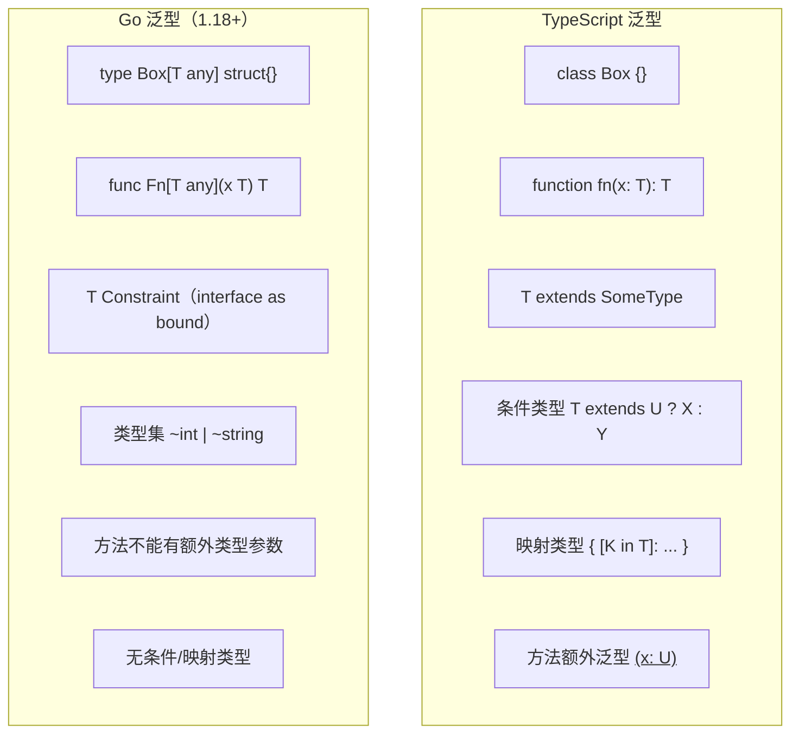
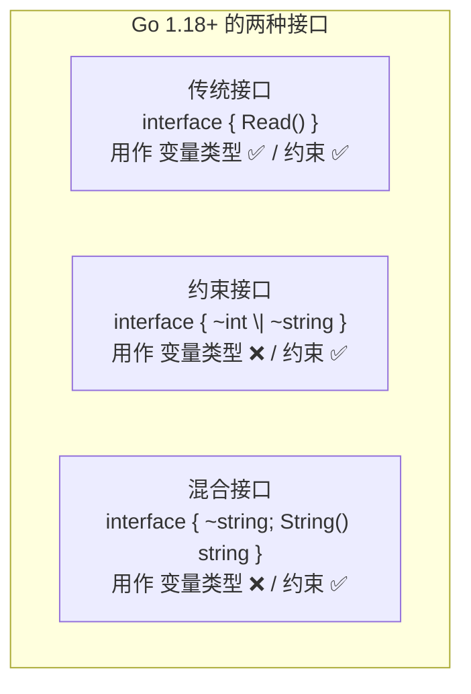
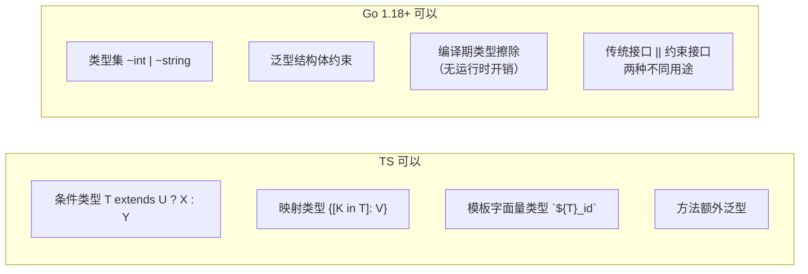

# 泛型 — Generics

> TypeScript: 泛型从 1.x 就是核心特性
> Go: Go 1.18（2022）引入泛型，设计更保守

## 全景对比



---

## 1. Go 泛型的语法

```typescript
// TypeScript
function identity<T>(value: T): T {
    return value;
}

const result = identity<string>("hello");
```

```go
// Go — 类型参数在函数名后、参数前
func Identity[T any](value T) T {
    return value
}

// 调用时类型推断
result := Identity("hello") // string
result2 := Identity[string]("hello") // 也可显式

// 多个类型参数
func Pair[T, U any](a T, b U) (T, U) {
    return a, b
}
```

---

## 2. 类型约束（Type Constraints）

```go
// Go — 用 interface 作为类型约束
// any = interface{} = 所有类型

// 预定义的约束
// comparable — 支持 == 和 !=
func Contains[T comparable](slice []T, v T) bool {
    for _, item := range slice {
        if item == v {
            return true
        }
    }
    return false
}

// 自定义约束
type Number interface {
    ~int | ~int8 | ~int16 | ~int32 | ~int64 |
        ~uint | ~uint8 | ~uint16 | ~uint32 | ~uint64 |
        ~float32 | ~float64
}

func Sum[T Number](values []T) T {
    var total T
    for _, v := range values {
        total += v
    }
    return total
}
```

```typescript
// TypeScript
type Number = number | bigint;

function sum<T extends number>(values: T[]): T {
    return values.reduce((a, b) => a + b, 0 as T);
}
```

> **`~` 的含义**：`~int` 表示"底层类型为 int 的所有类型"，包括 `type MyInt int`。
> 不加 `~` 则只匹配字面的 `int`，不包括自定义别名。

---

## 3. 泛型结构体与方法

```go
// Go — 泛型结构体
type Stack[T any] struct {
    items []T
}

func NewStack[T any]() *Stack[T] {
    return &Stack[T]{}
}

func (s *Stack[T]) Push(v T) {
    s.items = append(s.items, v)
}

func (s *Stack[T]) Pop() (T, bool) {
    if len(s.items) == 0 {
        var zero T
        return zero, false
    }
    v := s.items[len(s.items)-1]
    s.items = s.items[:len(s.items)-1]
    return v, true
}

// ⚠️ 方法不能有额外的类型参数！
// func (s *Stack[T]) Convert[U any]() Stack[U] { ... } // ❌ 编译错误
```

```typescript
// TypeScript — 方法可以额外泛型
class Stack<T> {
    items: T[] = [];
    push(v: T) {}
    pop(): T | undefined {}
    convert<U>(): Stack<U> { return new Stack(); } // ✅
}
```

---

## 4. Go 1.21+ 的 cmp / slices / maps 泛型包

```go
// Go 1.21+ 内置了大量泛型工具

import (
    "cmp"
    "slices"
    "maps"
)

// cmp — 比较
cmp.Compare(1, 2)  // -1
cmp.Less(1, 2)     // true
cmp.Or("", "fallback") // "fallback"（返回第一个非零值）

// slices — 切片操作
nums := []int{3, 1, 4, 1, 5}
slices.Sort(nums)  // [1, 1, 3, 4, 5]
slices.Reverse(nums)
idx := slices.Index(nums, 4) // 2

// maps — map 操作（见 map 章节）
```

---

## 5. 泛型约束的高级用法

### 5.1 方法约束

```go
// Go — 约束中要求方法
type Stringer interface {
    String() string
}

// Go 1.18+ 约束中可包含方法 + 类型集
type Printable interface {
    ~int | ~string
    String() string
}

// 注意：不能在一个约束中同时有方法约束和类型集（接口会被拆成两个概念）
// 以下是旧接口（可以有方法）
type Reader interface {
    Read(p []byte) (n int, err error)
}
```

### 5.2 类型推断与约束推导

```go
// Go — 编译时类型推断
func Min[T cmp.Ordered](a, b T) T {
    if a < b { return a }
    return b
}

Min(1, 2)        // int，自动推断
Min(1.5, 2.5)    // float64
Min("a", "b")    // string

// ⚠️ 类型参数必须满足所有约束条件
// Min(1, "a")  // ❌ 编译错误：类型参数不统一
```

---

## 6. 深入：类型定义 vs 类型别名

TypeScript 的 `type` 永远创建别名（alias），但 Go 的 `type` 有两种模式，这是 TS→Go 学习中最容易混淆的概念之一。

### 6.1 类型定义 `type Name ExistingType`（不含 `=`）

```go
// 创建一个全新的、不同的类型
type Celsius float64
type ID string

// 完全不能互转，即使底层类型相同
var c Celsius = 100.0
var f float64 = 100.0
// c = f           // ❌ 编译错误：Cannot use f (type float64) as type Celsius
// f = c           // ❌
c = Celsius(f)     // ✅ 必须显式转换
f = float64(c)     // ✅

// 定义的方法只属于新类型
func (c Celsius) String() string {
    return fmt.Sprintf("%.1f°C", c)
}
// float64 不会自动获得 String() 方法
```

```typescript
// TypeScript — type 永远是别名
type Celsius = number;  // Celsius 和 number 完全一样
let c: Celsius = 100;
let n: number = c;      // ✅ 完全可互换
// Celsius 不能添加新方法
```

### 6.2 类型别名 `type Name = ExistingType`（含 `=`）

```go
// Go 1.9+ — 别名与原类型完全互换
type ID = string  // ID 就是 string 的另一个名字

var id ID = "abc"
var s string = id  // ✅ 直接赋值，无需转换
id = s             // ✅

// 别名主要用于 渐进式重构 + 跨包兼容
// 完全等价，编译器层面也无区别
```

### 6.3 实际区别速查

```go
type Name string      // 类型定义：Name 是全新类型
type Name = string    // 类型别名：Name 就是 string

var n1 Name
var n2 string

// 定义（无 =）
n1 = n2          // ❌ 不同类型
n1 = Name(n2)    // ✅ 显式转换
func(n1)         // ✅ 接受 Name 参数
func(n2)         // ❌ 不接受 string

// 别名（有 =）
n1 = n2          // ✅ 完全可互换
func(n1)         // ✅ 等效于 func(string)
```

### 6.4 泛型中的 `~` 与类型定义的关系

```go
// ~int 匹配 "底层类型为 int 的所有类型"
// 包括：int 本身 + type MyInt int（类型定义）

type MyInt int
var m MyInt = 10

func Double[T ~int](v T) T { return v * 2 }
Double(m)       // ✅ MyInt 的底层类型是 int
Double(10)      // ✅

// 没有 ~ 的情况
func DoubleStrict[T int](v T) T { return v * 2 }
// DoubleStrict(m)  // ❌ T=int 不匹配 MyInt
DoubleStrict(10)    // ✅
```

| 语法 | 名称 | 是否新类型？ | 是否可互换？ |
|------|------|:---:|:---:|
| `type A B` | 类型定义 | ✅ | ❌ |
| `type A = B` | 类型别名 | ❌ | ✅ |
| `[T ~int]` | 近似约束 | 匹配定义和别名 | N/A |
| `[T int]` | 精确约束 | 只匹配 int | N/A |

---

## 7. 深入：`comparable` 是什么？

`comparable` 是 Go 预声明的一个**特殊接口**，但你不能把它当成普通接口用。

### 7.1 为什么 special？

```go
// comparable 内建定义（伪代码）
type comparable interface { comparable } // 编译器魔法

// ✅ 作为约束使用
func Find[T comparable](slice []T, v T) int {
    for i, item := range slice {
        if item == v { return i }  // == 和 != 可用
    }
    return -1
}

// ❌ 不能作为变量类型
// var x comparable      // ❌ comparable 只能用于约束
// var m map[comparable]int  // ❌

// ✅ 但是 map 键本身就是 comparable
var m map[string]int  // string 是 comparable
```

### 7.2 什么类型实现了 `comparable`？

```go
// ✅ 可比较（实现 comparable）
bool, int, float64, string, rune, byte     // 所有基本类型
[3]int                                      // 数组（元素可比较）
struct{ A int }                             // 结构体（字段全可比较）
*int                                        // 指针
interface{ String() string }               // 接口（运行时比较动态类型）

// ❌ 不可比较（不实现 comparable）
[]int                                       // 切片
map[string]int                              // map
func()                                      // 函数
struct{ S []int }                           // 含不可比较字段的结构体
```

```go
// 所以以下代码会编译错误：
type User struct {
    Name string
    Tags []string  // ❌ 切片不可比较
}
// var users map[User]int  // ❌ User 不实现 comparable
// slices.Contains(users, User{})  // ❌
```

### 7.3 `maps.Keys` 的约束为什么是 `comparable` 而不是 `any`？

```go
// 因为 map 的 key 必须是 comparable
// 所以 maps.Keys 的签名是：
// func Keys[M ~map[K]V, K comparable, V any](m M) []K
```

### 7.4 `comparable` vs `constraints` 包

```go
import "golang.org/x/exp/constraints"  // 实验性包

// constraints 定义了更丰富的约束：
// constraints.Integer      — 所有有符号+无符号整数
// constraints.Float        — float32 + float64
// constraints.Complex      — complex64 + complex128
// constraints.Ordered      — 所有可排序类型（Integer | Float | ~string）

// Go 1.21+ 推荐用 cmp.Ordered 替代 constraints.Ordered
// cmp.Ordered 在标准库中，不需要 golang.org/x/exp

func Min[T cmp.Ordered](a, b T) T {
    if a < b { return a }
    return b
}
```

---

## 8. 深入：Pre-1.18 接口 vs 约束接口

Go 1.18 引入泛型的同时，把 interface 分成了**两种**，这是一个常被忽略但很重要的设计。

### 8.1 传统接口（只有方法）

```go
// 只有方法 — 可以作为变量类型
type Reader interface {
    Read(p []byte) (n int, err error)
}

// ✅ 可以作为变量类型
var r Reader = os.Stdin
var r Reader = bytes.NewBuffer(nil)

// ✅ 可以作为约束
func ReadAll[T Reader](r T) []byte { ... }
```

### 8.2 约束接口（包含类型集 `~` / `|`）

```go
// 包含类型集 — 只能作为约束，不能作为变量类型
type Number interface {
    ~int | ~float64
}

// ❌ 不能作为变量类型
// var n Number   // ❌ interface contains type constraints

// ✅ 只能作为约束
func Double[T Number](v T) T { return v * 2 }
```

### 8.3 混合接口（方法 + 类型集）

```go
// Go 1.18+ — 可以同时有方法约束和类型集
type Printable interface {
    ~int | ~string
    String() string
}

// 只能作为约束
func Print[T Printable](v T) {
    fmt.Println(v.String())
}

// ❌ 不能作为变量类型
// var p Printable
```

### 8.4 为什么有这个限制？

```go
// 如果约束接口可以做变量类型，会导致歧义：
type Number interface {
    ~int | ~string
}

// var n Number
// n = 42        // 是 int？
// n = "hello"   // 还是 string？
// n + 1         // 试图做什么？

// Go 选择禁止这种用法：约束接口只用在泛型编译期展开，不用于运行时多态
```

### 8.5 三者的关系



---

## 9. TS vs Go 泛型差异详解



| 特性 | TypeScript | Go |
|------|-----------|-----|
| 引入版本 | 1.x（2012） | 1.18（2022） |
| 运行时开销 | 无（编译时擦除） | 无（静态单态化） |
| 类型参数位置 | 任意 | 仅函数/类型声明 |
| 方法额外泛型 | ✅ | ❌ |
| 条件类型 | ✅ | ❌ |
| 映射类型 | ✅ | ❌ |
| 类型集 | `extends` | interface + `\|` |
| 类型参数推断 | 复杂，支持部分推断 | 简单，全推断或全显式 |
| 泛型约束为 interface | ✅ | ✅ |
| 零值 | `null!` | `var zero T` |
| 类型定义 vs 别名 | 只有别名 `type A = B` | 两种：`type A B`（定义） `type A = B`（别名） |
| `comparable` | `extends` | 预声明接口，只能做约束 |
| 接口种类 | 一种 | 两种：传统接口 + 约束接口 |

---

## 10. 常见通用泛型模式

```go
// 选项：Maybe/Option 模式
type Option[T any] struct {
    value T
    valid bool
}

func Some[T any](v T) Option[T] {
    return Option[T]{value: v, valid: true}
}

func None[T any]() Option[T] {
    return Option[T]{valid: false}
}

func (o Option[T]) Get() (T, bool) {
    return o.value, o.valid
}

// 结果：Result 模式
type Result[T any] struct {
    value T
    err   error
}

func Ok[T any](v T) Result[T] {
    return Result[T]{value: v}
}

func Err[T any](e error) Result[T] {
    return Result[T]{err: e}
}
```

---

## 11. 完整对照表

| 操作 | TypeScript | Go |
|------|-----------|-----|
| 泛型函数 | `function f<T>(x:T)` | `func F[T any](x T)` |
| 泛型类型 | `type Box<T> = {...}` | `type Box[T any] struct{}` |
| 约束 | `T extends Constraint` | `T Constraint` |
| 联合约束 | `T extends A \| B` | `T ~A \| ~B` |
| 方法泛型 | `method<U>(x:U)` | ❌ 不支持 |
| 类型推断 | 部分支持（infer） | 全推断或全显式 |
| 类型集/代数 | 条件/映射类型 | interface + `\|` |
| 零值 | 无安全语法 | `var zero T` |
| 运行时开销 | 无（擦除） | 无（单态化） |

---

## 快速记忆

```
[T any]              — 泛型类型参数（无约束）
[T comparable]       — 可比较约束（==/!=）
[T ~int | ~float64]  — 类型集约束
[T Number]           — 自定义 interface 约束

type Box[T any] struct{ Value T }  — 泛型结构体
func Fn[T any](x T) T              — 泛型函数

!  ~ 表示底层类型 — 包含自定义别名
!  方法不能额外泛型 — 用参数或包函数绕过
!  无条件类型 — 不支持 T extends U ? X : Y
!  Go 泛型偏保守 — 覆盖 80% 场景，缺失 TS 的类型体操
```
