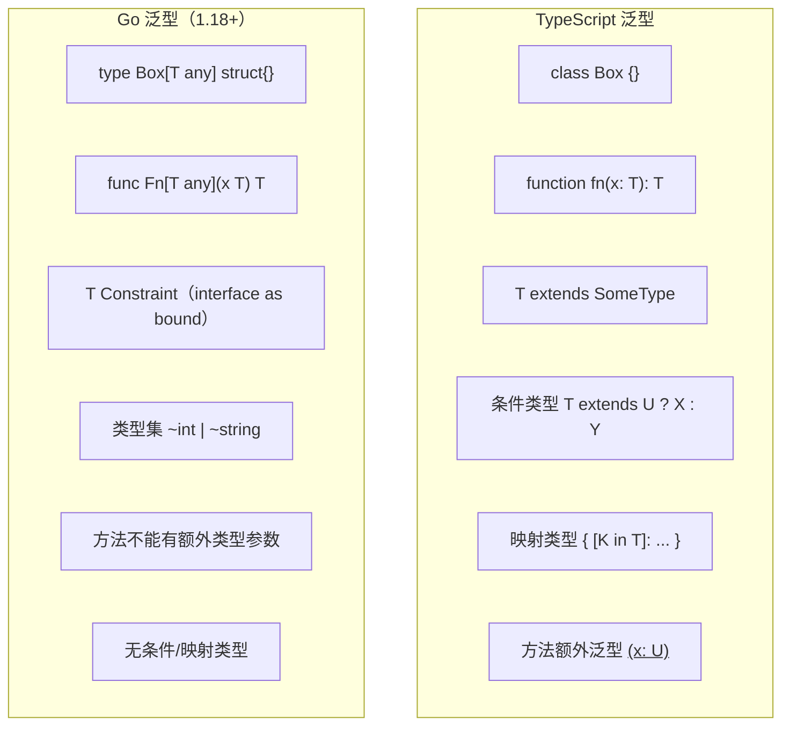
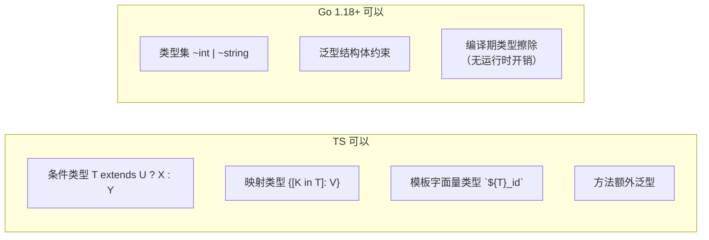

# 泛型 — Generics

> TypeScript: 泛型从 1.x 就是核心特性
> Go: Go 1.18（2022）引入泛型，设计更保守

## 全景对比



---

## 1. Go 泛型的语法

```typescript
// TypeScript
function identity<T>(value: T): T {
    return value;
}

const result = identity<string>("hello");
```

```go
// Go — 类型参数在函数名后、参数前
func Identity[T any](value T) T {
    return value
}

// 调用时类型推断
result := Identity("hello") // string
result2 := Identity[string]("hello") // 也可显式

// 多个类型参数
func Pair[T, U any](a T, b U) (T, U) {
    return a, b
}
```

---

## 2. 类型约束（Type Constraints）

```go
// Go — 用 interface 作为类型约束
// any = interface{} = 所有类型

// 预定义的约束
// comparable — 支持 == 和 !=
func Contains[T comparable](slice []T, v T) bool {
    for _, item := range slice {
        if item == v {
            return true
        }
    }
    return false
}

// 自定义约束
type Number interface {
    ~int | ~int8 | ~int16 | ~int32 | ~int64 |
        ~uint | ~uint8 | ~uint16 | ~uint32 | ~uint64 |
        ~float32 | ~float64
}

func Sum[T Number](values []T) T {
    var total T
    for _, v := range values {
        total += v
    }
    return total
}
```

```typescript
// TypeScript
type Number = number | bigint;

function sum<T extends number>(values: T[]): T {
    return values.reduce((a, b) => a + b, 0 as T);
}
```

> **`~` 的含义**：`~int` 表示"底层类型为 int 的所有类型"，包括 `type MyInt int`。
> 不加 `~` 则只匹配字面的 `int`，不包括自定义别名。

---

## 3. 泛型结构体与方法

```go
// Go — 泛型结构体
type Stack[T any] struct {
    items []T
}

func NewStack[T any]() *Stack[T] {
    return &Stack[T]{}
}

func (s *Stack[T]) Push(v T) {
    s.items = append(s.items, v)
}

func (s *Stack[T]) Pop() (T, bool) {
    if len(s.items) == 0 {
        var zero T
        return zero, false
    }
    v := s.items[len(s.items)-1]
    s.items = s.items[:len(s.items)-1]
    return v, true
}

// ⚠️ 方法不能有额外的类型参数！
// func (s *Stack[T]) Convert[U any]() Stack[U] { ... } // ❌ 编译错误
```

```typescript
// TypeScript — 方法可以额外泛型
class Stack<T> {
    items: T[] = [];
    push(v: T) {}
    pop(): T | undefined {}
    convert<U>(): Stack<U> { return new Stack(); } // ✅
}
```

---

## 4. Go 1.21+ 的 cmp / slices / maps 泛型包

```go
// Go 1.21+ 内置了大量泛型工具

import (
    "cmp"
    "slices"
    "maps"
)

// cmp — 比较
cmp.Compare(1, 2)  // -1
cmp.Less(1, 2)     // true
cmp.Or("", "fallback") // "fallback"（返回第一个非零值）

// slices — 切片操作
nums := []int{3, 1, 4, 1, 5}
slices.Sort(nums)  // [1, 1, 3, 4, 5]
slices.Reverse(nums)
idx := slices.Index(nums, 4) // 2

// maps — map 操作（见 map 章节）
```

---

## 5. 泛型约束的高级用法

### 5.1 方法约束

```go
// Go — 约束中要求方法
type Stringer interface {
    String() string
}

// Go 1.18+ 约束中可包含方法 + 类型集
type Printable interface {
    ~int | ~string
    String() string
}

// 注意：不能在一个约束中同时有方法约束和类型集（接口会被拆成两个概念）
// 以下是旧接口（可以有方法）
type Reader interface {
    Read(p []byte) (n int, err error)
}
```

### 5.2 类型推断与约束推导

```go
// Go — 编译时类型推断
func Min[T cmp.Ordered](a, b T) T {
    if a < b { return a }
    return b
}

Min(1, 2)        // int，自动推断
Min(1.5, 2.5)    // float64
Min("a", "b")    // string

// ⚠️ 类型参数必须满足所有约束条件
// Min(1, "a")  // ❌ 编译错误：类型参数不统一
```

---

## 6. TS vs Go 泛型差异详解



| 特性 | TypeScript | Go |
|------|-----------|-----|
| 引入版本 | 1.x（2012） | 1.18（2022） |
| 运行时开销 | 无（编译时擦除） | 无（静态单态化） |
| 类型参数位置 | 任意 | 仅函数/类型声明 |
| 方法额外泛型 | ✅ | ❌ |
| 条件类型 | ✅ | ❌ |
| 映射类型 | ✅ | ❌ |
| 类型集 | `extends` | interface + `\|` |
| 类型参数推断 | 复杂，支持部分推断 | 简单，全推断或全显式 |
| 泛型约束为 interface | ✅ | ✅ |
| 零值 | `null!` | `var zero T` |

---

## 7. 常见通用泛型模式

```go
// 选项：Maybe/Option 模式
type Option[T any] struct {
    value T
    valid bool
}

func Some[T any](v T) Option[T] {
    return Option[T]{value: v, valid: true}
}

func None[T any]() Option[T] {
    return Option[T]{valid: false}
}

func (o Option[T]) Get() (T, bool) {
    return o.value, o.valid
}

// 结果：Result 模式
type Result[T any] struct {
    value T
    err   error
}

func Ok[T any](v T) Result[T] {
    return Result[T]{value: v}
}

func Err[T any](e error) Result[T] {
    return Result[T]{err: e}
}
```

---

## 8. 完整对照表

| 操作 | TypeScript | Go |
|------|-----------|-----|
| 泛型函数 | `function f<T>(x:T)` | `func F[T any](x T)` |
| 泛型类型 | `type Box<T> = {...}` | `type Box[T any] struct{}` |
| 约束 | `T extends Constraint` | `T Constraint` |
| 联合约束 | `T extends A \| B` | `T ~A \| ~B` |
| 方法泛型 | `method<U>(x:U)` | ❌ 不支持 |
| 类型推断 | 部分支持（infer） | 全推断或全显式 |
| 类型集/代数 | 条件/映射类型 | interface + `\|` |
| 零值 | 无安全语法 | `var zero T` |
| 运行时开销 | 无（擦除） | 无（单态化） |

---

## 快速记忆

```
[T any]              — 泛型类型参数（无约束）
[T comparable]       — 可比较约束（==/!=）
[T ~int | ~float64]  — 类型集约束
[T Number]           — 自定义 interface 约束

type Box[T any] struct{ Value T }  — 泛型结构体
func Fn[T any](x T) T              — 泛型函数

!  ~ 表示底层类型 — 包含自定义别名
!  方法不能额外泛型 — 用参数或包函数绕过
!  无条件类型 — 不支持 T extends U ? X : Y
!  Go 泛型偏保守 — 覆盖 80% 场景，缺失 TS 的类型体操
```
