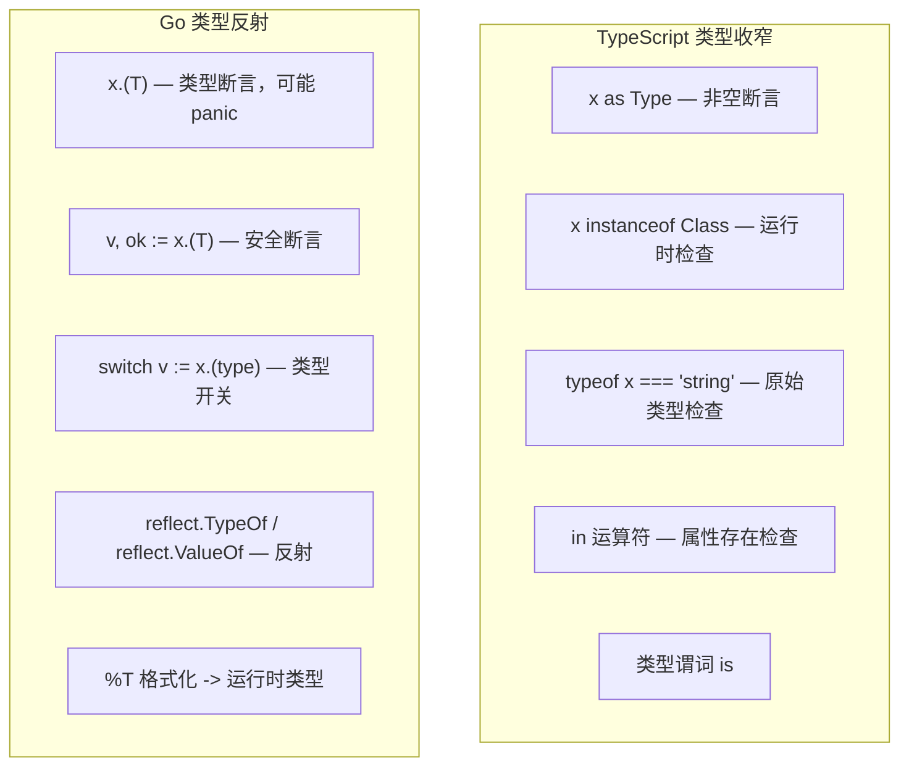
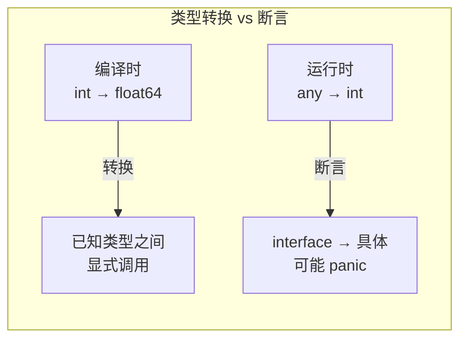

# 类型断言与类型开关 — Type Assertion & Type Switch

> TypeScript: `as` / `instanceof` / `typeof` / 类型收窄
> Go: `.(T)` 类型断言 / `.(type)` 类型开关 / 显式类型转换

## 全景对比



---

## 1. 类型断言（Type Assertion）

```go
// Go — x.(T)，从 interface{} 中提取具体类型
var v any = "hello"

// 不安全断言（失败时 panic）
s := v.(string)      // ✅ "hello"
// n := v.(int)      // ❌ panic: interface conversion: string is not int

// 安全断言（推荐）
s, ok := v.(string)  // ok=true, s="hello"
n, ok := v.(int)     // ok=false, n=0（不 panic）

// 使用模式
if s, ok := v.(string); ok {
    fmt.Println("string:", s)
} else {
    fmt.Println("not a string")
}
```

```typescript
// TypeScript
const v: unknown = "hello";

const s = v as string;        // 信任我，这是 string
const s = v as string ?? "";  // 安全些

if (typeof v === "string") {
    console.log(v.toUpperCase()); // 类型收窄
}

// instanceof
if (v instanceof Error) {
    console.log(v.message);
}
```

---

## 2. 类型开关（Type Switch）

```go
// Go — 最优雅的多类型分派
func describe(v any) string {
    switch v := v.(type) {
    case nil:
        return "nil"
    case int:
        return fmt.Sprintf("int: %d", v) // v 是 int
    case float64:
        return fmt.Sprintf("float64: %f", v) // v 是 float64
    case string:
        return fmt.Sprintf("string: %q", v) // v 是 string
    case bool:
        if v {
            return "true"
        }
        return "false"
    case []int:
        return fmt.Sprintf("[]int: %v", v)
    default:
        return fmt.Sprintf("unknown type: %T", v) // %T 打印类型名
    }
}

// 测试
describe(42)              // "int: 42"
describe("hello")         // "string: "hello""
describe([]int{1, 2, 3}) // "[]int: [1 2 3]"
describe(nil)             // "nil"
```

```typescript
// TypeScript
function describe(v: unknown): string {
    if (v === null) return "null";
    if (typeof v === "number") return `number: ${v}`;
    if (typeof v === "string") return `string: ${v}`;
    if (typeof v === "boolean") return `boolean: ${v}`;
    if (Array.isArray(v)) return `array: ${v}`;
    return `unknown: ${typeof v}`;
}
```

> **`v := v.(type)` 语法**：左侧的 `v` 是**新变量**，shadow 了外面那个 `any` 版本的 `v`，但类型已经被收窄为具体类型。

---

## 3. `%T` — 格式化打印类型

```go
// Go — %T 输出类型名，非常实用
var x any = 42
fmt.Printf("type=%T value=%v\n", x, x) // type=int value=42

// 在日志 / debugging 中常用
func logValue(v any) {
    fmt.Printf("[%T] %+v\n", v, v)
}
```

```typescript
// TypeScript — 无直接等价
console.log(typeof x);     // "number"
console.log(Object.prototype.toString.call(x)); // "[object Number]"
```

---

## 4. 反射（reflect 包）

```go
// Go — reflect 包处理更复杂的类型操作
import "reflect"

var v any = "hello"

t := reflect.TypeOf(v)      // string
val := reflect.ValueOf(v)   // "hello"

fmt.Println(t.Name())       // "string"
fmt.Println(t.Kind())       // string（Kind 是底层类别）
fmt.Println(val.String())   // "hello"

// 通过反射修改值（需要可寻址）
x := 42
p := reflect.ValueOf(&x).Elem()
p.SetInt(100)
fmt.Println(x) // 100

// 遍历 struct 字段
type User struct {
    Name string `json:"name"`
    Age  int    `json:"age"`
}

u := User{"Alice", 30}
t = reflect.TypeOf(u)
for i := 0; i < t.NumField(); i++ {
    field := t.Field(i)
    fmt.Printf("%s: tag=%s\n", field.Name, field.Tag.Get("json"))
}
// Name: tag=name
// Age:  tag=age
```

```typescript
// TypeScript — 索引类型与映射类型
const u = { name: "Alice", age: 30 };
type Keys = keyof typeof u; // "name" | "age"
```

> ⚠️ **反射使用原则**：反射慢、不类型安全、难读。优先用接口、泛型、类型开关。仅在 JSON 序列化 / ORM / 配置解析等场景使用。

---

## 5. 类型转换 vs 类型断言

```go
// Go — 两个不同概念

// 类型转换（type conversion）：编译时，已知类型之间
var i int = 42
var f float64 = float64(i)  // 编译时转换
var s string = string(rune) // rune → string

// 类型断言（type assertion）：运行时，interface{} → 具体类型
var x any = 42
n := x.(int)                // 运行时断言

// ⚠️ 不能对具体类型做断言
// var y int = 42
// y.(float64)              // ❌ 编译错误：non-interface type int
```



---

## 6. `any` 与接口赋值的nil陷阱

```go
// 回忆 nil 章节：接口的 nil 检查比想象中复杂
var v any = (*int)(nil)     // 把一个 nil *int 赋给 any
fmt.Println(v == nil)       // false！

// 安全判断
if v == nil {
    fmt.Println("truly nil") // 不会执行
}

// 需要用反射检底层值
if v != nil {
    if reflect.ValueOf(v).IsNil() {
        fmt.Println("v is nil pointer wrapped in interface")
    }
}

// 或者用类型断言
if p, ok := v.(*int); ok && p == nil {
    fmt.Println("it's a nil *int")
}
```

---

## 7. Go 1.18+ 泛型与类型断言

```go
// 泛型中有时也需要类型断言
func IsZero[T any](v T) bool {
    // 错误写法：
    // return v == 0  // ❌ T 不一定是 comparable

    // 方法 1：用 reflect
    return reflect.ValueOf(&v).Elem().IsZero()

    // 方法 2：用 comparable 约束
}

func IsZero2[T comparable](v T) bool {
    var zero T
    return v == zero  // ✅ comparable 允许 ==
}

// 类型断言在泛型中受限
func Wrap[T any](v T) any {
    if s, ok := any(v).(string); ok {
        return "string: " + s
    }
    return v
}
```

---

## 8. 完整对照表

| 操作 | TypeScript | Go |
|------|-----------|-----|
| 类型收窄 | `typeof` / `instanceof` | `.(type)` switch |
| 非空断言 | `x as T` | `x.(T)`（可能 panic） |
| 安全断言 | `if typeof x === "string"` | `v, ok := x.(T)` |
| 多类型分派 | `typeof` + if 链 | `switch v := x.(type)` |
| 运行时类型名 | `typeof x` | `reflect.TypeOf(x)` |
| 类型转换 | `x as unknown as T` | `T(x)`（编译时） |
| 反射 | 无强类型反射 | `reflect` 包 |
| 结构体标签 | 装饰器 | tag 字符串 + reflect |

---

## 快速记忆

```
x.(T)                — 类型断言（panic 如果类型不匹配）
v, ok := x.(T)       — 安全断言（ok=false 不 panic）
switch v := x.(type) — 类型开关

%T                   — printf 打印类型
reflect.TypeOf(x)    — 获取类型元信息
reflect.ValueOf(x)   — 获取值 + 修改

!  断言只能用于 interface — 具体类型上不能用 .(T)
!  类型转换在编译时        — 断言在运行时
!  any 包裹 nil 指针 ≠ nil — 接口 nil 检查有陷阱
!  优先用泛型 + 类型开关   — 反射是最后的手段
```
