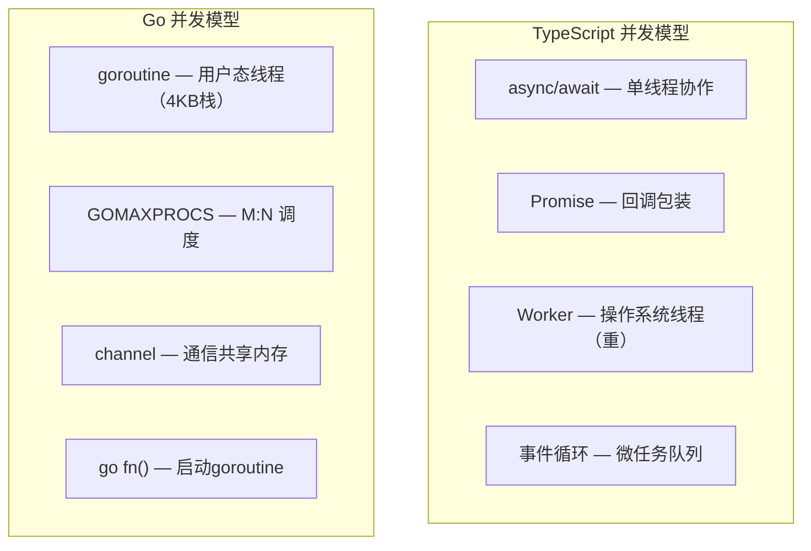
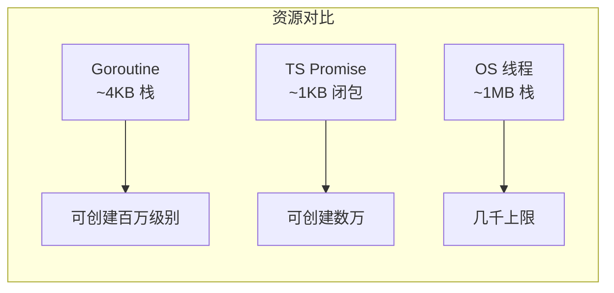

# Goroutine — Go 协程

> TypeScript: `Promise` / `async-await` / `Worker` 线程
> Go: `go fn()` — 轻量级并发执行

## 全景对比



---

## 1. 基本使用

```typescript
// TypeScript — 异步函数
async function fetchData(url: string): Promise<Data> {
    const response = await fetch(url);
    return response.json();
}

// 调用
const data = await fetchData("/api/data");
```

```go
// Go — goroutine，不阻塞当前执行
func fetchData(url string) (Data, error) {
    resp, err := http.Get(url)
    if err != nil {
        return Data{}, err
    }
    defer resp.Body.Close()
    var data Data
    err = json.NewDecoder(resp.Body).Decode(&data)
    return data, err
}

// 启动 goroutine
go fetchData("/api/data")   // ✅ 异步执行，不等待

// 但这样拿不到返回值——需要用 channel
```

---

## 2. Goroutine vs Promise/Worker



| 特性 | TS Promise | TS Worker | Go Goroutine |
|------|-----------|-----------|-------------|
| 栈大小 | 闭包捕获 | 每个线程 ~1MB | 初始 ~4KB，动态扩容 |
| 启动成本 | ~1μs | ~1ms（线程创建） | ~0.1μs |
| 最大数量 | 数万 | 数千 | 数百万 |
| 调度 | 事件循环（单线程） | OS 调度 | Go 运行时 M:N 调度 |
| 通信 | 返回值/回调 | postMessage | channel |

---

## 3. 启动与等待

```go
// 启动 goroutine 很简单，但需要同步机制

// 方法 1：使用 WaitGroup（推荐）
func main() {
    var wg sync.WaitGroup

    for i := 1; i <= 3; i++ {
        wg.Add(1) // 计数器 +1
        go func(id int) {
            defer wg.Done() // 计数器 -1
            fmt.Printf("goroutine %d running\n", id)
            time.Sleep(time.Second)
        }(i)
    }

    wg.Wait() // 等待所有 goroutine 完成
    fmt.Println("all done")
}
```

```typescript
// TypeScript
const promises = [1, 2, 3].map(async (id) => {
    console.log(`task ${id} running`);
    await new Promise(r => setTimeout(r, 1000));
});

await Promise.all(promises);
console.log("all done");
```

> ⚠️ **goroutine 闭包陷阱**：循环变量直接引用
> ```go
> for i := 1; i <= 3; i++ {
>     go func() {
>         fmt.Println(i) // Go < 1.22: 可能全是 4
>     }()
> }
>
> // ✅ 正确：传参
> go func(id int) {
>     fmt.Println(id)
> }(i)
>
> // Go 1.22+：循环变量每次迭代创建新变量 ✅
> ```

---

## 4. Goroutine 是协作式调度

```go
// Goroutine 是协作式的——不是抢占式
// 长时间 CPU 计算会"饿死"其他 goroutine？

// Go 1.14+ 引入了基于信号的抢占式调度
// 但某些场景仍可能阻塞

// 长时间计算中主动让出
func heavyTask() {
    for i := 0; i < 1_000_000_000; i++ {
        if i%10_000_000 == 0 {
            runtime.Gosched() // 主动让出
        }
        _ = i * i
    }
}
```

---

## 5. Goroutine 无法直接返回值

```go
// ❌ goroutine 内部的值无法直接返回
func compute() int {
    return 42
}

// 启动 goroutine 但丢了返回值
// go compute() // 返回值被丢弃

// ✅ 用 channel 获取结果
func computeWithChannel(ch chan int) {
    ch <- 42
}

// ✅ 用闭包写入外部变量（需要同步）
var result int
var wg sync.WaitGroup
wg.Add(1)
go func() {
    defer wg.Done()
    result = compute()
}()
wg.Wait()
fmt.Println(result) // 42
```

---

## 6. `sync.Once` — 仅执行一次

```go
var once sync.Once
var config *Config

func loadConfig() *Config {
    once.Do(func() {
        fmt.Println("loading config...")
        config = &Config{Host: "localhost"}
    })
    return config
}

// 多个 goroutine 同时调用，只有第一个会执行
// 后续调用直接返回已初始化的 config
```

```typescript
// TypeScript
let config: Config | null = null;
let loading = false;

async function loadConfig(): Promise<Config> {
    if (config) return config;
    if (loading) await loadingPromise; // 等待初始化完成
    loading = true;
    config = await fetchConfig();
    return config;
}
```

---

## 7. 完整对照表

| 操作 | TypeScript | Go |
|------|-----------|-----|
| 启动异步 | `async fn()` | `go fn()` |
| 等待完成 | `await promise` | `wg.Wait()` / `<-ch` |
| 闭包传参 | 直接捕获 | 显式传参（推荐） |
| 返回结果 | `return` | channel / 闭包写入 |
| 资源占用 | ~1KB | ~4KB（动态扩展） |
| 最大数量 | 数千（Promise） | 数百万 |
| 调度 | 事件循环 | M:N 用户态调度 |
| 超时 | `Promise.race` | `context.WithTimeout` |
| 取消 | `AbortController` | `context.WithCancel` |

---

## 快速记忆

```
go fn()               — 启动 goroutine
go fn(arg1, arg2)     — 传参启动（推荐）
wg.Add(1) / wg.Done() — 计数
wg.Wait()              — 等待全部完成

!  goroutine 是轻量级 — 百万级没问题
!  闭包循环变量要传参  — 避免捕获同一个变量
!  goroutine 不可直接返回 — 用 channel 或 sync 传结果
!  main 函数结束 = 全部 goroutine 结束 — 用 sync.WaitGroup 等
```
