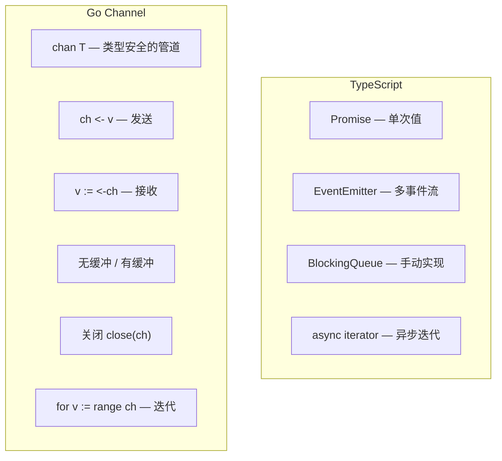
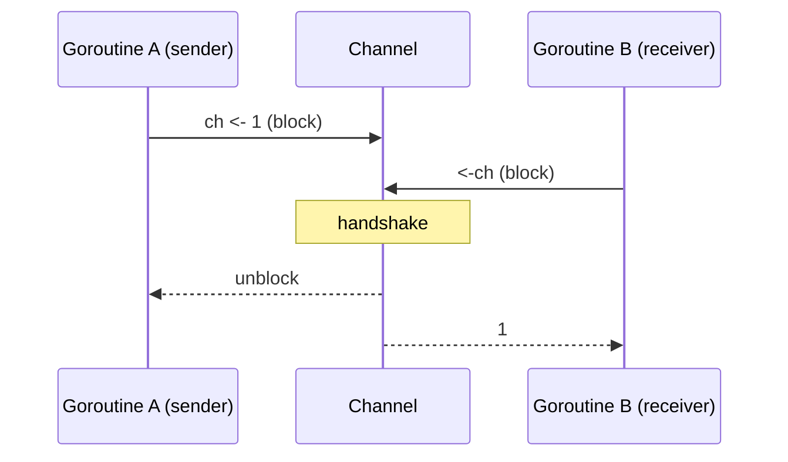

# 通道 — Channel

> TypeScript: 无直接等价——用 `Promise` / `EventEmitter` / `Queue` 模拟
> Go: `chan T` — goroutine 之间通信的一等公民

## 全景对比



---

## 1. 基本操作

```go
// 创建
ch := make(chan int)         // 无缓冲 channel
bufCh := make(chan int, 10)  // 有缓冲 channel（容量 10）

// 发送
go func() {
    ch <- 42  // 发送（阻塞直到有人接收）
}()

// 接收
v := <-ch     // 接收（阻塞直到有人发送）
fmt.Println(v) // 42

// 关闭
close(ch)

// 通道关闭后：
// 1. 已缓冲的数据仍可读
// 2. 未缓冲的接收立即返回零值 + ok=false
// 3. 发送 panic: send on closed channel

// 安全接收
v, ok := <-ch
if ok {
    fmt.Println("received:", v)
} else {
    fmt.Println("channel closed")
}
```

```typescript
// TypeScript — 无直接等价
// 用 Promise 模拟单次
const ch = new Promise<number>((resolve) => {
    resolve(42);
});
const v = await ch;

// 用 Queue 模拟多值
class Channel<T> {
    private queue: T[] = [];
    private resolvers: ((v: T) => void)[] = [];

    send(v: T) {
        if (this.resolvers.length > 0) {
            this.resolvers.shift()!(v);
        } else {
            this.queue.push(v);
        }
    }

    async receive(): Promise<T> {
        if (this.queue.length > 0) {
            return this.queue.shift()!;
        }
        return new Promise(resolve => this.resolvers.push(resolve));
    }
}
```

---

## 2. 无缓冲 vs 有缓冲

### 2.1 无缓冲通道

```go
// 无缓冲：同步通信
// 发送方阻塞，直到接收方就绪
// 接收方阻塞，直到发送方就绪
// → 一次握手，保证双方同时到达

ch := make(chan int)

go func() {
    ch <- 1  // 阻塞直到 main 中的 <-ch 执行
    fmt.Println("sent 1")
}()
// <-ch 在这里执行
time.Sleep(time.Second)
v := <-ch

fmt.Println("got", v)
// 输出：
// got 1
// sent 1
```



### 2.2 有缓冲通道

```go
// 有缓冲：异步通信
// 发送方在缓冲区未满时不阻塞
// 接收方在缓冲区非空时不阻塞

ch := make(chan int, 3)

ch <- 1  // ✅ 不阻塞
ch <- 2  // ✅ 不阻塞
ch <- 3  // ✅ 不阻塞
// ch <- 4  // ❌ 阻塞！缓冲区已满

fmt.Println(<-ch) // 1
fmt.Println(<-ch) // 2
fmt.Println(<-ch) // 3
```

---

## 3. Channel 方向

```go
// Go 可以指定 channel 的方向，提高类型安全

// 只发送（双向 chan 可隐式转）
func sendOnly(ch chan<- int, v int) {
    ch <- v
    // <-ch  // ❌ 编译错误：只能发送
}

// 只接收
func receiveOnly(ch <-chan int) int {
    return <-ch
    // ch <- 1  // ❌ 编译错误：只能接收
}

// 在函数签名中使用方向
func worker(done chan<- bool) {
    // 处理...
    done <- true
}

func main() {
    ch := make(chan bool)
    go worker(ch)
    <-ch
}
```

---

## 4. for range 读取 channel

```go
// channel 可以像 slice/map 一样用 range 遍历
// 迭代到 channel 关闭为止

ch := make(chan int)
go func() {
    for i := 0; i < 5; i++ {
        ch <- i
    }
    close(ch) // 必须关闭，否则 range 死锁
}()

for v := range ch {
    fmt.Println(v) // 0, 1, 2, 3, 4
}
```

```typescript
// TypeScript — 异步迭代器
async function* generator() {
    for (let i = 0; i < 5; i++) {
        yield i;
    }
}

for await (const v of generator()) {
    console.log(v);
}
```

---

## 5. 关闭 Channel 的原则

```go
// Go 通道关闭的黄金法则：
// 不要在接收方关闭
// 不要在有多个发送方时关闭
// 只在发送方关闭

// 正确示例：
ch := make(chan int)
go func() {
    // 发送方
    defer close(ch) // ✅ 发送方关闭
    for i := 0; i < 3; i++ {
        ch <- i
    }
}()

for v := range ch {
    fmt.Println(v)
}

// 检测关闭
v, ok := <-ch
if !ok {
    fmt.Println("channel closed")
}
```

---

## 6. Channel 实现 Worker Pool

```go
func worker(id int, jobs <-chan int, results chan<- int) {
    for job := range jobs {
        fmt.Printf("worker %d processing job %d\n", id, job)
        time.Sleep(time.Second)
        results <- job * 2
    }
}

func main() {
    const numJobs = 10
    const numWorkers = 3

    jobs := make(chan int, numJobs)
    results := make(chan int, numJobs)

    // 启动 worker
    for w := 1; w <= numWorkers; w++ {
        go worker(w, jobs, results)
    }

    // 发送任务
    for j := 1; j <= numJobs; j++ {
        jobs <- j
    }
    close(jobs) // 通知 worker 没有更多任务

    // 收集结果
    for r := 1; r <= numJobs; r++ {
        <-results
    }
}
```

```typescript
// TypeScript
async function worker(id: number, jobs: number[], results: number[]) {
    for (const job of jobs) {
        console.log(`worker ${id} processing job ${job}`);
        await new Promise(r => setTimeout(r, 1000));
        results.push(job * 2);
    }
}
```

---

## 7. 完整对照表

| 操作 | TypeScript | Go |
|------|-----------|-----|
| 创建 | `Promise` / `Queue` | `make(chan T)` |
| 发送 | `resolve(v)` | `ch <- v` |
| 接收 | `await promise` | `<-ch` |
| 缓冲 | 无 | `make(chan T, N)` |
| 关闭 | 无（Promise 自动终态） | `close(ch)` |
| 迭代 | `for await...of` | `for v := range ch` |
| 多消费者 | `EventEmitter` | 多 goroutine + chan |
| 超时 | `Promise.race` | `select { case <-ch: case <-time.After: }` |
| 方向 | 无 | `chan<-` / `<-chan` |

---

## 快速记忆

```
ch := make(chan T)     — 无缓冲（同步通信）
ch := make(chan T, N)  — 有缓冲（异步，N 容量）

ch <- v                — 发送
v := <-ch              — 接收
v, ok := <-ch          — 安全接收（检测关闭）
close(ch)              — 关闭

for v := range ch { }  — 迭代直到关闭

!  无缓冲 = 同步握手     — 发送/接收都阻塞直到配对
!  缓冲 = 异步队列      — 空时收阻塞，满时发阻塞
!  只在发送方关闭       — 接收方关闭 panic
!  关闭后接收 → 零值    — 关闭后发送 → panic
```
