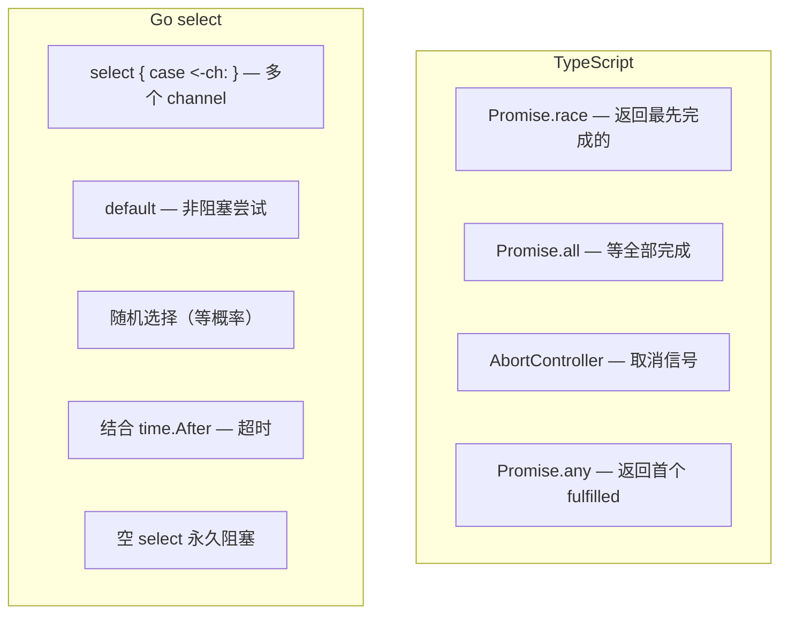

# Select — 多路复用

> TypeScript: `Promise.race()` / `Promise.all()` / `AbortController`
> Go: `select { case <-ch1: case <-ch2: }` — 等待多个 channel 之一就绪

## 全景对比



---

## 1. 基础语法

```go
// select 等待多个 channel 操作中的一个就绪
func main() {
    ch1 := make(chan string)
    ch2 := make(chan string)

    go func() {
        time.Sleep(1 * time.Second)
        ch1 <- "one"
    }()
    go func() {
        time.Sleep(2 * time.Second)
        ch2 <- "two"
    }()

    select {
    case msg1 := <-ch1:
        fmt.Println("received from ch1:", msg1)
    case msg2 := <-ch2:
        fmt.Println("received from ch2:", msg2)
    case <-time.After(3 * time.Second):
        fmt.Println("timeout")
    }
}
```

```typescript
// TypeScript — Promise.race
const ch1 = new Promise<string>(resolve => {
    setTimeout(() => resolve("one"), 1000);
});
const ch2 = new Promise<string>(resolve => {
    setTimeout(() => resolve("two"), 2000);
});

const result = await Promise.race([ch1, ch2]);
console.log(result); // "one"（1秒后）
```

---

## 2. Select 的关键特性

### 2.1 随机选择

```go
// 当多个 case 同时就绪时，select 随机选择一个
ch1 := make(chan int, 1)
ch2 := make(chan int, 1)

ch1 <- 1
ch2 <- 2

select {
case v := <-ch1:
    fmt.Println("ch1:", v)
case v := <-ch2:
    fmt.Println("ch2:", v)
}
// 每次运行可能不同结果
```

```typescript
// TypeScript — Promise.race 偏向先注册的
// 无法做到真正的随机选择
const first = await Promise.race([promise1, promise2]);
```

### 2.2 非阻塞操作（default）

```go
// default — 所有 case 都阻塞时立即执行
ch := make(chan int)

select {
case v := <-ch:
    fmt.Println("received:", v)
default:
    fmt.Println("no message available") // 立即执行
}

// 非阻塞发送
select {
case ch <- 42:
    fmt.Println("sent")
default:
    fmt.Println("channel full, not sent")
}
```

### 2.3 空 select

```go
// 永久阻塞（通常是有意为之）
// select {}  // 当前 goroutine 永久阻塞
// 常见于 main 函数保持程序运行
```

---

## 3. 超时控制

```go
// Select + time.After 是最常见的超时模式
ch := make(chan int)

go func() {
    time.Sleep(5 * time.Second)
    ch <- 42
}()

select {
case v := <-ch:
    fmt.Println("result:", v)
case <-time.After(2 * time.Second):
    fmt.Println("timeout after 2s")
}
```

```typescript
// TypeScript
const result = await Promise.race([
    fetchData(),
    new Promise((_, reject) =>
        setTimeout(() => reject(new Error("timeout")), 2000)
    ),
]);
```

> ⚠️ **time.After 的内存泄漏**：`time.After` 创建定时器，在 select 结束前不会 GC。高并发循环中应使用 `time.NewTimer` 并手动 Stop：
> ```go
> timer := time.NewTimer(2 * time.Second)
> defer timer.Stop()  // 防止泄漏
> select {
> case v := <-ch:
>     fmt.Println(v)
> case <-timer.C:
>     fmt.Println("timeout")
> }
> ```

---

## 4. 循环 select 模式

```go
// 最常用的模式：for + select 持续处理
func main() {
    ch := make(chan int)
    done := make(chan bool)

    // 生产者
    go func() {
        for i := 0; i < 10; i++ {
            ch <- i
        }
        close(done)
    }()

    // 消费者
    for {
        select {
        case v, ok := <-ch:
            if !ok {
                fmt.Println("channel closed")
                return
            }
            fmt.Println("processing:", v)
        case <-done:
            fmt.Println("all done")
            return
        default:
            // 没有数据时做其他事
            fmt.Print(".")
            time.Sleep(50 * time.Millisecond)
        }
    }
}
```

---

## 5. Select 与 Context 取消

```go
// Go 标准模式：任务循环配合 ctx.Done()
func worker(ctx context.Context, tasks <-chan Task) {
    for {
        select {
        case task, ok := <-tasks:
            if !ok {
                return // 任务队列关闭
            }
            process(task)
        case <-ctx.Done():
            fmt.Println("cancelled:", ctx.Err())
            return // 上下文取消，退出
        }
    }
}

// 使用
ctx, cancel := context.WithTimeout(context.Background(), 5*time.Second)
defer cancel()

go worker(ctx, tasks)
```

---

## 6. Select + nil Channel 技巧

```go
// nil channel 在 select 中永远不会被选中
// 可以用来"动态开关"某个 case

func main() {
    ch := make(chan int)
    var disabledCh chan int = nil // 禁用

    go func() {
        time.Sleep(1 * time.Second)
        ch <- 42
    }()

    select {
    case v := <-ch:
        fmt.Println("from ch:", v)
    case v := <-disabledCh: // 永远不会执行
        fmt.Println("from disabled:", v)
    }

    // 动态启用/禁用 channel
    enable := true
    var dynamicCh chan int
    if enable {
        dynamicCh = ch
    }

    select {
    case v := <-dynamicCh: // 只有 enable=true 时才会被选中
        fmt.Println(v)
    default:
        fmt.Println("not enabled")
    }
}
```

---

## 7. 完整对照表

| 操作 | TypeScript | Go |
|------|-----------|-----|
| 多选一 | `Promise.race` | `select { case: ... }` |
| 等全部 | `Promise.all` | 多个 goroutine + WaitGroup |
| 超时 | `Promise.race` + timeout | `select { case <-ch: case <-time.After: }` |
| 非阻塞 | `Promise.resolve(undefined)` | `select { default: }` |
| 取消信号 | `AbortController` | `ctx.Done()` |
| 轮询 | 事件循环 | `for { select {} }` |
| 随机选择 | 不可控（先注册先得） | 同时就绪时随机 |
| 空阻塞 | `await new Promise(()=>{})` | `select {}` |

---

## 快速记忆

```
select {
case v := <-ch1:      — 从 ch1 接收（就绪则执行）
case ch2 <- v:        — 向 ch2 发送（就绪则执行）
case <-time.After(d): — 超时控制
default:              — 非阻塞（无 case 就绪时）
}

!  多个 case 同时就绪 → 随机选一个
!  select 只执行一个 case
!  default 立即执行（非阻塞）
!  nil channel 永不会被选中（可动态开关）
!  for + select = 持续处理循环
```
