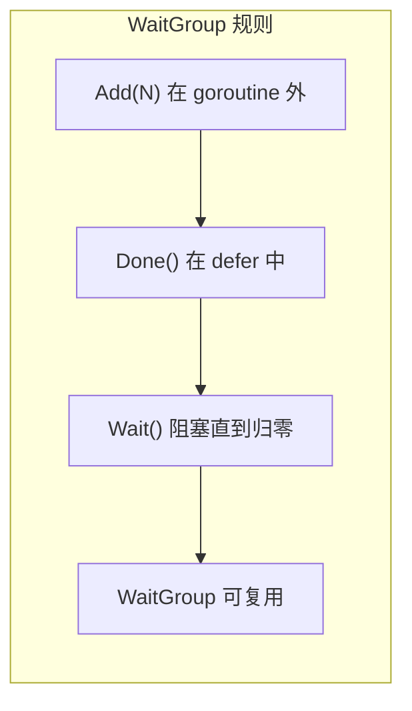

# WaitGroup — 等待集合

> TypeScript: `Promise.all()` / `Promise.allSettled()`
> Go: `sync.WaitGroup` — 等待 N 个 goroutine 完成

## 全景对比

```typescript
// TypeScript
const promises = [1, 2, 3].map(async (id) => {
    await doWork(id);
});
await Promise.all(promises);
console.log("all done");
```

```go
// Go
var wg sync.WaitGroup

for _, id := range []int{1, 2, 3} {
    wg.Add(1) // 计数器 +1
    go func(id int) {
        defer wg.Done() // 计数器 -1
        doWork(id)
    }(id)
}

wg.Wait() // 阻塞直到计数器归零
fmt.Println("all done")
```

---

## 1. 基础使用

```go
func main() {
    var wg sync.WaitGroup

    // 启动 3 个 goroutine
    for i := 1; i <= 3; i++ {
        wg.Add(1) // 在 goroutine 外 Add
        go func(id int) {
            defer wg.Done() // 用 defer 保证 Done
            fmt.Printf("worker %d starting\n", id)
            time.Sleep(time.Duration(id) * time.Second)
            fmt.Printf("worker %d done\n", id)
        }(i)
    }

    wg.Wait() // 等待所有 worker 完成
    fmt.Println("all workers finished")
}
```

---

## 2. 使用原则



```go
// ✅ 正确
wg.Add(1)
go func() {
    defer wg.Done()
    work()
}()

// ❌ 错误：在 goroutine 内部 Add
go func() {
    wg.Add(1) // 可能会在 Wait 之后才 Add
    defer wg.Done()
    work()
}()
wg.Wait() // 可能不等这个 goroutine
```

---

## 3. WaitGroup + 错误传播

```go
// WaitGroup 本身不传递错误
// 需要结合 channel 或 error group

// 方式 1：error channel
func main() {
    var wg sync.WaitGroup
    errCh := make(chan error, 3) // 缓冲避免阻塞

    for _, task := range tasks {
        wg.Add(1)
        go func(t Task) {
            defer wg.Done()
            if err := process(t); err != nil {
                errCh <- err
            }
        }(task)
    }

    wg.Wait()
    close(errCh) // 关闭后 range 结束

    for err := range errCh {
        fmt.Println("error:", err)
    }
}
```

---

## 4. errgroup — WaitGroup + 错误传播（官方扩展）

```go
// Go 官方扩展：golang.org/x/sync/errgroup

import "golang.org/x/sync/errgroup"

func main() {
    g := errgroup.Group{}

    for _, url := range urls {
        url := url // 捕获
        g.Go(func() error {
            resp, err := http.Get(url)
            if err != nil {
                return err
            }
            defer resp.Body.Close()
            // 处理响应
            return nil
        })
    }

    // 等待所有 goroutine 完成，返回第一个非 nil 错误
    if err := g.Wait(); err != nil {
        fmt.Println("error:", err)
    }
}
```

---

## 5. WaitGroup 的限制

```go
// WaitGroup 不支持：
// 1. 超时（用 context）
// 2. 错误传播（用 errgroup）
// 3. 最大并发数（用 semaphore/worker pool）
// 4. 取消（用 context）

// 带超时的等待
func waitWithTimeout(wg *sync.WaitGroup, timeout time.Duration) bool {
    c := make(chan struct{})
    go func() {
        defer close(c)
        wg.Wait()
    }()
    select {
    case <-c:
        return true // 正常完成
    case <-time.After(timeout):
        return false // 超时
    }
}
```

---

## 6. 完整对照表

| 操作 | TypeScript | Go |
|------|-----------|-----|
| 启动批任务 | `Promise.all(fns.map(fn))` | `wg.Add(N)` + `go fn()` |
| 等待完成 | `await Promise.all` | `wg.Wait()` |
| 收集结果 | `Promise.all` 返回数组 | channel |
| 错误收集 | `Promise.allSettled` | errgroup |
| 超时 | `Promise.race` + timeout | `context.WithTimeout` |
| 限制并发 | 自定义 | worker pool (chan) |
| 取消 | `AbortController` | `context.WithCancel` |

---

## 快速记忆

```
var wg sync.WaitGroup

wg.Add(1)          — 加 1（在 goroutine 外）
defer wg.Done()    — 减 1（在 goroutine 内）
wg.Wait()          — 阻塞等归零

!  Add 在 goroutine 外 — 防止 Wait 提前执行
!  Done 用 defer 保证 — 即使 panic 也会执行
!  WaitGroup 可复用  — 用完后可以再次 Add/Wait
!  不传递错误        — 需额外 channel 或 errgroup
```
