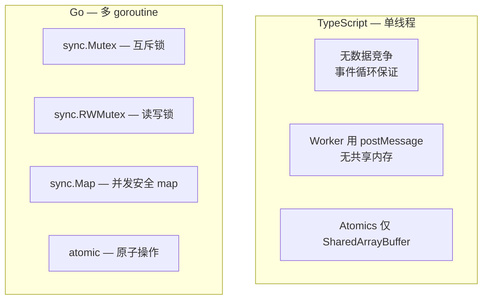
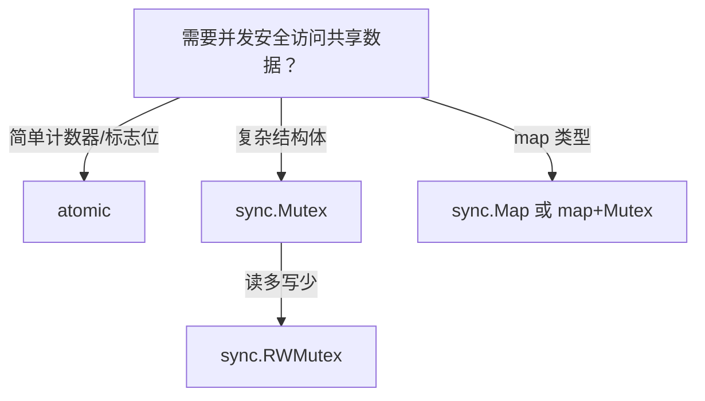

# 互斥锁 — Mutex

> TypeScript: 单线程无数据竞争——不需要锁
> Go: `sync.Mutex` / `sync.RWMutex` — 保护共享数据

## 全景对比



---

## 1. 为什么需要锁

```go
// ❌ 数据竞争：多个 goroutine 同时写
var counter int

func main() {
    var wg sync.WaitGroup
    for i := 0; i < 1000; i++ {
        wg.Add(1)
        go func() {
            defer wg.Done()
            counter++ // ❌ 数据竞争！
        }()
    }
    wg.Wait()
    fmt.Println(counter) // 可能 ≠ 1000
}

// 检测数据竞争：
// go run -race main.go
// 输出：WARNING: DATA RACE
```

---

## 2. sync.Mutex — 互斥锁

```go
// ✅ 用 Mutex 保护
type Counter struct {
    mu    sync.Mutex
    value int
}

func (c *Counter) Increment() {
    c.mu.Lock()
    defer c.mu.Unlock()
    c.value++
}

func (c *Counter) Value() int {
    c.mu.Lock()
    defer c.mu.Unlock()
    return c.value
}

// 使用
counter := &Counter{}
var wg sync.WaitGroup
for i := 0; i < 1000; i++ {
    wg.Add(1)
    go func() {
        defer wg.Done()
        counter.Increment()
    }()
}
wg.Wait()
fmt.Println(counter.Value()) // 1000 ✅
```

```typescript
// TypeScript — 单线程不需要锁
// 如果有 Worker，用 Atomics
let counter = 0;
for (let i = 0; i < 1000; i++) {
    counter++; // 安全！单线程
}
```

---

## 3. sync.RWMutex — 读写锁

```go
// RWMutex：读不互斥，写互斥
// 适合读多写少的场景

type Cache struct {
    mu    sync.RWMutex
    data  map[string]string
}

func (c *Cache) Get(key string) (string, bool) {
    c.mu.RLock()          // 读锁——多个读可同时获取
    defer c.mu.RUnlock()
    v, ok := c.data[key]
    return v, ok
}

func (c *Cache) Set(key, value string) {
    c.mu.Lock()           // 写锁——排他
    defer c.mu.Unlock()
    c.data[key] = value
}

// 性能对比：
// Mutex: 任何时候只有一个 goroutine 可以访问
// RWMutex: N 个读并发，写排他
```

---

## 4. 锁的常见陷阱

### 4.1 忘记解锁

```go
// ❌ 忘记 Unlock
func (c *Counter) BadIncrement() {
    c.mu.Lock()
    c.value++  // 如果这里 panic，锁永远不会释放
    // 没有 Unlock → 死锁
}

// ✅ 用 defer
func (c *Counter) Increment() {
    c.mu.Lock()
    defer c.mu.Unlock()  // 即使 panic 也会释放
    c.value++
}
```

### 4.2 复制 Mutex

```go
// ❌ Mutex 不能复制！复制后两个 Mutex 不共享状态
type Counter struct {
    mu    sync.Mutex  // 复制后会得到独立的锁
    value int
}

func process(c Counter) { // ❌ 复制了结构体，也包括 Mutex
    c.mu.Lock()
    defer c.mu.Unlock()
    c.value++
}

// ✅ 用指针
func process(c *Counter) {
    c.mu.Lock()
    defer c.mu.Unlock()
    c.value++
}
```

### 4.3 同时持有多个锁（死锁风险）

```go
type Account struct {
    mu    sync.Mutex
    balance int
}

// ❌ 可能死锁：A 转账 B，B 转账 A 同时执行
func (a *Account) Transfer(b *Account, amount int) {
    a.mu.Lock()
    defer a.mu.Unlock()
    time.Sleep(100 * time.Millisecond) // 模拟延迟
    b.mu.Lock()
    defer b.mu.Unlock()
    a.balance -= amount
    b.balance += amount
}

// ✅ 解决方案：固定锁顺序（按 ID）
func (a *Account) Transfer(b *Account, amount int) {
    if a.id > b.id {
        a, b = b, a // 确保总是按相同顺序加锁
    }
    a.mu.Lock()
    defer a.mu.Unlock()
    b.mu.Lock()
    defer b.mu.Unlock()
    a.balance -= amount
    b.balance += amount
}
```

---

## 5. atomic — 原子操作

```go
// 对简单计数器，atomic 比 Mutex 更轻量
import "sync/atomic"

var counter atomic.Int64 // Go 1.19+ 类型安全版本

counter.Add(1)
fmt.Println(counter.Load())

// 旧版本（Go < 1.19）
// var counter int64
// atomic.AddInt64(&counter, 1)
// fmt.Println(atomic.LoadInt64(&counter))

// atomic 适用于：
// - 计数器
// - 标志位
// - CompareAndSwap（CAS）

var swapped atomic.Bool
if swapped.CompareAndSwap(false, true) {
    fmt.Println("only one goroutine reaches here")
}
```

---

## 6. 并发安全的 Singleton

```go
type Singleton struct{}

var (
    instance *Singleton
    once     sync.Once
)

func GetInstance() *Singleton {
    once.Do(func() {
        instance = &Singleton{}
    })
    return instance
}
```

```typescript
// TypeScript
let instance: Singleton | null = null;

function getInstance(): Singleton {
    if (!instance) {
        instance = new Singleton();
    }
    return instance;
}
```

---

## 7. 选择指南



---

## 8. 完整对照表

| 操作 | TypeScript | Go |
|------|-----------|-----|
| 互斥锁 | 不需要 | `sync.Mutex` |
| 读写锁 | 不需要 | `sync.RWMutex` |
| 原子操作 | `Atomics` | `sync/atomic` |
| 单次执行 | 无 | `sync.Once` |
| 并发 map | 不需要 | `sync.Map` |
| 数据竞争 | 不存在（单线程） | `go run -race` 检测 |

---

## 快速记忆

```
sync.Mutex    — 互斥锁（任何时候只有一个访问）
sync.RWMutex  — 读写锁（读并发，写排他）
sync.Once     — 只执行一次

m.Lock()      — 加锁
defer m.Unlock()  — 解锁
m.RLock()     — 读锁
defer m.RUnlock() — 解读锁

!  defer 解锁 — 忘记解锁 = 死锁
!  不要复制 Mutex — 用指针传递
!  固定锁顺序 — 避免死锁
!  go run -race — 黄金检测工具
```
