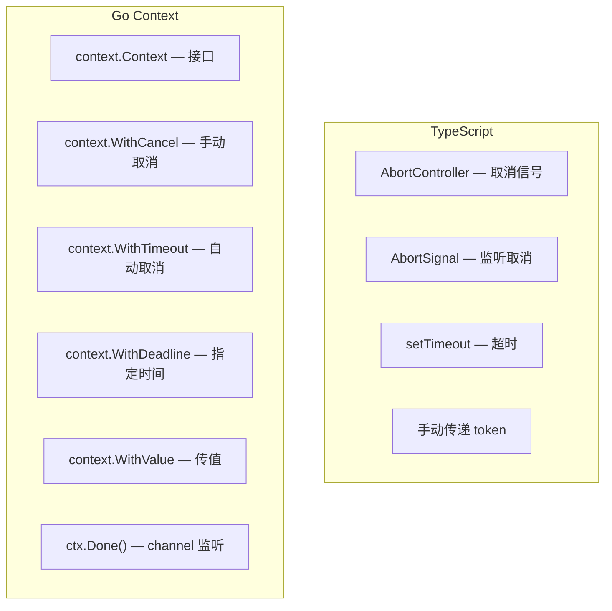
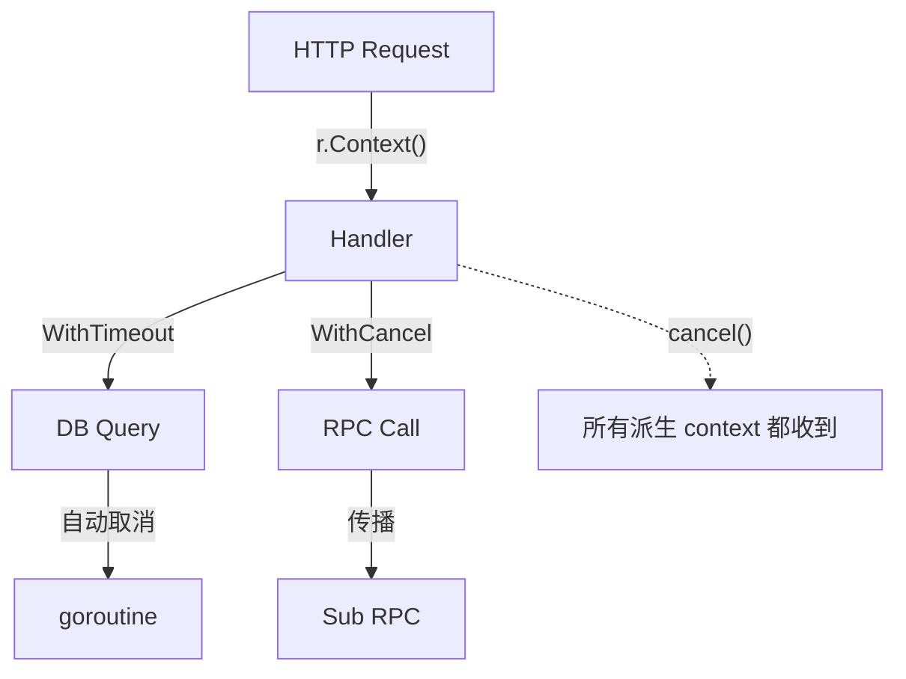

# Context — 上下文

> TypeScript: `AbortController` / `AbortSignal` / timeout
> Go: `context.Context` — 取消、超时、传值的标准方式

## 全景对比



---

## 1. 基本概念

```go
// Context 的核心职责：
// 1. 取消信号传递
// 2. 超时控制
// 3. 请求范围的值传递

// 两个根 context：
ctx := context.Background()   // 主函数/初始化使用
// ctx := context.TODO()      // 不确定用哪个时

// 从根派生子 context
ctx, cancel := context.WithCancel(ctx)
defer cancel() // 确保释放资源
```

```typescript
// TypeScript
const controller = new AbortController();
const signal = controller.signal;
// 后续通过 signal.aborted 检查
```

---

## 2. 取消（WithCancel）

```go
func main() {
    ctx, cancel := context.WithCancel(context.Background())

    go worker(ctx, "worker-1")
    go worker(ctx, "worker-2")

    time.Sleep(2 * time.Second)
    cancel() // 通知所有 worker 停止

    time.Sleep(500 * time.Millisecond)
}

func worker(ctx context.Context, name string) {
    for {
        select {
        case <-ctx.Done():
            fmt.Printf("%s: stopped (%v)\n", name, ctx.Err())
            return
        default:
            fmt.Printf("%s: working...\n", name)
            time.Sleep(500 * time.Millisecond)
        }
    }
}
```

```typescript
// TypeScript
const controller = new AbortController();

async function worker(name: string, signal: AbortSignal) {
    while (!signal.aborted) {
        console.log(`${name}: working...`);
        await new Promise(r => setTimeout(r, 500));
    }
    console.log(`${name}: stopped`);
}

Promise.all([worker("worker-1", controller.signal), worker("worker-2", controller.signal)]);
setTimeout(() => controller.abort(), 2000);
```

---

## 3. 超时（WithTimeout）

```go
// 最常见的 Context 使用场景
func queryDatabase(ctx context.Context) (Result, error) {
    // 模拟数据库查询
    select {
    case <-time.After(3 * time.Second):
        return Result{Data: "result"}, nil
    case <-ctx.Done():
        return Result{}, ctx.Err()
    }
}

func handler(w http.ResponseWriter, r *http.Request) {
    // 2 秒超时的 context
    ctx, cancel := context.WithTimeout(r.Context(), 2*time.Second)
    defer cancel()

    result, err := queryDatabase(ctx)
    if err != nil {
        if errors.Is(err, context.DeadlineExceeded) {
            http.Error(w, "timeout", http.StatusGatewayTimeout)
            return
        }
        http.Error(w, err.Error(), http.StatusInternalServerError)
        return
    }
    json.NewEncoder(w).Encode(result)
}
```

```typescript
// TypeScript
async function queryDatabase(signal: AbortSignal): Promise<Result> {
    return new Promise((resolve, reject) => {
        const timer = setTimeout(() => resolve({ data: "result" }), 3000);
        signal.addEventListener("abort", () => {
            clearTimeout(timer);
            reject(new DOMException("Aborted", "AbortError"));
        });
    });
}

async function handler(req: Request) {
    const controller = new AbortController();
    const timer = setTimeout(() => controller.abort(), 2000);

    try {
        const result = await queryDatabase(controller.signal);
        return new Response(JSON.stringify(result));
    } catch (e) {
        return new Response("timeout", { status: 504 });
    } finally {
        clearTimeout(timer);
    }
}
```

---

## 4. 截止时间（WithDeadline）

```go
// 指定绝对时间
deadline := time.Now().Add(5 * time.Second)
ctx, cancel := context.WithDeadline(context.Background(), deadline)
defer cancel()

// 与 WithTimeout 的区别：
// WithTimeout(d) = WithDeadline(time.Now().Add(d))
```

---

## 5. 传值（WithValue）

```go
// 谨慎使用——仅用于请求范围的值（trace ID、认证信息等）
// 不要用 context 传递函数参数

type contextKey string

const (
    UserIDKey    contextKey = "user_id"
    TraceIDKey   contextKey = "trace_id"
)

func main() {
    ctx := context.Background()
    ctx = context.WithValue(ctx, UserIDKey, "user-123")
    ctx = context.WithValue(ctx, TraceIDKey, "trace-abc")

    processRequest(ctx)
}

func processRequest(ctx context.Context) {
    userID := ctx.Value(UserIDKey).(string)
    traceID := ctx.Value(TraceIDKey).(string)
    fmt.Printf("processing request: user=%s trace=%s\n", userID, traceID)
}
```

> ⚠️ **Key 的类型**：context 的 key 使用自定义类型，**不要用 string**——避免不同包 key 冲突。
> ```go
> // ❌ 包 A 和包 B 都用 "user_id" → 冲突
> ctx = context.WithValue(ctx, "user_id", "123")
>
> // ✅ 自定义类型防止冲突
> type userCtxKey struct{}
> ctx = context.WithValue(ctx, userCtxKey{}, "123")
> ```

---

## 6. Context 在标准库中的使用

```go
// 标准库几乎所有阻塞操作都接受 Context

// HTTP 请求
req, _ := http.NewRequestWithContext(ctx, "GET", url, nil)
resp, _ := http.DefaultClient.Do(req)

// 数据库查询
db.QueryContext(ctx, "SELECT * FROM users")

// 文件操作（Go 1.21+）
r, _ := os.OpenFile("file.txt")
r.ReadContext(ctx, buf) // Go 1.21+

// 不是所有 IO 都支持 Context——需要检查 API
```

---

## 7. Context 传播规则



---

## 8. 完整对照表

| 操作 | TypeScript | Go |
|------|-----------|-----|
| 创建取消信号 | `new AbortController()` | `context.WithCancel(parent)` |
| 超时 | `setTimeout` | `context.WithTimeout(parent, d)` |
| 截止时间 | `Date.now() + ms` | `context.WithDeadline(parent, t)` |
| 传值 | 函数参数 | `context.WithValue(ctx, k, v)` |
| 监听取消 | `signal.addEventListener("abort")` | `<-ctx.Done()` |
| 检查取消 | `signal.aborted` | `ctx.Err() != nil` |
| 手动触发 | `controller.abort()` | `cancel()` |
| 释放资源 | N/A | `defer cancel()` |

---

## 快速记忆

```
context.Background()    — 根 context
context.TODO()          — 不确定用哪个时

ctx, cancel := context.WithCancel(ctx)    — 手动取消
ctx, cancel := context.WithTimeout(ctx, d) — 超时
ctx := context.WithValue(ctx, key, val)   — 传值

defer cancel()          — 确保释放

监听：select {
    case <-ctx.Done():  — 被取消
    default:            — 继续工作
}

!  永远传递 ctx 作为第一个参数 — 标准惯例
!  不要用 string 做 Value 的 key — 用自定义类型
!  defer cancel() 无论什么路径 — 防止资源泄漏
!  不要将 context 存在 struct 中 — 作为参数传递
```
