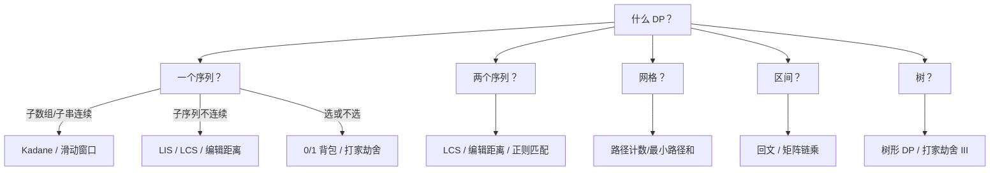

# 动态规划 — DP Patterns

## 1. 背包问题

```go
// 0/1 背包
func ZeroOneKnapsack(weights, values []int, capacity int) int {
    dp := make([]int, capacity+1)
    for i := 0; i < len(weights); i++ {
        for w := capacity; w >= weights[i]; w-- { // 倒序！
            dp[w] = max(dp[w], dp[w-weights[i]]+values[i])
        }
    }
    return dp[capacity]
}

// 完全背包
func CompleteKnapsack(weights, values []int, capacity int) int {
    dp := make([]int, capacity+1)
    for i := 0; i < len(weights); i++ {
        for w := weights[i]; w <= capacity; w++ { // 正序！
            dp[w] = max(dp[w], dp[w-weights[i]]+values[i])
        }
    }
    return dp[capacity]
}

// 分割等和子集（0/1 背包变体）
func CanPartition(nums []int) bool {
    sum := 0
    for _, v := range nums { sum += v }
    if sum%2 != 0 { return false }
    target := sum / 2
    dp := make([]bool, target+1)
    dp[0] = true
    for _, num := range nums {
        for w := target; w >= num; w-- {
            dp[w] = dp[w] || dp[w-num]
        }
    }
    return dp[target]
}
```

## 2. 最长子序列

```go
// LIS（最长递增子序列）— O(n log n)
func LengthOfLIS(nums []int) int {
    tails := make([]int, 0)
    for _, x := range nums {
        i := sort.SearchInts(tails, x)
        if i == len(tails) {
            tails = append(tails, x)
        } else {
            tails[i] = x
        }
    }
    return len(tails)
}

// LCS（最长公共子序列）
func LongestCommonSubsequence(text1, text2 string) int {
    m, n := len(text1), len(text2)
    dp := make([][]int, m+1)
    for i := range dp { dp[i] = make([]int, n+1) }

    for i := 1; i <= m; i++ {
        for j := 1; j <= n; j++ {
            if text1[i-1] == text2[j-1] {
                dp[i][j] = dp[i-1][j-1] + 1
            } else {
                dp[i][j] = max(dp[i-1][j], dp[i][j-1])
            }
        }
    }
    return dp[m][n]
}
```

## 3. 区间 DP

```go
// 最长回文子串
func LongestPalindrome(s string) string {
    n := len(s)
    dp := make([][]bool, n)
    for i := range dp { dp[i] = make([]bool, n) }
    start, maxLen := 0, 1

    for i := 0; i < n; i++ { dp[i][i] = true }

    for length := 2; length <= n; length++ {
        for i := 0; i <= n-length; i++ {
            j := i + length - 1
            if s[i] == s[j] {
                if length == 2 || dp[i+1][j-1] {
                    dp[i][j] = true
                    if length > maxLen { start, maxLen = i, length }
                }
            }
        }
    }
    return s[start : start+maxLen]
}
```

## 4. 线性 DP

```go
// 打家劫舍
func Rob(nums []int) int {
    prev, curr := 0, 0
    for _, v := range nums {
        prev, curr = curr, max(curr, prev+v)
    }
    return curr
}

// 爬楼梯（斐波那契）
func ClimbStairs(n int) int {
    if n <= 2 { return n }
    a, b := 1, 2
    for i := 3; i <= n; i++ {
        a, b = b, a+b
    }
    return b
}

// 最大子数组和（Kadane）
func MaxSubArray(nums []int) int {
    maxEnding, maxSoFar := nums[0], nums[0]
    for i := 1; i < len(nums); i++ {
        maxEnding = max(nums[i], maxEnding+nums[i])
        maxSoFar = max(maxSoFar, maxEnding)
    }
    return maxSoFar
}
```

## 5. 树形 DP

```go
// 打家劫舍 III（二叉树）
type TreeNode struct { Val int; Left, Right *TreeNode }

func RobIII(root *TreeNode) int {
    var dfs func(*TreeNode) (int, int)
    dfs = func(n *TreeNode) (int, int) {
        if n == nil { return 0, 0 }
        lRob, lSkip := dfs(n.Left)
        rRob, rSkip := dfs(n.Right)
        // 选当前：不能选子节点
        rob := n.Val + lSkip + rSkip
        // 不选当前：子节点可选可不选
        skip := max(lRob, lSkip) + max(rRob, rSkip)
        return rob, skip
    }
    rob, skip := dfs(root)
    return max(rob, skip)
}
```

## DP 选择速查



## 完整对照表

| 模式 | 状态转移 | Go 注意点 |
|------|---------|----------|
| 0/1 背包 | `dp[w] = max(dp[w], dp[w-w[i]]+v[i])` | 容量倒序 |
| 完全背包 | 同上 | 容量正序 |
| LIS | 二分 tails 数组 | `sort.SearchInts` |
| LCS | `dp[i][j]` 二维 | 二维 slice 初始化 |
| 打家劫舍 | 滚动变量 | `prev, curr` |
| Kadane | `maxEnding, maxSoFar` | 理解状态定义 |
