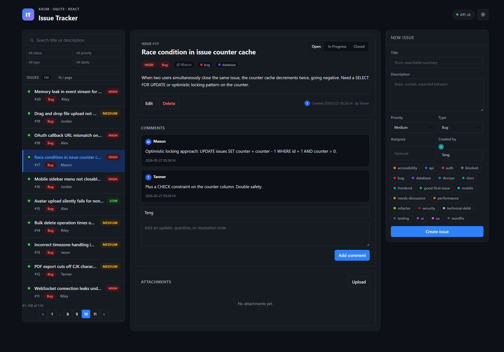
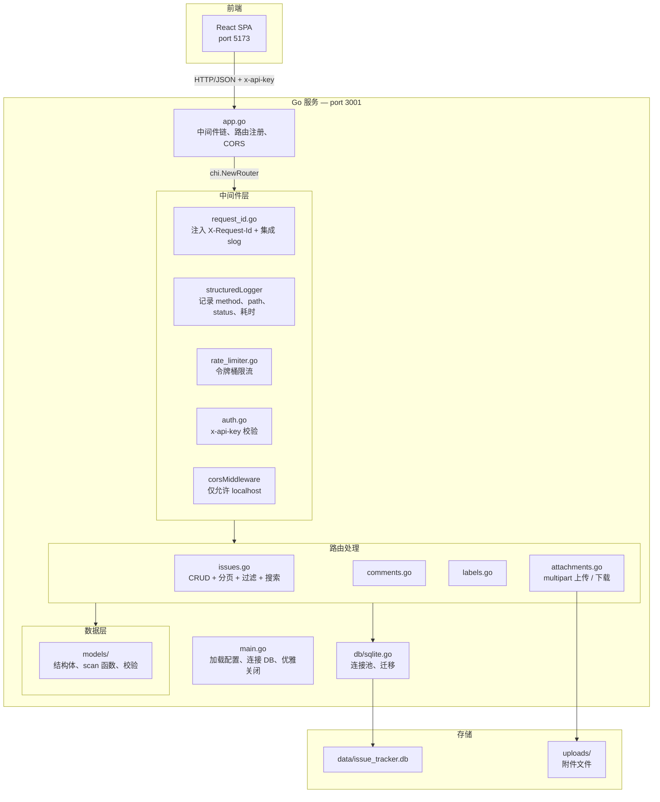

# Issue Tracker API

一个生产风格（production-style）的 Go REST API，支持 issue、评论、标签和文件附件的 CRUD。  
作为学习项目，代码中展示了大量真实 Go 后端开发的工程模式。



---

## 快速开始

```bash
# 灌种子数据
make seed

# 启动服务
make run

# 运行测试
make test
```

服务默认在 `http://127.0.0.1:3001`。  
前端（如果运行中）在 `http://127.0.0.1:5173`。

### Swagger 文档

启动服务后，浏览器打开：

```
http://localhost:3001/swagger/index.html
```

可以看到完整的 API 文档，包含 16 个端点的请求参数、响应格式和认证方式（`x-api-key`）。  
文档由 [swaggo](https://github.com/swaggo/swag) 注释自动生成，修改 handler 后运行以下命令更新：

```bash
swag init -g main.go --output docs/
```

---

## 技术栈

| 组件 | 选型 | 理由 |
|------|------|------|
| 语言 | **Go 1.23+** | 最新泛型、range-over-func、slog |
| 路由 | **chi/v5** | 标准 `http.Handler` 接口，不绑定框架 |
| 数据库 | **SQLite** via `modernc.org/sqlite` | 纯 Go 实现，零 CGO 依赖 |
| 测试 | `testing` + `httptest` | 标准库，无外部测试框架 |
| 构建 | **多阶段 Docker** | Scratch 镜像，最终二进制 ~8MB |

---

## 架构



### 请求生命周期

```
Client                    中间件链                          Handler         数据库
  │                           │                               │                │
  │──GET /api/issues─────────►│                               │                │
  │                           │──InjectRequestID──►           │                │
  │                           │──RealIP───────────►           │                │
  │                           │──structuredLogger─►           │                │
  │                           │──Timeout──────────►           │                │
  │                           │──CORS─────────────►           │                │
  │                           │──RateLimit (可选)─►            │                │
  │                           │──RequireAPIKey────►           │                │
  │                           │                               │                │
  │                           │──────────────────►issues.go──►│                │
  │                           │                               │──QueryContext──►│
  │                           │                               │◄─────rows──────│
  │                           │                               │                │
  │◄────JSON 200──────────────│◄──────────────────────────────│                │
```

---

## 工程模式详解

### 1. Fail Fast 配置

`config.MustLoad()` 在进程启动时验证所有配置项。如果 `ISSUE_TRACKER_BIND_ADDR` 格式无效，进程立即 panic —— 不会先开数据库再炸。

```go
// config/config.go
func MustLoad() *Config {
    cfg := Load()
    if _, err := net.ResolveTCPAddr("tcp", cfg.BindAddr); err != nil {
        panic(fmt.Sprintf("ISSUE_TRACKER_BIND_ADDR invalid: %v", err))
    }
    // ... 更多校验
    return cfg
}
```

### 2. Context 传播

每个数据库查询都传递 `r.Context()`，这会携带：
- **超时**：chi 的 `Timeout(30s)` 中间件在 30 秒后取消 context
- **取消**：如果客户端断开连接，context 立即取消
- **Request ID**：`middleware.InjectRequestID` 将 ID 存入 context

```go
// ⚠️ 永远不要用 db.Query() — 始终用 db.QueryContext(ctx, ...)
rows, err := queryContext(r.Context(), db, "SELECT * FROM issues WHERE ...")
```

### 3. Request ID + 结构化日志

每个请求分配一个 UUID，存入 context 并注入 `slog`。所有日志行自动携带 `request_id` 字段：

```go
// middleware/request_id.go
logger := slog.Default().With("request_id", id)
ctx = context.WithValue(ctx, loggerKey{}, logger)

// 在 handler 中 — request_id 自动出现在每行日志中
slog.ErrorContext(r.Context(), "query failed", "error", err)
// 输出: ... msg="query failed" error="..." request_id="abc-123"
```

### 4. 统一错误响应

所有错误都输出 `{"error": "message"}` 格式，不会出现纯文本 body 或不同的 JSON 结构。

```go
// utils/response.go — 始终用这些函数
utils.JSON(w, data)         // 200 + 数据
utils.Error400(w, msg)      // 400 + {"error": "..."}
utils.Error404(w, msg)      // 404 + {"error": "..."}
utils.Error500(w, msg)      // 500 + {"error": "..."}
utils.JSONDeleted(w)        // 200 + {"deleted": true}
```

### 5. Partial Update（PATCH）模式

`UpdateIssue` 先读当前状态，再合并传入的字段。只有客户端传了的字段才会被更新。

```go
// coalesce 模式：传了就覆盖，没传就保留
title := coalesce(input.Title, current.Title)
status := coalesce(input.Status, current.Status)
```

### 6. SQL 注入防护

所有查询使用 `?` 参数化占位符，绝不拼接字符串：

```go
// ✅ 安全 — SQLite 将 ? 视为参数化绑定
db.Query("SELECT * FROM issues WHERE status = ?", status)

// ❌ 危险 — 永远不要这么做
// db.Query(fmt.Sprintf("SELECT * FROM issues WHERE status = '%s'", status))
```

### 7. 事务安全

```go
tx, err := db.Begin()
if err != nil { /* 处理错误 */ }
defer tx.Rollback() // Commit 之后调 Rollback 是安全的（no-op）

// ... 事务操作 ...

if err := tx.Commit(); err != nil { /* 处理错误 */ }
// 此时 defer Rollback() 什么也不做
```

### 8. HTTP 超时保护

```go
srv := &http.Server{
    ReadTimeout:  10 * time.Second,  // 防止慢读取攻击
    WriteTimeout: 30 * time.Second,  // 防止慢写入攻击（文件上传）
    IdleTimeout:  60 * time.Second,  // 关闭空闲的 keep-alive 连接
}
```

### 9. 优雅关闭

```go
sigCh := make(chan os.Signal, 1)
signal.Notify(sigCh, syscall.SIGINT, syscall.SIGTERM)
<-sigCh

ctx, cancel := context.WithTimeout(context.Background(), 15*time.Second)
defer cancel()
srv.Shutdown(ctx)  // 停止接受新请求，等待活跃请求完成
database.Close()   // 关闭连接池
```

### 10. 迁移追踪

初次迁移时创建 `_migrations` 表，记录已执行过的迁移文件。模拟 `golang-migrate` / `goose` 的行为。

```sql
CREATE TABLE IF NOT EXISTS _migrations (
    filename TEXT PRIMARY KEY,
    applied_at TEXT NOT NULL DEFAULT CURRENT_TIMESTAMP
);
```

### 11. 令牌桶限流

```go
// middleware/rate_limiter.go
// rate:  每秒允许的请求数
// burst: 允许的突发请求数
middleware.RateLimit(cfg.RateLimitPerSec, cfg.RateLimitBurst)

// 超限时返回 429 Too Many Requests + Retry-After 头
```

### 12. 文件上传安全

```go
r.Body = http.MaxBytesReader(w, r.Body, 10<<20) // 硬限制：10MB
// 文件名被 UUID 前缀保护，防止路径穿越攻击：
//   上传 "evil/../../etc/passwd" → 存储为 "uuid-safe_name"
storedName := utils.StoredFileName(origName)
filePath, err := utils.EnsureInsideUploadDir(h.UploadDir, storedName)
```

---

## 目录结构

```
projects/server/
├── main.go                 # 入口：加载配置、连接 DB、启动 HTTP
├── app.go                  # 中间件链 + 路由注册
│
├── config/
│   └── config.go           # 环境变量加载 + 校验
│
├── db/
│   └── sqlite.go           # 连接池 + 迁移执行器
│
├── middleware/
│   ├── auth.go             # x-api-key 校验
│   ├── request_id.go       # X-Request-Id + slog 集成
│   └── rate_limiter.go     # 令牌桶限流
│
├── routes/
│   ├── issues.go           # Issue CRUD + 分页 + 过滤 + 搜索
│   ├── comments.go         # 评论 CRUD
│   ├── labels.go           # 标签 CRUD + Issue 关联
│   ├── attachments.go      # Multipart 上传 / 下载 / 删除
│   └── issues_test.go      # 表驱动集成测试
│
├── models/
│   ├── issue.go            # Issue 结构体 + scan 函数 + 校验
│   ├── comment.go          # Comment 结构体 + scan 函数
│   ├── label.go            # Label 结构体 + scan 函数
│   ├── attachment.go       # Attachment 结构体 + scan 函数
│   ├── paginated.go        # PaginatedResponse[T] — 泛型唯一使用处
│   └── request.go          # 请求 DTO
│
├── utils/
│   ├── errors.go           # AppError 类型 + 工厂函数
│   ├── response.go         # 统一 JSON 响应函数
│   └── file.go             # 安全文件名 + 路径穿越防护
│
├── scripts/
│   ├── reset_dev_db.sh     # 重置数据库 + 灌种子数据
│   └── seed.sql            # 20 条 issue + 14 个 label + 评论
│
├── migrations/
│   └── 0001_init.sql       # DDL
│
├── Dockerfile              # 多阶段构建（scratch 镜像，~8MB）
├── Makefile                # run / test / seed / coverage / docker-build
└── README.md
```

---

## API 端点

所有端点需要 `x-api-key` 请求头（默认 `dev-secret`）。

### Health

```
GET /health → {"status":"ok"}
```

### Issues

```
GET    /api/issues?status=&priority=&issueType=&labelId=&search=&limit=&offset
POST   /api/issues                           → IssueDetail
GET    /api/issues/{id}                      → IssueDetail
PATCH  /api/issues/{id}                      → IssueDetail（局部更新）
DELETE /api/issues/{id}                      → {"deleted": true}
```

### Comments

```
GET    /api/issues/{issueID}/comments        → Comment[]
POST   /api/issues/{issueID}/comments        → Comment
DELETE /api/comments/{id}                    → {"deleted": true}
```

### Labels

```
GET    /api/labels                           → Label[]
POST   /api/labels                           → Label
POST   /api/issues/{issueID}/labels/{labelID}  → {"linked": true}
DELETE /api/issues/{issueID}/labels/{labelID}  → {"deleted": true}
```

### Attachments

```
GET    /api/issues/{issueID}/attachments       → Attachment[]
POST   /api/issues/{issueID}/attachments       → Attachment（multipart，字段名: "file"）
GET    /api/attachments/{id}/download           → 文件二进制
DELETE /api/attachments/{id}                   → {"deleted": true}
```

---

## 配置项

| 环境变量 | 默认值 | 说明 |
|---------|--------|------|
| `ISSUE_TRACKER_BIND_ADDR` | `127.0.0.1:3001` | 监听地址 |
| `DATABASE_URL` | `sqlite://./data/db.sqlite` | SQLite 路径 |
| `ISSUE_TRACKER_UPLOAD_DIR` | `./uploads` | 上传目录 |
| `ISSUE_TRACKER_API_KEY` | `dev-secret` | API 密钥 |
| `ISSUE_TRACKER_MAX_UPLOAD_BYTES` | `10485760` | 单文件最大字节数（10MB） |
| `ISSUE_TRACKER_RATE_LIMIT_PER_SEC` | `0` | 每秒请求限制（0 = 不限制） |
| `ISSUE_TRACKER_RATE_LIMIT_BURST` | `10` | 突发请求数 |
| `ISSUE_TRACKER_READ_TIMEOUT_SEC` | `10` | HTTP 读超时（秒） |
| `ISSUE_TRACKER_WRITE_TIMEOUT_SEC` | `30` | HTTP 写超时（秒） |
| `ISSUE_TRACKER_SHUTDOWN_TIMEOUT_SEC` | `15` | 优雅关闭等待时间（秒） |
| `ISSUE_TRACKER_LOG_LEVEL` | `debug` | 日志级别：debug/info/warn/error |
| `ISSUE_TRACKER_DB_MAX_OPEN_CONNS` | `1` | 数据库最大连接数 |
| `ISSUE_TRACKER_DB_MAX_IDLE_CONNS` | `1` | 数据库最大空闲连接数 |

---

## 测试

```bash
make test        # 52 个测试用例（含子测试）

make coverage    # 生成 HTML 覆盖率报告 → coverage.html
```

测试中展示的模式：
- **表驱动测试**：一个测试函数，多组输入/输出
- **子测试**：`t.Run()` 隔离失败，单个用例失败不影响其他
- **内存 SQLite**：每个测试使用独立的 `:memory:` 数据库
- **`httptest.NewRecorder`**：无需启动真实 HTTP 服务器
- **边界覆盖**：不存在的 ID、无效输入、已删除的资源

---

## 踩坑记录

### 1. Context 取消与 `*sql.Rows`

```go
// ❌ 错误 — context 在读取 rows 之前就被取消了
func query(ctx, db, query, args) (*sql.Rows, error) {
    ctx, cancel := context.WithTimeout(ctx, 3*time.Second)
    defer cancel()  // ← 函数返回时立即取消！rows.Next() 会失败
    return db.QueryContext(ctx, query, args...)
}

// ✅ 正确 — 让调用方管理 context
func query(ctx, db, query, args) (*sql.Rows, error) {
    return db.QueryContext(ctx, query, args...)
}
```

### 2. SQLite + 并发

SQLite 的写入是串行化的。多连接不会加速写入——它们只会互相阻塞。设置 `MaxOpenConns=1`。

### 3. `defer Rollback` 与 `Commit` 的顺序

```go
tx, _ := db.Begin()
defer tx.Rollback()  // 安全 — Commit 后调用是 no-op
tx.Commit()
```

### 4. `MaxBytesReader` 必须在 `ParseMultipartForm` 之前

必须保证顺序：先 `r.Body = http.MaxBytesReader(...)`，再 `r.ParseMultipartForm(...)`。顺序反了限制不会生效。

### 5. `httptest` 的 context 行为

`httptest.NewRequest` 创建的 context 没有 chi 中间件的超时或取消机制。测试中需要手动设置 middleware。

---

## License

MIT
