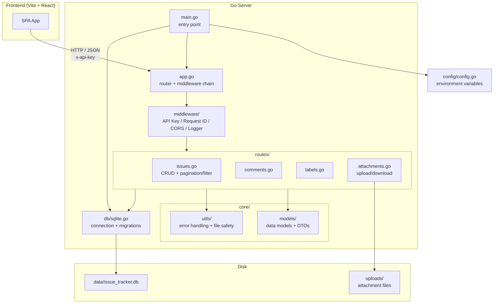

# Issue Tracker API — Go Edition

A Go rewrite of the Rust/Axum Issue Tracker backend. Fully compatible with the existing frontend.

## Tech Stack

| Component | Choice |
|-----------|--------|
| Router | [chi/v5](https://github.com/go-chi/chi) — standard `http.Handler` middleware chain |
| Database | [modernc.org/sqlite](https://gitlab.com/cznic/sqlite) — pure Go SQLite, zero CGO |
| UUID | `google/uuid` |
| Logger | `log/slog` — Go standard library |
| Testing | `testing` + `net/http/httptest` |
| Generics | `PaginatedResponse[T]` — single usage |

## Architecture



### Request Lifecycle

```mermaid
sequenceDiagram
    participant F as Frontend
    participant A as app.go
    participant M as middleware
    participant R as routes
    participant D as SQLite

    F->>+A: GET /api/issues?status=open
    A->>+M: middleware chain
    M-->>M: InjectRequestID
    M-->>M: CorsMiddleware
    M-->>M: RequireAPIKey
    M->>-R: route match → issues.go
    R->>+D: SELECT COUNT + SELECT data
    D-->>-R: result set
    R->>R: Scan → PaginatedResponse[Issue]
    R-->>-F: JSON 200
```

## Quick Start

```bash
# 1. Seed the database (20 issues + 14 labels + comments)
make seed

# 2. Start the server (default: 127.0.0.1:3001)
make run
```

Access the frontend at `http://127.0.0.1:5173`.

## Commands

```bash
make run      # Start the server
make build    # Build binary → bin/issue_tracker
make test     # Run tests
make seed     # Reset DB + seed data
make clean    # Clean build artifacts and database
```

## Directory Structure

```
projects/server/
├── main.go              # entry point
├── app.go               # router + middleware assembly
├── config/config.go     # environment config
├── db/sqlite.go         # DB connection + auto-migration
├── models/              # data models + DTOs + validation
├── routes/              # HTTP handlers
├── middleware/          # API key auth + request ID
├── utils/               # error helpers + file name safety
├── scripts/             # reset script + seed SQL
├── migrations/          # DDL
├── Makefile
└── README.md
```

## API Endpoints

All API endpoints are prefixed with `/api` and require the `x-api-key` header (default: `dev-secret`).

### Health

```
GET /health
```

### Issues

```
GET    /api/issues[?status=&priority=&issueType=&labelId=&search=&limit=&offset]
POST   /api/issues
GET    /api/issues/{id}
PATCH  /api/issues/{id}
DELETE /api/issues/{id}
```

### Comments

```
GET    /api/issues/{issueID}/comments
POST   /api/issues/{issueID}/comments
DELETE /api/comments/{id}
```

### Labels

```
GET    /api/labels
POST   /api/labels
POST   /api/issues/{issueID}/labels/{labelID}
DELETE /api/issues/{issueID}/labels/{labelID}
```

### Attachments

```
GET    /api/issues/{issueID}/attachments
POST   /api/issues/{issueID}/attachments    (multipart, field name: "file")
GET    /api/attachments/{id}/download
DELETE /api/attachments/{id}
```

## Configuration (Environment Variables)

| Variable | Default | Description |
|----------|---------|-------------|
| `ISSUE_TRACKER_BIND_ADDR` | `127.0.0.1:3001` | Listen address |
| `DATABASE_URL` | `sqlite://{cwd}/data/issue_tracker.db` | SQLite path |
| `ISSUE_TRACKER_UPLOAD_DIR` | `{cwd}/uploads` | Upload directory |
| `ISSUE_TRACKER_API_KEY` | `dev-secret` | API key |

## Differences from the Rust Version

| Feature | Rust | Go |
|---------|------|----|
| Runtime | Tokio (async) | Go goroutines |
| DB | SQLx + SQLite | `database/sql` + `modernc.org/sqlite` |
| Logger | tracing | `log/slog` |
| Generics | none | `PaginatedResponse[T]` |
| Request ID | tower-http middleware | hand-rolled |
| Upload limit | axum middleware | `http.MaxBytesReader` |

## Testing

```bash
make test
```

6 integration tests using in-memory SQLite. Each test has its own isolated database.
